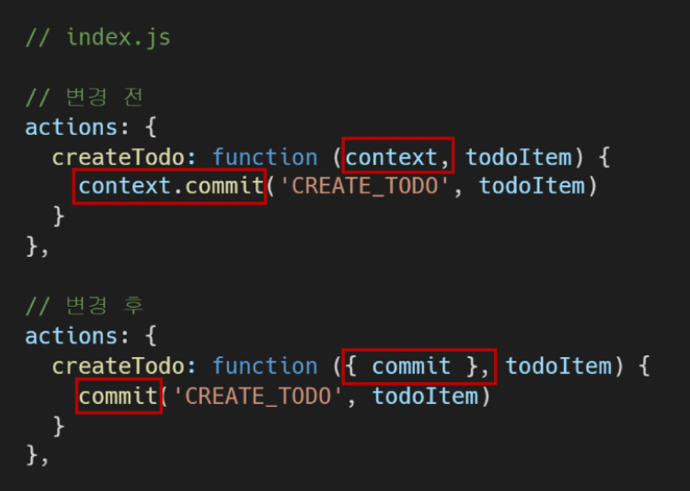
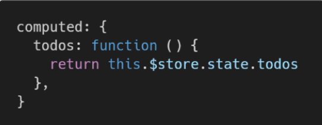
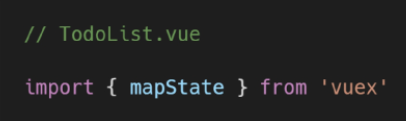
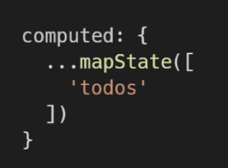
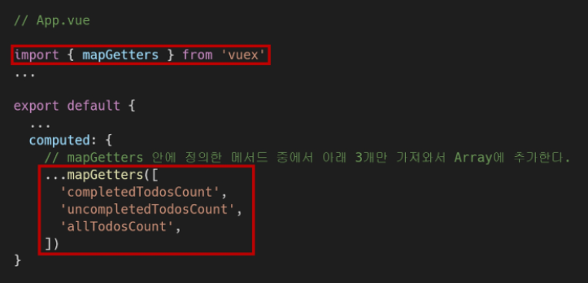
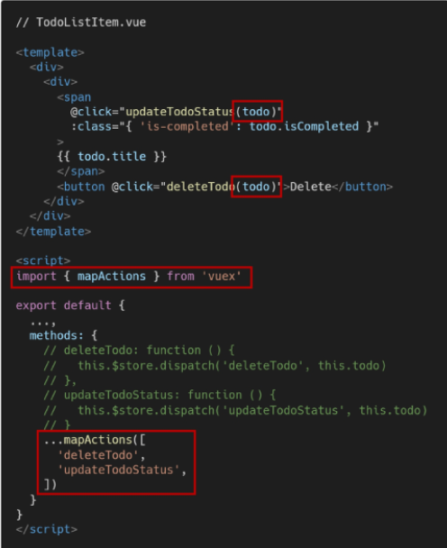
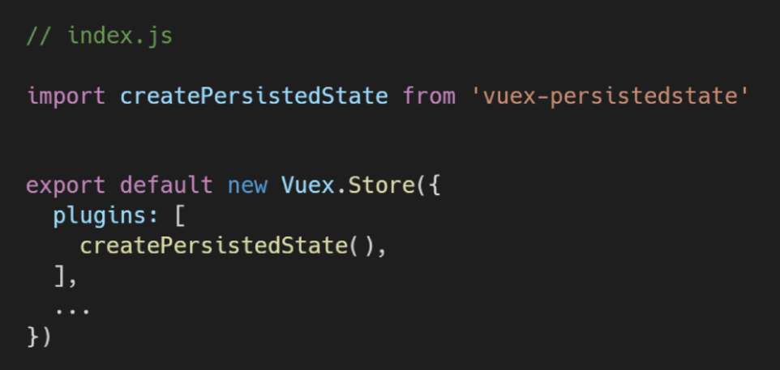

`vue add vuex`

### Vuex 핵심 컨셉

1. state
   - data
   - vue store에 모여지는 상태정보
2. Mutations
   - 실제로 state를 변경하는 유일한 방법
   - 핸들러 함수 반드시 동기적
   - 첫번째 인자로 항상 `state`받음
   - Actions에서 `commit()` 메서드로 호출
3. Actions
   - mutations를 `commit()` 메서드로 호출
   - 비동기 작업 포함가능
   - `context`인자를 받음
     - state를 직접적으로 변경하면 안됨
   - 컴포넌트에서 `dispatch()` 메서드로 호출
4. Getters
   - computed
   - state변경하지 않고 활용하여 계산 수행
   - 예를들어 목록 필터링해서 출력할때


- state작성

  - `index.js`의 state에 작성

    

- 매번 store의 todos 호출하면 비효율적이므로 computed로 가져옴

  

- dispatch메서드로 actions 불러오기

  


- Vuex상태 관리 흐름
  1. dispatch
  2. actions
  3. mutations


### JS Destructuring assingments

- 배열의 값이나 객체의 속성을 고유한 변수로 압축해제가능

  ```javascript
  // 1. 하나하나 할당
  const commit = context.commit
  const state = context.state
  
  // 2. Destructuring assinment
  // 이름으로 가져온다
  // 순서가 필요없다
  const {state, commit} = context
  
  // 한개만 가져와도 됨
  const {commit} = context
  ```

- actions 변경

  


### Component Binding Helper

- 종류

  - mapState

  - mapGetters

  - mapActions

  - mapMutations

    

### mapState

- computed와 Store의 state를 매핑

- 매핑된 computed 이름이 state 이름과 같을때 문자열 배열 전달 가능

  

->





- 최종 객체를 computed에 전달할 수 있도록 객체 연산자로 객체를 복사하여 작성
- mapState()는 객체 반환


### mapGetters

- Computed와 Getters매핑

- 객체 연산자로 계산하여 추가

  


### mapActions

- actions를 객체연산자로 계산하여 추가

  


### vuex-persistedstate

- `npm i vuex-persistedstate`
- 라이브러리 사용

