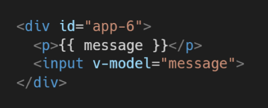

# Vue.js

> SPA(Single Page Application)를 완벽하게 지원

### SPA(단일 페이지 애플리케이션)

- 현재 페이지를 동적으로 렌더링
- 최초만 페이지 다운로드, 이후 동적으로 DOM구성
  - 필요한 부분만 동적으로 다시 작성
- 동작 원리 일부가 CSR(Client Side Rendering) 구조 따름
- 모바일 앱과 비슷한 형태의 UX제공

### CSR(Client Side Rendering)

- 서버에서 화면 구성 x 클라이언트에서 화면 구성!
- 최초 요청시 데이터 제외 각종 리소스 응답받고 이후 필요한데이터만 요청 JS로 DOM 렌더링
- SPA가 사용하는 렌더링 방식

- 장점
  - 서버와 클라이언트 간 트래픽 감소
  - UX 향상
- 단점
  - SSR에 비해 전체 페이지 최종 렌더링 시점 느림
  - SEO(검색 엔진 최적화)에 어려움이 있음(최조 문서에 데이터 마크업이 없기 때문)

### SSR(Server Side Rendering)

- 서버에서 클라이언트에게 보여줄 페이지를 모두 구성하여 전달
- 전통적인 렌더링 방식
- 장점
  - 초기 구동 속도 빠름
  - SEO에 적합
- 단점
  - 모든 요청마다 새로운 페이지 구성하여 전달
    - UX떨어짐
    - 상대적으로 트래픽 많아 서버 부담

### SSR & CSR

- 두 방식의 차이는 최종 HTML 생성 주체가 누구인가에 따라 결정
  - 서버가 만든다면 SSR / 클라이언트가 만든다면 CSR
- Django에서 Axios를 활용한 대부분의 좋아요/팔로우 로직(SSR)
- 특정 요소(좋아요/팔로우)만 JS활용 DOM 조작

### Why Vue.js?

- Data를 변경하면 이에 연결된 DOM은 알아서 변경
- 신경써야 할 것은 오직 Data에 대한 관리(Developer Exp 향상)
- DOM과 Data의 중재자

### MVVM Pattern

- 애플리케이션 로직을 UI로부터 분리하기 위해 설계된 디자인 패턴
- 구성요소
  - Model
    - JS의 Object
    - Instance 내부의 data라는 이름으로 존재
    - 이 data가 바뀌면 View(DOM)가 반응
  - View
    - DOM(HTML)
    - Data의 변화에 따라 바뀌는 대상
  - View Model
    - 모든 Vue Instance
    - View와 Model사이에서 Data와 DOM 관련 모든 일 처리
    - 데이터를 얼마만큼 잘 처리해서 보여줄 것인지

### Vue 시작하기

1. Vue cdn 작성

2. 선언적 렌더링

   

3. Element 속성 바인딩

4. 조건문

5. 반복문

6. 사용자 입력 핸들링

### Vue instance

- Options 객체를 전달
- Vue Instance === Vue Component

### Options/DOM - 'el'

- Vue 인스턴스에 연결(마운트) 할 기존 DOM 요소 필요
- CSS 선택자 문자열 혹은 HTML Element로 작성
- new를 이용한 인스턴스 생성  때만 사용

### Options/DOM  - 'data'

- Vue 인스턴스의 데이터 객체
- 상테 데이터 정의
- Vue template에서 interpolation을 통해 접근 가능
- v-bind, v-on과 같은 directive에서도 사용 가능
- Vue 객체 내 다른 함수에서 this 키워드를 통해 접근 가능
- 주의
  - 화살표 함수를 메서드를 정의하는데 사용하면 안 됨
  - 화살표 함수가 부모 컨텍스트를 바인딩하기 때문에, 'this'는 Vue 인스턴스가 아님

### 'this' keyword in vue.js

- Vue 함수 객체 내에서 vue 인스턴스를 가리킴

### Template Syntax

1. Interpolation(보간법)
2. Directive
   - v- 접두사가 있는 특수 속성
   - 속성 값은 단일 JS 표현식이 됨(v-for 제외)
   - 표현값이 변경될 때 반응적으로 DOM에 적용
   - 전달인자
     - `:` 을 통해 전달인자를 받을 수도 있음
   - 수식어
     - `.` 으로 표시되는 특수 접미사
     - directive를 특별한 방법으로 바인딩해야 함을 나타냄

### v-text

- 엘리먼트의 textContent를 업데이트

- 내부적으로 interpolation 문법이 v-text로 컴파일됨

  

### v-html

- 엘리먼트의 innerHTML을 업데이트
  - XSS 공격에 취약
- 임의로 사용자로부터 입력받은 내용은 **절대 사용금지**

### v-show

- 조건부 렌더링 중 하나
- 요소는 항상 렌더링 되고 DOM에 남아있음
- 단순히 엘리먼트에 display CSS 속성을 hidden 토글하는 것

### v-if, v-else-if, v-else

- 엘리먼트 및 포함된 directive는 토글하는 동안 삭제되고 다시 작성됨

### v-show 와 v-if

- v-show ( 렌더링비용 높음, 토글비용 적음)
  - 실제로 렌더링은 되지만 눈에서 보이지 않음
- v-if (렌더링비용 낮음, 토글비용 높음)
  - 화면에서 보이지 않을 뿐만아니라 렌더링 자체가 안됨

### v-for

- item in items 구문 사용
- 반드시 key속성을 각 요소에 작성
- (item, index) in item
- v-if와 함께 사용할 경우 v-for가 우선순위 더 높음

### v-on

- 엘리먼트에 이벤트 리스너를 연결
- 이벤트 유형은 전달인자로 표시
- 약어
  - `@`
  - `v-on:click -> @click`

### v-bind

- 클래스, 스타일, 속성..

- HTML 요소의 속성에 Vue의 상태 데이터를 값으로 할당
- Object 형태로 사용하면 value가 true인 key가 class 바인딩 값으로 할당
- 약어
  - `:`
  - `v-bind:href -> :href`

### v-model

- HTML form 요소의 값과 data를 양방향 바인딩
- 수식어
  - `.lazy`
    - input 대신 change 이벤트 이후에 동기화
  - `.number`
    - 문자열을 숫자로 변경
  - `.trim`
    - 입력에 대한 trim을 진행

### Options/Data - 'computed'

- 데이터를 기반으로 하는 계산된 속성
- 함수 형태로 정의하지만 반환 값이 바인딩 됨
- 종속된 데이터에 따라 저장(캐싱)
- 종속된 데이터가 변경될 때만 함수를 실행
- 반드시 반환값이 있어야 함

### computed & methods

- 최종 결과에 대해 두 가지 접근 방식은 서로 동일
- computed는 종속 대상의 변경에따라 저장(캐싱)
- methods는 렌더링마다 항상 함수 실행

### Options/Data - 'watch'

- 데이터를 감시
- 데이터에 변화가 일어났을때 실행

### computed & watch

- computed
  - 선언형 프로그래밍
    - 계산해야 하는 목표 데이터를 정의
  - 특정 데이터를 직접적으로 사용/가공하여 다른값으로 만듦
- watch
  - 명령형 프로그래밍
    - 데이터가 바뀌면 특정 함수를 실행
  - 감시할 데이터가 바뀌면 특정 함수 실행(다른 data 변경)

### Options/Assets - 'filter'

- interpolation 혹은 v-bind를 이용할 때 사용 가능
- JS 표현식 마지막에 `|` 추가
- 이어서 사용 가능

### Lifecycle Hooks

- 각 vue 인스턴스는 생성될 때 일련의 초기화 단계 거침
- 그 과정에서 사용자 정의 로직을 실행할 수 있는 Lifecycle Hooks 호출

- 공식문서참고