### Component(컴포넌트)

- 기본 HTML 엘리먼트를 확장하여 재사용 가능한 코드를 캡슐화
- Vue 컴포넌트 === Vue 인스턴스

### SFC (Single File Component)

- Vue의 컴포넌트 기반 개발의 핵심 특징
- 하나의 컴포넌트는 `.vue`확장자를 가진 하나의 파일 안에서 작성되는 코드의 결과물
- `.vue` 확장자를 가진 싱글 파일 컴포넌트를 통해 개발
- Vue 컴포넌트 === Vue 인스턴스 === .vue 파일

### Vue CLI

- Vue.js 개발을 위한 표준 도구

### Node.js

- JS가 아닌 환경에서도 구동할 수 있도록하는 런타임 환경
- SSR 아키텍처에서도 사용

### NPM( Node Package Manage)

### Pass Props & Emit Events

- props는 아래로, events는 위로
- 부모는 props를 통해 자식에게 데이터 전달
- 자식은 events를 통해 부모에게 메시지 보냄

### 컴포넌트 등록 3단계

1. 등록하기
   - `import (이름) from '/@/components/이름'`
2. 컴포넌트츠에 `(이름)` 등록
3. 템플릿에 케밥케이스로 보이기

### Props

1. 부모 컴포넌트에 자식 컴포넌트에 보낼 prop 데이터 선언

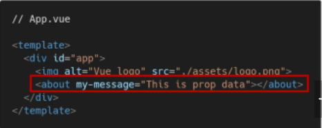

1-1. Dynamic Props

- v-bind directive 사용해 데이터 업데이트마다 자식데이터로 전달

  - data에 함수형태로 return값 설정

    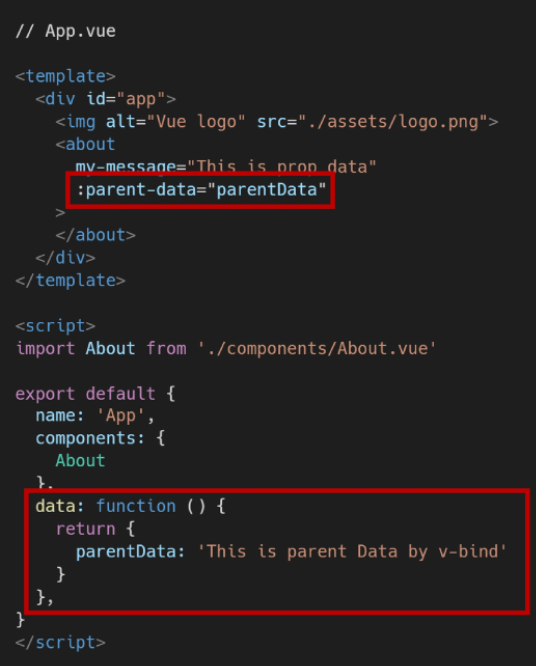

2. 수신할 prop 데이터를 자식에 선언 후 사용

​			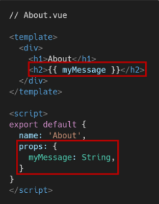

- HTML에서는 케밥케이스, 선언시는 카멜케이스

### Emit event

- `$emit(eventName)`
  - 현재 인스턴스에서 이벤트를 트리거
  - 추가 인자는 리스너의 콜백 함수로 전달
- 부모 컴포넌트는 자식 컴포넌트가 사용되는 템플릿에스 v-on 사용 이벤트 청취

1. 자식 인스턴스에서 `$emit` 사용해서 methods에 이벤트 트리거
   - 이벤트명 케밥케이스

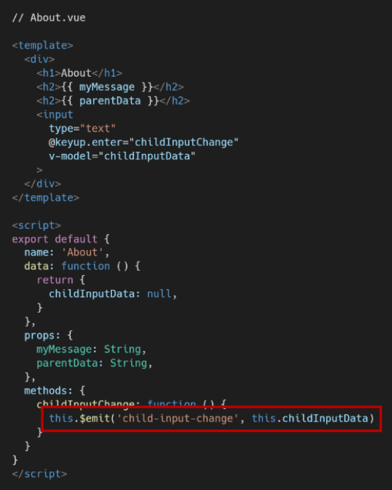

2. 부모 컴포넌트가 v-on 이용해서 자식이 보낸 이벤트 청취
   - `@`로 emit이 보낸 이벤트 받기

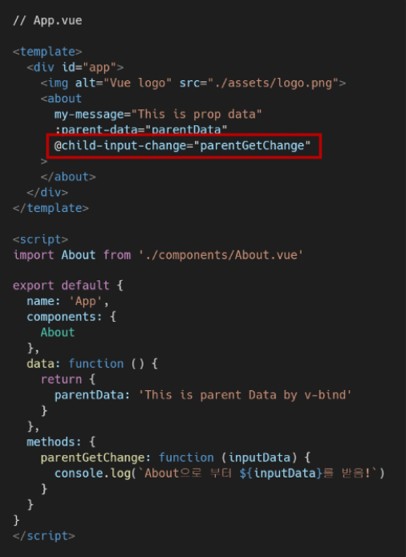

### Vue Router 시작하기

1. 프로젝트 생성 및 이동
2. 뷰 라우터 설치(Vue CLI환경)
   - `vue add router`
   - y -> y

### Vue Router

- <router-link>
  - 목표 경로는 to prop
  - a태그에서 기존 GET 요청을 보내는 이벤트 제거한 형태로 구성
- <router-view>
  - 실제 컴포넌트가 DOM에 부착되어 보이는 자리
  - router-link를 클릭하면 해당 경로와 이어져잇는 컴포넌트 위치
    - index.js에 정의한 컴포넌트

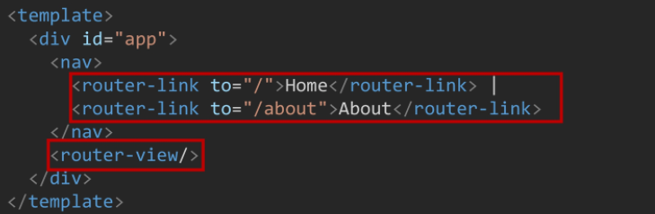

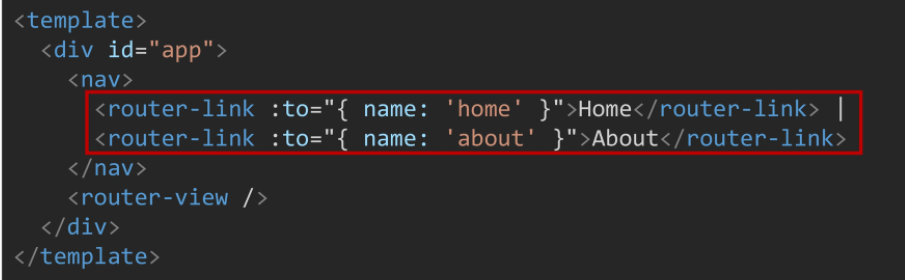

- index.js

  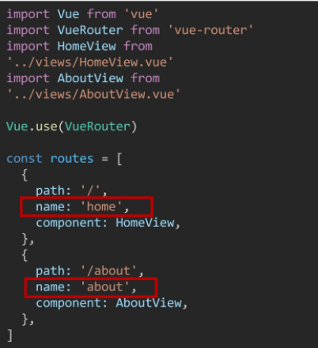

- About에서 Home으로 이동하는 로직

  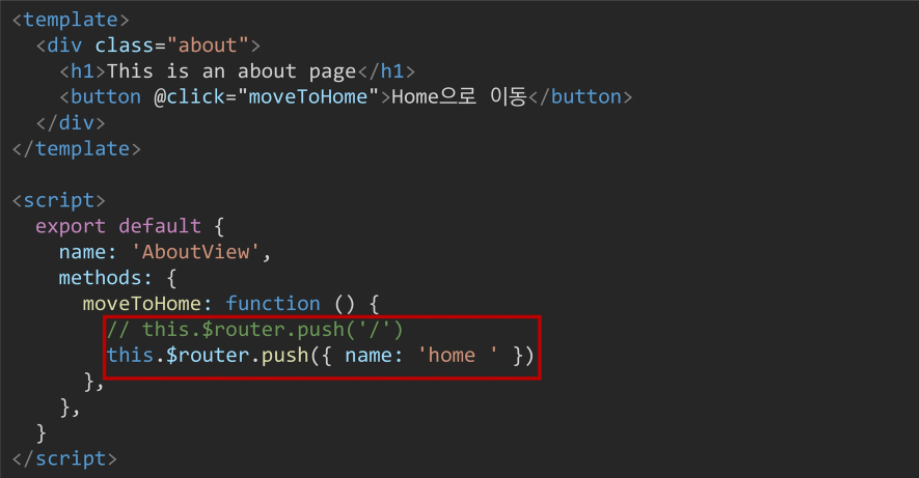

- Dynamic Route Matching

  - 동적 인자 전달

    - 동일한 레이웃이지만 다른 id로 렌더링 되어야 할때

      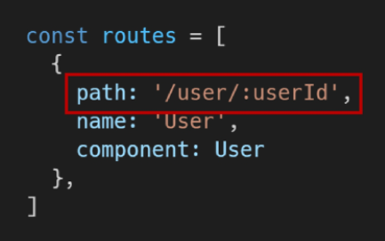

​		컴포넌트에서 `this.$route.params.동적인자`로 사용가능

- 로또 예시

  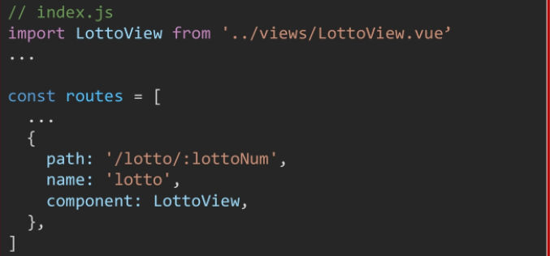

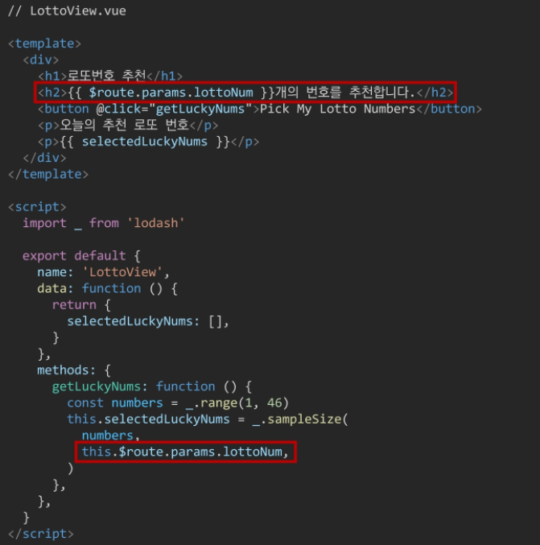

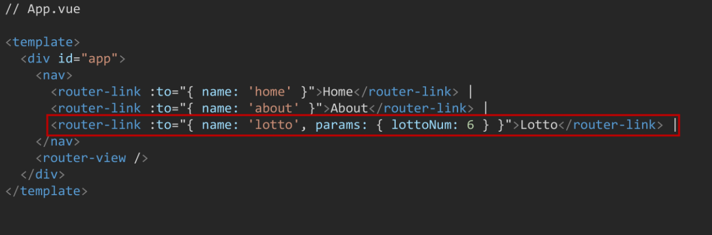
