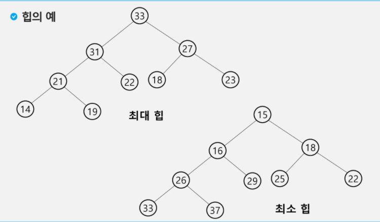

# 트리

### 트리

- 비선형 구조
- 원소들 간에 1:n 관계
- 계층 관계
- 상위 원소에서 하위 원소로 내려가면서 확장되는 트리 모양의 구조
- 한 개 이상의 노드로 이루어진 유한 집합
  - 최상위 노드 -> `루트`
  - 나머지 노드는 분리 집합으로 분리 가능
- 분리 집합은 각각 하나의 트리가 되며(재귀적 정의) 루트의 부트리라 한다.

### 용어

- 형제 노드
- 조상 노드 - 부모~ 루트 노드까지 있는 모든 노드들
- 서브 트리
- 자손 노드 - 하위 레벨의 모든 노드
- 차수
  - 노드의 차수: 노드에 연결된 자식 노드의 수
  - 트리의 차수: 노드의 차수 중에 가장 큰 값
  - 단말 노드(리프 노드): 차수가 0(자식x)인 노드
- 높이
  - 노드의 높이: 루트에서 노드에  이르는 간선의 수, 노드의 레벨
    - 루트노드 - 레벨0
  - 트리의 높이: 트리에 있는 노드의 높이 중에서 가장 큰 값, 최대 레벨

### 이진 트리

- 모든 노드들이 2개의 서브트리를 갖는 특별한 형태의 트리
- 각 노드가 자식 노드를 최대한 2개만 가질 수 있음
- 높이 h인 이진 트리가 가질 수 있는 노드의 최소 개수는 (h+1)개, 최대 개수는(2^(h+1)-1)개

### 포화 이진 트리

- 모든 레벨에 노드가 포화상태로 차 있는 이진 트리
- 높이가 h일때, 최대 노드 개수인 (2^(h+1)-1)의 노드를 가진 이진 트리
- 루트를 1번으로 하여 정해진 위치에 대한 노드 번호를 가짐

### 완전 이진 트리

- 높이가 h이고 노드 수가 n개일 때, 포화 이진 트리의 노드 번호 1번부터 n번까지 빈자리가 없는 이진 트리

### 편향 이진 트리

- 높이 h에 대한 최소 개수의 노드를 가지면서 한쪽 방향의 자식 노드만을 가진 이진 트리

### 이진트리 - 순회

- 중복되지 않게 전부 방문

- 순회 방법
  - 전위 순회: VLR
  - 중위 순회: LVR
  - 후위 순회: LRV

### 배열을 이용한 이진 트리의 표현

- 노드 번호의 성질
  - 노드 번호가 i인 노드의 부모 노드 번호 -> `i//12`
  - 노드 번호가 i인 노드의 왼쪽 자식 노드 번호 -> `2*i`
  - 노드 번호가 i인 노드의 오른쪽 자식 노드 번호 -> `2*i+1`
  - 레벨 n의 노드 번호 시작 번호 -> `2^n`
  - 레벨 i의 최대 노드 수 -> `2^i`

- 단점
  - 편향 이진 트리의 경우 메모리 공간 낭비
  - 중간에 새로운 노드를 삽입하거나 기존의 노드를 삭제할 경우 배열의 크기 변경 어려워 비효율적

### 수식 트리

- 수식을 표현하는 이진 트리
- 연산자는 루트 노드이거나 가지 노드
- 피연산자는 모두 잎 노드

### 이진 탐색 트리

-  모든 원소는 서로 다른 유일한 키 갖음
- key(왼쪽 서브트리)<key(루트 노드)<key(오른쪽 서브트리)
- 중위 순회하면 오름차순으로 정렬된 값을 얻을 수 있다.

- 탐색 연산
  - 루트에서 시작
  - 탐색할 키 값 x를 루트 노드의 키 값과 비교
  - 서브트리에 대해서 순환적으로 탐색 연산을 반복
- 삽입 연산
  - 탐색 연산 수행
    - 탐색 실패가 결정되는 위치가 삽입 위치
  - 탐색 실패한 위치에 원소 삽입
- 성능
  - 탐색, 삽입, 삭제 시간은 트리 높이만큼 걸림
    - O(h)
  - 평균(이진 트리가 균형적으로 생성)
    - O(log n)
  - 최악의 경우(한쪽으로 치우친 경사 이진트리)
    - O(n)
    - 순차탐색과 시간복잡도가 같다.

- 삭제 연산

  - 단말 노드인 경우
    - 단말 노드의 부모 노드를 찾아서 연결 끊음

  - 하나의 서브트리만 가지고 있는 경우
    - 해당 노드 삭제하고 서브트리를 부모노드(삭제된 위치)에 붙여줌
  - 두 개의 서브트리를 가지고 있는 경우
    - 삭제할 노드와 가장 근사한 값을 가진 노드(직후노드 또는 직전노드)를 삭제할 노드 위치로 가져옴

# 힙

- 완전 이진 트리에 있는 노드 중에서 키값이 가장 큰 노드나 키 값이 가장 작은 노드를 찾기 위해 만든 자료구조
- 힙에서는 루트 노드의 원소만을 삭제 가능

- 삽입
  - 삽입할 자리 확장, 삽입
  - 맞는 자리까지 부모노드랑 자리 바꿈
- 삭제
  - 루느 노드의 원소 삭제
  - 마지막 노드랑 자리 바꾸기
  - 맞는 위치까지 삽입노드랑 자식노드 자리 바꾸기
- 우선순위 큐 구현 가능
  - 추가 삭제 - O(logN)
  - 최대/최소값 - O(1)

- 트리 형태 쉽게  구현 가능
  - 부모나 자식 노드 탐색 O(1)

- 힙 정렬
  - N개의 삽입 연산 + N개의 노드 삭제 연산
  - 삽입과 삭제 연산은 각각 O(logN)
  - 전체 정렬은 O(NlogN)