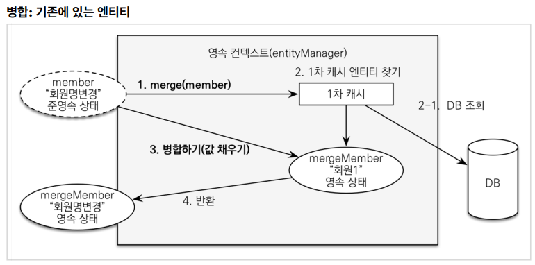

# JPA 활용 1 노트

- 라이브러리 
  - 커넥션 풀: 부트 기본은 `HikariCP`
  - 로깅 인터페이스 모음 : `SL4J`
  - 로깅 구현체 : `LogBack`
    - `SL4J`  + `LogBack` 함께 씀
  - 등등 ...

- Thymeleaf
  - 네츄럴 템플릿
    - 순수 HTML 최대한 유지
    - 웹브라우저로 파일을 열어 볼 수 있음
  - `<html xmlns:th="http://www.thymeleaf.org">`
    - html에 선언 필요
  - `SSR`
- MemberRepository
  - `@PersistenceContext`
    - EntityManager를 빈으로 주입할 때 사용하는 어노테이션
    - EntityManager를 Proxy로 감싸서 thread-safe
    - 호출마다 EntityManager 생성
- MemberRepositoryTest
  - `@Transactional`
    - 테스트 코드에서는 테스트가 끝나고 자동 롤백
  - `@Rollback(false)`
    - 자동 롤백을 원하지 않는다면
- 쿼리 파라미터 자동화
  - 파라미터가 무슨 타입으로 DB에 바인딩 되었는지
  - 스프링 부트 2.x
    - `org.hibernate.type: trace`
  - 스프링 부트 3.x
    - `org.hibernate.orm.jdbc.bind: trace`
  - 외부 라이브러리 사용
    - p6spy

- Item

  - `@Inheritance`
  - `@DiscriminatorColumn`

- Category

  - 자기 자신의 상속관계

    ```java
    @ManyToOne(fetch = FetchType.LAZY)
    @JoinColumn(name = "parent_id")
    private Category parent;
    
    @OneToMany(mappedBy = "parent")
    private List<Category> child = new ArrayList<>();
    ```

- 엔티티 설계시 주의점
  - Setter를 막 열어두면 가까운 미래에 엔티티가 도대체 왜 변경되는지 추적하기 점점 힘들어짐
  - 엔티티를 변경할 때는 Setter 대신에 변경 지점이 명확하도록 변경을 위한 비즈니스 메서드 필요
  - 모든 연관관계는 지연로딩으로 설정
  - 컬렉션은 필드에서 초기화하자
    - 영속화 할 때, 컬렉션을 감싸서 하이버네이트가 내장 컬렉션으로 변경시킴
    - 변경 하지도 말자 내부 메커니즘이 제대로 동작 안 할 수도 있음
- 스프링 부트 신규 설정(엔티티(필드) -> 테이블(컬럼))
  1. 카멜 케이스 -> 언더스코어(memberPoint member_point)
  2. `.`(점) ->  `_`(언더스코어)
  3. 대문자 -> 소문자

- cacade
  - persist도 전파가 됨
  - 각각 persist해줄 필요 없이 하나만 persist하면 됨
- 계층형 구조
  - `controller`, `web`: 웹 계층
  - `service`: 비즈니스 로직, 트랜잭션 처리
  - `repository`: JPA를 직접 사용하는 계층, 엔티티 매니저 사용
  - `domain`: 엔티티가 모여 있는 계층, 모든 계층에서 사용
- MemberService
  - 읽기에는 `@Transactional(readOnly = true)`
    - 영속성 컨텍스트에 플러시하지 않음
    - 약간의 성능 향상
  - 쓰기에는 `@Transactional` (디폴트 false)
  - member의 name을 unique 제약 조건을 걸어주면 좋음
  - DI는 생성자 주입을 사용하자

- test
  - `@RunWith(SpringRunner.class)` : 스프링과 테스트 통합 
  - `@SpringBootTest` : 스프링 부트 띄우고 테스트
    - 이게 없으면 `@Autowired` 다 실패
  - `@Transactional` : 반복 가능한 테스트 지원, 각각의 테스트를 실행할 때마다 트랜잭션을 시작하고 테스트가 끝나면 트랜잭션을 강제로 롤백 
    - 이 어노테이션이 테스트 케이스에서 사용될 때만 롤백

- 테스트 케이스를 위한 설정
  - 메모리 모드
  - `application.yml`에서 `datasource` url을 바꿈
    - `url: jdbc:h2:mem:testdb`
  - 혹은 아예 설정이 없으면 자동으로 메모리 모드로 돌린다
    - `ddl-auto` 도 `create-drop` 모드로 동작
- 객체 지향
  - 데이터를 가지고 있는 쪽에서 비즈니스 로직을 작성하는 것이 좋음
- OrderService
  - cacade 옵션때문에 order를 저장하면, orderItem도 저장
  - cacade 옵션은 라이프 사이클을 함께하는, 혼자 참조하는 경우 권장
    - 여러 곳에서 참조하는 경우는 따로 레포를 만들자
- OrderItem
  - 객체를 생성하는 경우를 `createOrderItem()` 으로 한정하자(방법을 하나만 하자)
    - 빈 생성자를 `protected`로 하거나
    - `@NoArgsConstruct(access = AccessLevel.PROTECTED)` 달기
- 비즈니스 로직 처리
  - 도메일 모델 패턴
    - 서비스 계층은 단순히 엔티티에 필요한 요청을 위임하는 역할
    - 엔티티가 비즈니스 로직을 가지고 객체 지향의 특성을 적극 활용
  - 트랜잭션 스크립트 패턴
    - 엔티티에는 비즈니스 로직이 거의 없고 서비스 계층에서 대부분의 비즈니스 로직을 처리
  - 테스트를 엔티티 단위(메서드 단위)로 단위 테스트 하는것 중요
- OrderRepository
  - `findAll()` 메서드는 검색 조건에 동적으로 쿼리 생성 조회
  - JPQL 쿼리를 문자로 생성하기는 번거롭고, 실수로 인해 버그가 발생할 수 있음
  - JPA Criteria로 처리
    - JPQL을 자바 코드로 작성할 수 있게 도움
    - JPA 표준 스펙이지만 너무 복잡
  - 가장 좋은 방법은 Querydsl


- html
  - `<head th:replace="fragments/header :: header">`
    - `header`를 `fragments/header`로 교체한다는 의미
  - Hierarchical-style layouts
    - 중복 제거 가능
    - 세팅 필요
  - 타임리프에서 `?`를 사용하면 null 무시
- MemberController
  - `@Valid` : 파라미터에 붙이면 validation기능을 사용할 수 있음
  - 저장 후 객체를 리턴하지 않고 리다이렉트 해줌
  - 예외 처리시 이동하는 화면까지 `BindingResult`를 끌고 가서 화면에서 사용 가능 
- 폼 객체 vs 엔티티 직접 사용
  - 엔티티를 최대한 순수하게 유지해야 함
  - 엔티티를 직접 등록 수정 화면엣 사용하면 엔티티가 점점 화면에 종속적이게 변함
    - 유지보수가 어려워짐
  - 엔티티는 핵심 비즈니스 로직만 가지고, 화면을 위한 로직은 없어야 함
  - 화면이나 API에 맞는 폼 객체나 DTO를 사용하자
  - 특히 API는 엔티티를 외부로 반환하면 안됨!
    - API 스펙이 변함(불완전)
    - 보안

- 준영속 엔티티 수정 방법⭐

  - 임의로 만들어낸 엔티티도 기존 식별자를 가지고 있으면 준영속 엔티티로 볼 수 있다

  - 변경 감지(dirty checking) - **권장**

    - 영속성 컨텍스트에서 엔티티를 다시 조회한 후에 데이터를 수정
    - 트랜잭션 커밋 시점에 변경 감지가 동작해서 DB에 UPDATE SQL 실행

  - 병합

    - 필드를 받은 파라미터로 다 바꿔치기
    - 병합이 된 객체는 영속성 컨텍스트로 관리 됨
    - 파라미터로 넘어온 객체는 영속성 컨텍스트로 관리 X

    

    - 주의
      - 병합시 값이 없으면 null로 업데이트 할 위험도 있음

- 가장 좋은 해결 방법
  - 엔티티를 변경할 때는 항상 변경 감지를 사용
  - 컨트롤러에서 어설프게 인티티를 생성하지 말자
  - 트랜잭션이 있는 서비스 계층에 식별자와 변경할 데이터를 명확하게 전달(파라미터 or dto)
  - 트랜잭션이 있는 서비스 게층에서 영속 상태의 엔티티를 조회하고, 엔티티의 데이터를 직접 변경
  - 트랜잭션 커밋 시점에 변경 감지가 실행

- OrderController
  - form데이터는 param으로 넘어옴
    - `@RequestParam` 사용
  - 컨트롤러에서 식별자로 엔티티를 찾아서 넘기지 말자
    - 서비스 계층에서 엔티티를 찾자
    - 컨트롤러는 식별자만 넘겨주자
    - 서비스의 트랜잭션 안에서 영속 상태로 진행되기 때문
    - 컨트롤러에서 찾아서 넘기면 영속 상태가 끝난 상태로 넘어가서 애매함
    - 조회는 상관없다