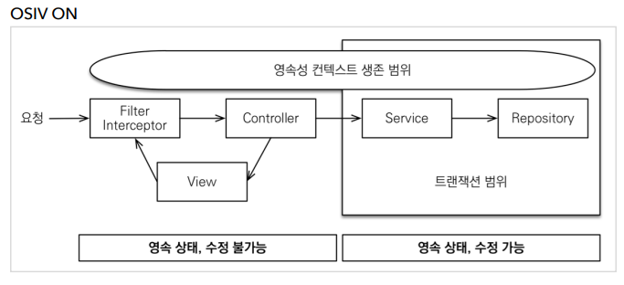
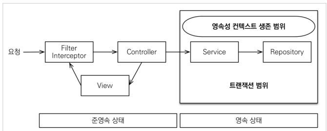

## OSIV와 성능 최적화

> Open Session In View: 하이버네이트
>
> Open EntityManager In View: JPA

- `spring.jpa.open-in-view` : true 기본값

- 언제 JPA가 DB 커넥션을 가져올까?
  - 트랜잭션 시작할 때, DB 커넥션을 가져옴
  - OSIV 전략은 트랜잭션 시작처럼 최초 데이터베이스 커넥션 시작 시점부터 API 응답이 **끝날 때 까지** 영속성 컨텍스트와 데이터베이스 커넥션을 유지
    - ex) 유저에게 완전히 response를 만들어 보낼때 까지
    - 그래서 지연 로딩이 가능
    - 지연 로딩은 영속성 컨텍스트가 살아있어야 하고, 영속성 컨텍스트는 기본적으로 DB커넥션을 유지함
  - 단점
    - 너무 오랜시간 DB 커넥션 리소스 사용
    - 실시간 트래픽이 중요한 애플리케이션에서 커넥션 부족으로 장애로 이어질 수 있음
    - ex) 외부 API를 호출하면 외부 API 대기 시간 만큼 커넥션 리소스를 반환하지 못하고, 유지

- OSIV OFF

  

  

  - OSIV를 끄면 트랜잭션을 종료할 때 영속성 컨텍스트를 닫고, 데이터베이스 커넥션도 반환
    - 커넥션 리소스를 낭비하지 않는다
  - OSIV를 끄면 모든 지연로딩을 트랜잭션 안에서 처리해야 한다
    - 지금까지 작성한 많은 지연 로딩 코드를 트랜잭션 안으로 넣어야 하는 단점이 있다
    - view template에서 지연로딩이 동작하지 않는다
  - 결론적으로 트랜잭션이 끝나기 전에 지연 로딩을 강제로 호출해 두어야 한다

- 커멘드와 쿼리 분리

  - 실무에서 OSIV를 끈 상태로 복잡성을 관리하는 좋은 방법
  - 복잡한 화면을 출력하기 위한 쿼리는 화면에 맞추어 성능을 최적화 하는 것이 중요
    - 보통 화면에 맞춘 로직은 라이프사이클이 빠름

  - 이 둘의 관심사를 명확하게 분리하는 선택은 유지보수 관점에서 충분히 의미 있다
    - 크고 복잡한 애플리케이션 개발 시
  - `OrderService`
    - `OrderService` : 핵심 비즈니스 로직
    - `OrderQueryService`: 화면이나 API에 맞춘 서비스 (주로 읽기 전용 트랜잭션 사용)

- 참고
  - 필자는 고객 서비스의 실시간 API는 OSIV를 끄고, ADMIN 처럼 커넥션을 많이 사용하지 않는 곳에서는 OSIV를 켠다.
