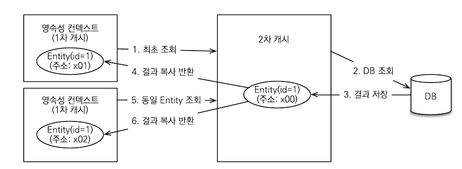
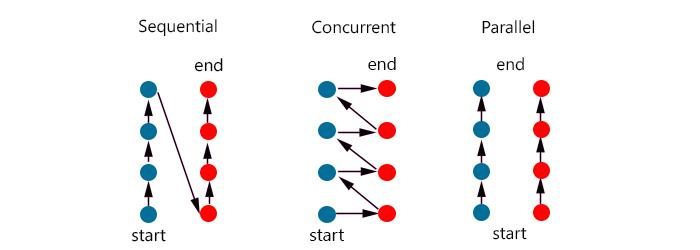

## 영속성 컨텍스트 

> 엔티티를 영구 저장하는 환경

- 특징

  - 영속성 컨텍스트는 논리적인 개념 -> 가상의 DB

  - 엔티티 매니저를 생성할 때 하나 만들어짐

  - 엔티티 매니저를 통해서 영속성 컨텍스트에 접근하고 관리할 수 있음
  - 식별자 값으로 엔티티를 구분
    - 엔티티는 반드시 식별자 값이 있어야 함

- 엔티티의 생명 주기
  - 비영속
    - 영속성 컨텍스트와 관계없는 새로운 상태
    - 엔티티 객체를 생성만 하고 영속성 컨텍스트에 저장하지 않은 상태
  - 영속
    - 객체를 `EntityManager`에 `persist()`로 넣음
    - 영속성 컨텍스트에 저장된 상태
    - 영속성 컨텍스트에 의해 관리
  - 준영속
    - 객체를 `EntityManager`에서 분리
      - `em.detach(member)`
      - `em.clear()`
      - `em.close()`
    - 영속성 컨텍스트에 저장(관리)되었다가 분리된 상태
    - 영속성 컨텍스트가 제공하는 어떠한 기능도 동작X
  - 삭제

- 장점
  - 1차 캐시
    - 영속 상태의 엔티티를 저장하는 곳
    - DB 조회 전 1차 캐시에서 먼저 조회
    - DB에서 조회한 데이터로 엔티티를 생성해 1차 캐시에 저장
      - 엔티티를 영속 상태로 만듦
  - 동일성 보장(`==`비교)
    - 한 트랜잭션에서 같은 인스턴스임을 보장
    - `REPETABLE READ` 등급의 트랜잭션 격리 수준을 애플리케이션에서 제공
      - 한 번 조회한 데이터를 반복해서 조회해도 같은 데이터가 조회된다.
  - 트랜잭션을 지원하는 쓰기 지연
    - 커밋하기 적전까지 내부 쿼리 저장소에 INSERT 쿼리를 모아둠
    - 커밋할 때 모아둔 쿼리를 DB에 보냄
    - DB 로우에 락이 걸리는 시간을 최소화
      - `commit()` 호출까지 락이 걸리는데
      - 쿼리를 보내고 바로 트랜잭션을 커밋
  - 변경 감지(dirty checking)
    - 영속 상태의 엔티티만 지원
    - 흐름
      1. 트랜잭션 커밋하면 엔티티 매니저 내부에서 플러시 호출
      2. 엔티티와 스냅샷을 비교하여 변경된 엔티티를 찾음
      3. 변경된 엔티티가 있으면 수정 쿼리를 생성해서 쓰기 지연 저장소에 저장
      4. 쓰기 지연 저장소 플러시
      5. DB 트랜잭션 커밋
    - 스냅샷 
      - 1차 캐시 안에는 `@Id` 와 `Entity`와 스냅샷이 있음
      - 최초로 영속성 컨텍스트에 들어왔을 때 JPA가 스냅샷을 떠둠
      - 커밋 시점에 스냅샷과 entity를 비교
  - 지연 로딩
    - 연관 관계가 매핑되어 있는 엔티티 조회시 프록시 반환

- `flush()`
  - 트랜잭션을 커밋하는 순간 영속성 컨텍스트에 새로 저장된 엔티티를 DB에 반영하는 것
  - 발생하는 경우
    - 직접` flush()` 사용
    - `commit()` 사용(자동 호출)
    - JPQL 사용(자동 호출)
  - 주의 사항
    - 영속성 컨텍스트를 비우지 않음
    - 영속성 컨텍스트의 변경 내용을 DB에 동기화

- `EntityManagerFactory`
  - DB당 하나 사용
  - Thread Safe 하지만 비용이 상당히 큼
  - 요청이 올 때 마다 `EntityManager` 생성
  - `EntityManager`는 Thread Safe하지 않음
    - 여러 스레드가 동시에 접근하면 동시성 문제 발생
      - 여러 스레드가 동시에 같은 인스턴스의 필드 값을 변경
    - (요청)스레드별로 한 개 씩 할당

- 2차 캐시

  - 실무에서는 잘 안쓴다고 함
  - 엔티티 수준만 캐시 가능
  - 실무에서는 API 통신을 하기 때문에 주로 DTO 단위로 캐싱

  

  - 애플리케이션 범위의 캐시(공유 캐시)
  - 애플리케이션을 종료할 때 까지 유지
  - 동시성 극대화를 위해 캐시 한 객체를 직접 반환하지 않고 복사본을 만들어서 반환
  - 여러 곳에서 같은 객체를 동시에 수정하는 동시성 문제 예방
  - 영속성 컨텍스트가 다르면 객체 동일성을 보장하지 않음
  - 사용법
    - Entity 객체 위에 `@Cacheable` 작성 + `application.yml` 수정
    - 등등

- 동시성 vs 병렬

  - | 동시성                                                     | 병렬성                                                    |
    | ---------------------------------------------------------- | --------------------------------------------------------- |
    | 동시에 실행되는 것 같이 보이는 것                          | 실제로 동시에 여러 작업이 처리되는 것                     |
    | 싱글 코어에서 멀티 쓰레드(Multi thread)를 동작 시키는 방식 | 멀티 코어에서 멀티 쓰레드(Multi thread)를 동작시키는 방식 |
    | 한번에 많은 것을 처리                                      | 한번에 많은 일을 처리                                     |
    | 논리적인 개념                                              | 물리적인 개념                                             |

​	