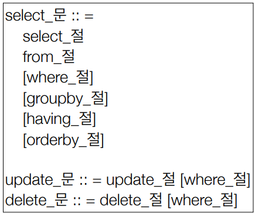

## 객체지향 쿼리 언어1 - 기초 문법

- **JPQL**

  - JPA는 SQL을 추상화한 JPQL이라는 객체 지향 쿼리 언어 제공

  - 테이블이 아니라 엔티티 객체를 대상으로 쿼리

  - 특정 DB SQL에 의존 X

  - 애플리케이션에 필요한 데이터만 DB에서 불러오려면 결국 검색 조건이 포함된 SQL 필요

    ```java
    //검색
    String jpql = "select m from Member m where m.age > 18";
    List<Member> result = em.createQuery(jpql, Member.class)
        .getResultList();
    ```

- **Criteria**

  - 잘 안씀

  ```java
  //Criteria 사용 준비
  CriteriaBuilder cb = em.getCriteriaBuilder();
  CriteriaQuery<Member> query = cb.createQuery(Member.class); 
  //루트 클래스 (조회를 시작할 클래스)
  Root<Member> m = query.from(Member.class); 
  //쿼리 생성
  CriteriaQuery<Member> cq = 
      query.select(m).where(cb.equal(m.get("username"), “kim”));
  List<Member> resultList = em.createQuery(cq).getResultList();
  
  ```

- **QueryDSL**

  - 문자가 아닌 자바코드로 JPQL을 작성할 수 있음
  - JPQL 빌더 역할
  - 컴파일 시점에 문법 오류를 찾을 수 있음
  - 동적쿼리 작성 편리함
  - 단순하고 쉬움, 실무 사용 권장

  ```java
  //JPQL
  //select m from Member m where m.age > 18
  
  JPAFactoryQuery query = new JPAQueryFactory(em);
  QMember m = QMember.member;
  
  List<Member> list = 
      query.selectFrom(m)
      .where(m.age.gt(18))
      .orderBy(m.name.desc())
      .fetch();
  ```

- **네이티브 SQL 소개**

  - JPA가 제공하는 SQL을 직접 사용하는 기능

  - 특정 DB에 의존적인 기능

    ```java
    String sql = 
        “SELECT ID, AGE, TEAM_ID, NAME FROM MEMBER WHERE NAME = ‘kim’";
    
    List<Member> resultList = 
        em.createNativeQuery(sql, Member.class).getResultList();
    ```

- **JDBC 직접 사용, SpringJdbcTemplate 등**

  - 영속성 컨텍스트를 적절한 시점에 강제로 플러시 필요
    - flush는 commit할 때, query날릴 때 호출
  - JPQL로 해결할 수 없는 복잡한 쿼리


- **JPQL - 기본 문법과 기능**

  

  - 문법

    - 엔티티와 속성은 대소문자 구분 O
    - JPQL 키워드는 대소문자 구분X
    - 엔티티 이름 사용(테이블 이름 X)
    - 별칭은 필수( as는 생략가능 )

  - `TypeQuery`, `Query`

    - `TypeQuery` : 반환 타입이 명확할 때

    - `Qeury` : 반환 타입이 명확하지 않을 때

      ```java
      TypedQuery<Member> query =
          em.createQuery("SELECT m FROM Member m", Member.class);
      
      Query query = 
          em.createQuery("SELECT m.username, m.age from Member m");
      ```

  - 결과 조회 API

    - `query.getResultList()`: 결과가 하나 이상일 때, 리스트 반환 
      - 결과가 없으면 빈 리스트 반환
    - `query.getSingleResult()`: 결과가 정확히 하나, 단일 객체 반환
      - 결과가 없으면: `javax.persistence.NoResultException`
      - 둘 이상이면: `javax.persistence.NonUniqueResultException`

  - 파라미터 바인딩 - 이름 기준, 위치 기준

    - 위치 기반은 쓰지말자

    ```JAVA
    // 이름 기반 바인딩
    
    Member result = em.createQuery("SELECT m FROM Member m where m.username=:username", Member.class)
        .setParameter("username", usernameParam)
        .getSingleResult();
    ```

    

- **프로젝션**

  - SELECT 절에 조회할 대상을 지정하는 것
  - 프로젝션 대상: 엔티티, 임베디드 타입, 스칼라 타입
  - 엔티티 프로젝션 결과는 모두 영속성 컨텍스트에서 관리됨
  - DISTINCT로 중복 제거

- **프로젝션 - 여러 값 조회**

  - `SELECT m.username, m.age FROM Member m`

  1. Query 타입으로 조회

  2. Object[] 타입으로 조회 

  3. new 명령어로 조회

     - 단순 값을 DTO로 바로 조회
       - `SELECT new jpabook.jpql.UserDTO(m.username, m.age) FROM  Member m`

     - 패키지 명을 포함한 전체 클래스 명 입력

     - 순서와 타입이 일치하는 생성자 필요


- 페이징 API

  - `setFirstResult(int startPosition)` : 조회 시작 위치(0부터 시작)

  - `setMaxResults(int maxResult)` : 조회할 데이터 수

    ```java
    //페이징 쿼리
    String jpql = "select m from Member m order by m.name desc";
    List<Member> resultList = em.createQuery(jpql, Member.class)
        .setFirstResult(10)
        .setMaxResults(20)
        .getResultList();
    ```

    

- 조인

  - 내부 조인
    - `SELECT m FROM Member m [INNER] JOIN m.team t`
  - 외부 조인
    - `SELECT m FROM Member m LEFT [OUTER] JOIN m.team t`
  - 세타 조인
    - `select count(m) from Member m, Team t where m.username  = t.name`

- **조인 - ON 절**

  1. 조인 대상 필터링

     ```java
     // 회원과 팀을 조인하면서, 팀 이름이 A인 팀만 조인
     JPQL:
     SELECT m, t FROM Member m LEFT JOIN m.team t on t.name = 'A' 
         
     SQL:
     SELECT m.*, t.* FROM 
     Member m LEFT JOIN Team t ON m.TEAM_ID=t.id and t.name='A'
     ```

  2. 연관관계 없는 엔티티 외부 조인(하이버네이트 5.1부터)

     ```java
     // 회원의 이름과 팀의 이름이 같은 대상 외부 조인
     JPQL:
     SELECT m, t FROM
     Member m LEFT JOIN Team t on m.username = t.name
         
     SQL:
     SELECT m.*, t.* FROM 
     Member m LEFT JOIN Team t ON m.username = t.name
     ```

     

- **서브 쿼리**

  - 지원 함수

    - `[NOT] EXISTS (subquery)`: 서브쿼리에 결과가 존재하면 참
    - `{ALL | ANY | SOME} (subquery)`
    - `ALL` : 모두 만족하면 참
    - `ANY`, `SOME`: 같은 의미, 조건을 하나라도 만족하면 참
    - `[NOT] IN (subquery)`: 서브쿼리의 결과 중 하나라도 같은 것이 있으면 참

  - 예제

    ```java
    팀A 소속인 회원
    select m from Member m
    where exists (select t from m.team t where t.name = ‘팀A')
    
    전체 상품 각각의 재고보다 주문량이 많은 주문들
    select o from Order o 
    where o.orderAmount > ALL (select p.stockAmount from Product p) 
    
    어떤 팀이든 팀에 소속된 회원
    select m from Member m 
    where m.team = ANY (select t from Team t)
    ```

  - 한계

    - JPA는 WHERE, HAVING 절에서만 서브 쿼리 사용 가능
      - 표준 스펙에서
    - SELECT 절도 가능
      - 하이버네이트에서 직원
    - FROM 절의 서브 쿼리는 현재 JPQL에서 불가능
      - 인라인 쿼리
      - 대부분 조인으로 할 수 있지만 정 안되는 경우 포기
        - 쿼리를 나누어 사용하거나 네이티브 쿼리 사용하는 경우도 있음
    - 하이버네이트6 부터는 FROM 절의 서브 쿼리를 지원!


- JPQL 타입 표현
  - 문자: ‘HELLO’, ‘She’’s’
  - 숫자: 10L(Long), 10D(Double), 10F(Float)
  - Boolean: TRUE, FALSE
  - ENUM: jpabook.MemberType.Admin (패키지명 포함)
  - 엔티티 타입: TYPE(m) = Member (상속 관계에서 사용)

- JPQL 기타

  - SQL과 문법이 같은 식
  - EXISTS, IN
  - AND, OR, NOT
  - =, >, >=, <, <=, <>
  - BETWEEN, LIKE, IS NULL

- 조건식 - CASE 식

  - `COALESCE` : 하나씩 조회해서 null이 아니면 반환

    ```java
    // 사용자 이름이 없으면 이름 없는 회원을 반환
    select coalesce(m.username,'이름 없는 회원') from Member m
    ```

  - `NULLIF` : 두 값이 같으면 null 반환, 다르면 첫번째 값 반환

    ```java
    // 사용자 이름이 ‘관리자’면 null을 반환하고 나머지는 본인의 이름을 반환
    select NULLIF(m.username, '관리자') from Member m
    ```

    

- JPQL 기본 함수

  - CONCAT
    - 문자를 더함
    - `'A' || 'B'` 로도 더할 수 있음
  - SUBSTRING
    - 문자열 잘라냄
  - TRIM
    - 공백 등 제거
  - LOWER, UPPER
  - LENGTH
  - LOCATE
    - 문자의 위치
  - ABS, SQRT, MOD
  - SIZE, INDEX(JPA 용도)
    - SIZE : 컬렉션 크기
    - INDEX : 값 타입 컬렉션에서 위치 구하기 - 쓰지말자

- 사용자 정의 함수 호출

  - 하이버네이트는 사용전 방언에 추가해야 함

    - 사용하는 DB 방언을 상속받고, 사용자 정의 함수를 등록

    ```java
    select function('group_concat', i.name) from Item i
    ```

    