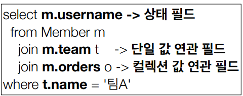

## 객체지향 쿼리 언어2 - 중급 문법

- **경로 표현식**

  - 점을 찍어 객체 그래프를 탐색하는 것

  

  - 용어 정리

    - 상태 필드(state field): 단순히 값을 저장하기 위한 필드 (ex: m.username)
    - 연관 필드(association field): 연관관계를 위한 필드
    - 단일 값 연관 필드: `@ManyToOne`, `@OneToOne`, 대상이 엔티티(ex: m.team)
    - 컬렉션 값 연관 필드: `@OneToMany`, `@ManyToMany`, 대상이 컬렉션(ex: m.orders)

  - 특징

    - 상태 필드(state field): 경로 탐색의 끝, 탐색X

    - 단일 값 연관 경로: 묵시적 내부 조인(inner join) 발생, 탐색O

      ```java
      JPQL: select o.member from Order o
      
      SQL:
      select m.* 
          from Orders o 
          inner join Member m on o.member_id = m.id
      
      ```

      

    - 컬렉션 값 연관 경로: 묵시적 내부 조인 발생, 탐색X

      - FROM 절에서 명시적 조인을 통해 별칭을 얻으면 별칭을 통 해 탐색 가능

    - 실무에서 묵시적 내부 조인은 사용하지 말자

      - JPQL과 SQL을 맞추자

- **명시적 조인, 묵시적 조인**

  - 명시적 조인: join 키워드 직접 사용
  - 묵시적 조인: 경로 표현식에 의해 묵시적으로 SQL 조인 발생 (내부 조인만 가능)

- **경로 표현식 - 예제**

  ```java
  • select o.member.team
  	from Order o -> 성공
  • select t.members from Team -> 성공
  • select t.members.username from Team t -> 실패(컬렉션 탐색 불가)
  • select m.username from Team t join t.members m -> 성공
  ```

- **경로 탐색을 사용한 묵시적 조인 시 주의사항**

  - 항상 내부 조인
  - 컬렉션은 경로 탐색의 끝, 명시적 조인을 통해 별칭을 얻어야함
  - 경로 탐색은 주로 SELECT, WHERE 절에서 사용하지만 묵시 적 조인으로 인해 SQL의 FROM (JOIN) 절에 영향을 줌


- **페치 조인( fetch join)**

  - SQL 조인 종류 X
  - JPQL에서 성능 최적화를 위해 제공하는 기능
  - 연관된 엔티티나 컬렉션을 SQL 한 번에 함께 조회하는 기능
  - 일반 조인 실행시는 연관된 엔티티를 함께 조회하지 않음

- **엔티티 페치 조인**

  - 회원 뿐만 아니라 팀도 함께 SELECT

    ```java
    [JPQL]
    select m from Member m join fetch m.team
        
    [SQL]
    SELECT M.*, T.* FROM MEMBER M
    INNER JOIN TEAM T ON M.TEAM_ID=T.ID
    ```

  -  지연로딩으로 세팅해도 페치 조인이 우선

- **컬렉션 페치 조인**

  ```JAVA
  [JPQL]
  select t
  from Team t join fetch t.members
  where t.name = ‘팀A'
      
  [SQL]
  SELECT T.*, M.*
  FROM TEAM T
  INNER JOIN MEMBER M ON T.ID=M.TEAM_ID
  WHERE T.NAME = '팀A'
  ```

- **페치 조인과 DISTINCT**
  - JPQL의  DISTINCT 2가지 기능 제공
    1. SQL에 DISTINCT를 추가
    2. 애플리케이션에서 엔티티 중복 제거
  - 같은 식별자를 지닌 엔티티 제거
  - 일대다는 개수 뻥튀기에 주의
  - 다대일은 개수 주의 안해도 됨 어짜피 1개

- **하이버네이트6 변경 사항**

  - DISTINCT 명령어를 사용하지 않아 도 애플리케이션에서 중복 제거가 자동으로 적용

- **페치 조인과 일반 조인의 차이**

  - 페치 조인을 사용할 때만 연관된 엔티티도 함께 조회(즉시 로딩)
  - 페치 조인은 객체 그래프를 SQL 한번에 조회하는 개념
  - N+1 대부분 문제를 해결할 수 있음

- **페치 조인의 특징과 한계**

  - 페치 조인 대상에는 별칭을 줄 수  없다
    - 일관성이 깨져서 문제가 발생할 수 있음
    - 조건절으로 일부 엔티티만 가져오지 않음
    - 하이버네이트는 가능, 가급적 사용X
  - 둘 이상의 컬렉션은 페치 조인 할 수 없다. 
    - 하나만 지정할 수 있다.
  - 컬렉션을 페치 조인하면 페이징 API(setFirstResult,  setMaxResults)를 사용할 수 없다.
    - 일대일, 다대일 같은 단일 값 연관 필드들은 페치 조인해도 페이징 가능
      - 데이터 뻥튀기가 되지 않기 때문
    - 데이터가 뻥튀기 됐을 때, 정확하게 데이터를 가져오지 못함
    - 하이버네이트는 경고 로그를 남기고 메모리에서 페이징(매우 위험)

- **BatchSize 사용**

  - LAZY로딩을 할 때,` List<Team>` result는 최대 100개씩 넘겨받게 됨

  ```java
  //Team.java
  @BatchSize(size = 100)
  @OneToMany(mappedBy = "team")
  List<Member> members = new ArrayList<Member>();
  ```

  ```xml
  // persistence.xml
  <property name="hibernate.default_batch_fetch_size" value="100" />
  ```

- **페치 조인 - 정리**

  - 모든 것을 페치 조인으로 해결할 수는 없음

  - 페치 조인은 객체 그래프를 유지할 때 사용하면 효과적

  - 복잡한 조인 등으로 엔티티가 가진 모양과 전혀 다른 결과를 내야 하면,

    일반 조인을 사용하고 필요한 데이터들만 조회해서 DTO로 반환하는 것이 효과


- **다형성 쿼리**

  - TYPE

    - 조회 대상을 특정 자식으로 한정

    ```java
    [JPQL]
    select i from Item i
    where type(i) IN (Book, Movie)
        
    [SQL]
    select i from i
    where i.DTYPE in (‘B’, ‘M’)
    ```

  - TREAT(JPA 2.1)

    - 자바의 타입 캐스팅과 유사
    - 상속 구조에서 부모 타입을 특정 자식 타입으로 다룰 때 사용
    - FROM, WHERE, SELECT(하이버네이트 지원) 사용

    ```java
    // 부모인 Item과 자식 Book이 있다.
    [JPQL]
    select i from Item i
    where treat(i as Book).author = ‘kim’
        
    [SQL]
    select i.* from Item i
    where i.DTYPE = ‘B’ and i.author = ‘kim'
    ```


- **JPQL 엔티티 직접 사용 - 기본 키 값**

  - JPQL에서 엔티티를 직접 사용하면 SQL에서 해당 엔티티의 기본 키 값을 사용

  ```java
  [JPQL]
  select count(m.id) from Member m //엔티티의 아이디를 사용
  select count(m) from Member m //엔티티를 직접 사용
      
  [SQL](JPQL 둘다 같은 다음 SQL 실행)
  select count(m.id) as cnt from Member m
  ```

  - 엔티티를 파라미터로 전달

    ```java
    String jpql = “select m from Member m where m = :member”;
    List resultList = em.createQuery(jpql) 
        .setParameter("member", member)
        .getResultList();
    ```

  - 식별자를 직접 전달

    ```java
    String jpql = “select m from Member m where m.id = :memberId”;
    List resultList = em.createQuery(jpql) 
        .setParameter("memberId", memberId)
        .getResultList();
    ```

  - 실행된 SQL

    ```java
    select m.* from Member m where m.id=?
    ```


- **JPQL 엔티티 직접 사용 - 외래 키 값**

  - 엔티티를 파라미터로 전달

    ```java
    Team team = em.find(Team.class, 1L);
    String qlString = “select m from Member m where m.team = :team”;
    List resultList = em.createQuery(qlString)
        .setParameter("team", team)
        .getResultList();
    ```

  - 식별자를 직접 전달

    ```java
    String qlString = “select m from Member m where m.team.id = :teamId”;
    List resultList = em.createQuery(qlString)
        .setParameter("teamId", teamId)
        .getResultList(); 
    ```

  - 실행된 SQL

    ```java
    select m.* from Member m where m.team_id=?
    ```


- **Name 쿼리 - 정적 쿼리**
  - 미리 정의해서 이름을 부여해두고 사용하는 JPQL
  - 어노테이션, XML에 정의
  - 애플리케이션 로딩 시점에 초기화 후 재사용
    - 로딩할 때 파싱 후 캐싱해서 가지고 있음
    - 로딩시에 한 번 파싱하므로 비용이 적다
  - **애플리케이션 로딩 시점에 쿼리를 검증**

- **Named 쿼리 - 어노테이션**

  - 로딩시점에 쿼리가 잘못되면 컴파일 에러가 남

  ```java
  @Entity
  @NamedQuery(
      name = "Member.findByUsername",
      query="select m from Member m where m.username = :username")
  public class Member {
      ...
  }
  ----------------------------------------
  List<Member> resultList = 
      em.createNamedQuery("Member.findByUsername", Member.class)
      .setParameter("username", 
                    "회원1")
      .getResultList();
  
  ```

- **Named 쿼리 - XML**

  ```xml
  // [META-INF/persistence.xml]
  <persistence-unit name="jpabook" >
      <mapping-file>META-INF/ormMember.xml</mapping-file>
  ```

  ```xml
  // [META-INF/ormMember.xml]
  <?xml version="1.0" encoding="UTF-8"?>
  <entity-mappings xmlns="http://xmlns.jcp.org/xml/ns/persistence/orm" version="2.1">
      <named-query name="Member.findByUsername">
          <query><![CDATA[
   select m
   from Member m
   where m.username = :username
   ]]></query>
      </named-query>
      <named-query name="Member.count">
          <query>select count(m) from Member m</query>
      </named-query>
  </entity-mappings>
  ```

- **Named 쿼리 환경에 따른 설정**
  - XML이 항상 우선권을 가진다
  - 애플리케이션 운영 환경에 따라 다른 XML을 배포할 수 있다


- **벌크 연산**

  - 재고가 10개 미만인 모든 상품의 가격을 10% 상승하려면?
  - JPA 변경 감지 기능으로 실행하려면 너무 많은 SQL 실행

- **벌크 연산 예제**

  - 쿼리 한 번으로 여러 테이블 로우 변경(엔티티)
  - `executeUpdate()`의 결과는 영향받은 엔티티 수 반환
  - UPDATE, DELETE 지원
  - INSERT(insert into .. select, 하이버네이트 지원)

  ```java
  String qlString = "update Product p " +
      "set p.price = p.price * 1.1 " + 
      "where p.stockAmount < :stockAmount"; 
  int resultCount = em.createQuery(qlString)
      .setParameter("stockAmount", 10) 
      .executeUpdate();
  ```

- **벌크 연산 주의**
  - 벌크 연산은 영속성 컨텍스트를 무시하고 DB에 직접 쿼리
  - 벌크 연산 변환은 영속성 컨텍스트를 바꾸지 않음
  - 조회할 시 영속성 컨텍스트에 있는 것을 꺼내 오기 때문에 정합성이 안맞을 수 있다.
  - 해결책 2가지
    - 벌크 연산을 먼저 실행
    - 벌크 연산 수행 후 영속성 컨텍스트 초기화