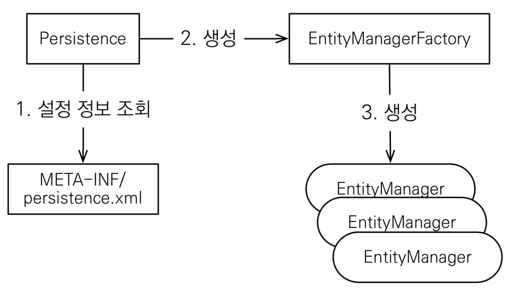

## JPA 시작하기

- JPA 하이버네이트 라이브러리

  - JPA 관련된 파일 포함됨

- JPA 설정하기

  - `resources/META-INF/persistence.xml`
  - `persistence-unit` : name으로 이름 지정
  - `property` : value로 위치나 옵션(true, false) 설정

- DB 방언

  - SQL별로 표준을 지키지 않은 *데이터베이스*만의 고유한 기능
  - `hibernate.dialect` 속성에 지정

- JPA 구동 방식

  

- 객체와 테이블을 생성하고 매핑

  `@Entity` : JPA가 관리할 객체

  `@Id` : `PK`

- 주의
  - `EntityManagerFactory` : 하나만 생성해서 애플리케이션 전체에서 공유
  - `Entity Manager` : 쓰레드간 공유X(사용하고 버려야함)
  - JPA의 모든 데이터 변경은 트랜젝션 안에서 실행
- JPQL
  - SQL을 추상화한 객체 지향 쿼리
  - 특정 DB SQL에 의존 X
  - 엔티티 객체를 대상으로 쿼리
  - SQL은 DB 테이블을 대상으로 쿼리