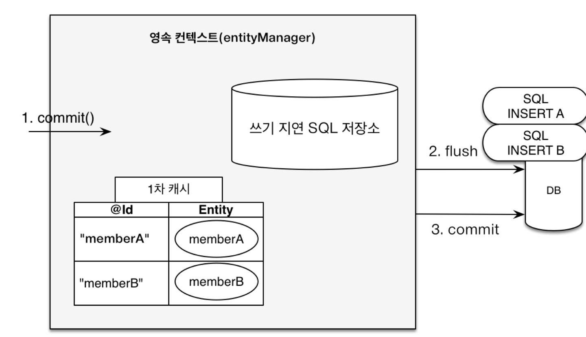
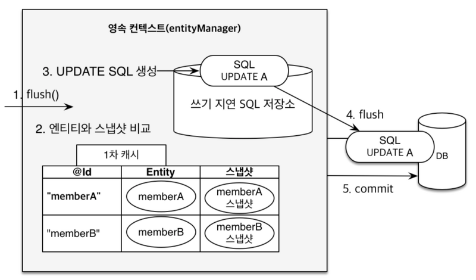

## 영속성 관리 - 내부 동작 방식

- **영속성 컨텍스트**

  - 엔티티를 영구 저장하는 환경
  - 영속성 컨텍스트는 논리적인 개념

- 엔티티의 생명 주기

  - 비영속
    - 영속성 컨텍스트와 관계없는 새로운 상태
    - 객체를 생성만함
  - 영속
    - 객체를 `EntityManager`에 `persist()`로 넣음
  - 준영속
    - 객체를 `EntityManager`에서 분리
  - 삭제

- **영속성 컨텍스트의 이점**

  - 1차 캐시

    - 조회를 하면 DB보다 캐시에서 먼저 조회
    - 한 트랜잭션 안에서 확보
    - 영속성 상태

  - 동일성 보장( `==`비교 )

    - 반복 가능한 읽기 등급의 트랜잭션 격리 수준을 애플리케이션 차원에서 제공
      - DB수준 X

  - 트랜잭션을 지원하는 쓰기 지연

    - 커밋까지 insert문을 모아뒀다가 한번에 보냄

    

  - 변경 감지

    - 스냅샷: 값을 읽어온 최초 시점 데이터

    

  - 지연 로딩

- 플러시
  - 영속성 컨텍스트의 변경 내역을 DB에 동기화
  - 발생하면
    - 변경 감지
    - 수정된 엔티티 쓰기 지연 SQL 저장소에 등록
    - 쓰기 지연 SQL 저장소의 쿼리를 DB에 전송
  - 영속성 컨텍스트를 비우지 않음
  - 트랜잭션이라는 작업 단위가 중요
    - 커밋 직전에만 동기화하면 됨

- 준영속 상태
  - 영속상태의 엔티티가 영속성 컨텍스트에서 분리(`detatched`)
  - 만드는 방법
    - `em.detatch(entity)` : 특정 엔티티만 분리
    - `em.clear()` : 영속성 컨텍스트 초기화
    - `em.close()` : 영속성 컨텍스트 종료