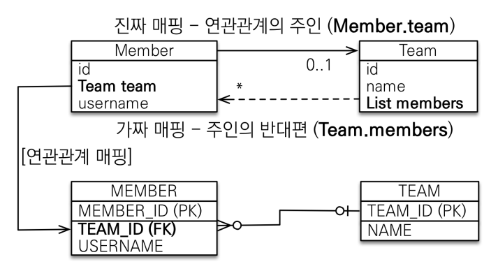
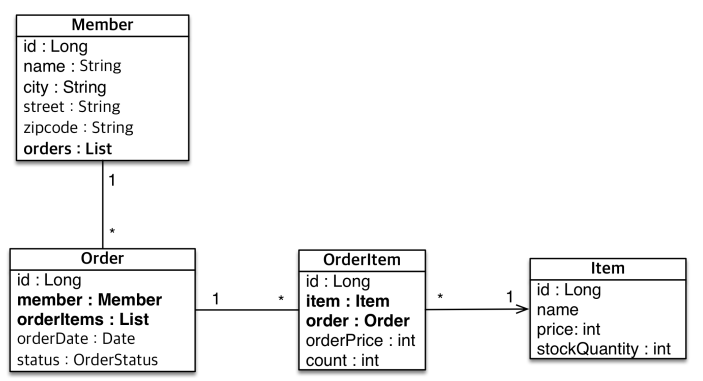

## 연관관계 매핑 기초

- **객체를 테이블에 맞추어 모델링**

  - 참조 대신에 외래키를 그대로 사용

    ```java
    @Entity
    public class Member { 
        @Id @GeneratedValue
        private Long id;
        @Column(name = "USERNAME")
        private String name;
        @Column(name = "TEAM_ID")
        private Long teamId; 
        … 
    } 
    @Entity
    public class Team {
        @Id @GeneratedValue
        private Long id;
        private String name; 
        … 
    }
    
    ```

  - 외래 키 식별자를 직접 다룸

    ```java
    //팀 저장
    Team team = new Team();
    team.setName("TeamA");
    em.persist(team);
    //회원 저장
    Member member = new Member();
    member.setName("member1");
    member.setTeamId(team.getId());
    em.persist(member);
    
    ```

  - 식별자로 다시 조회, 객체 지향적이지 않음

    ```java
    //조회
    Member findMember = em.find(Member.class, member.getId()); 
    //연관관계가 없음
    Team findTeam = em.find(Team.class, team.getId());
    ```

  - 객체를 테이블에 맞추어 데이터 중심 모델링하면, 협력 관계를 만들 수 없음
    - 테이블은 외래 키로 조인을 사용해서 연관된 테이블을 찾는다.  
    - 객체는 참조를 사용해서 연관된 객체를 찾는다.

- **객체 지향 모델링**

  - 객체의 참조와 테이블의 외래키를 매핑

    ```java
    @Entity
    public class Member { 
        @Id @GeneratedValue
        private Long id;
        
        @Column(name = "USERNAME")
        private String name;
        
        private int age;
    
        @ManyToOne
        @JoinColumn(name = "TEAM_ID")
        private Team team;
    ```

  - 연관 관계 저장

    ```java
    //팀 저장
    Team team = new Team();
    team.setName("TeamA");
    em.persist(team);
    //회원 저장
    Member member = new Member();
    member.setName("member1");
    member.setTeam(team); //단방향 연관관계 설정, 참조 저장
    em.persist(member);
    
    ```

  - 참조로 연관관계 조회 - 객체 그래프 탐색

    ```java
    //조회
    Member findMember = em.find(Member.class, member.getId()); 
    //참조를 사용해서 연관관계 조회
    Team findTeam = findMember.getTeam();
    /** 여러번 조회하면 쿼리가 나가지 않음
    1차 캐시에 저장되어 있기 때문에 캐시에서 꺼내어서 사용 
    트랜잭션이 끝나면 1차 캐시는 지워진다.**/
    ```


- **양방향 연관관계와 연관관계의 주인**

  - 테이블의 연관관계는 FK가 있으면 양방향 접근 가능
  - 객체 연관관계는 양방향으로 매핑을 해주어야 함

- **양방향 매핑**

  - 객체와 테이블이 양방향 관계를 맺는 차이

    - 객체 : 단방향 연관관계 2개
    - 테이블 : 양방향 연관관계 1개

  - 양방향 매핑 규칙

    - 객체의 두 관계 중 하나만 주인으로 지정
    - 연관관계의 주인만이 외래 키 관리(등록, 수정)
    - 주인이 아니면 읽기만 가능
    - 주인은 `mappedBy` 속성 사용 X
    - 주인이 아니면 `mappedBy` 속성으로 주인 지정
    - mappedBy쪽에 값을 넣어도 안들어감(읽기만 가능하기 때문)

  - 누구를 주인으로 ?

    - 외래 키가 있는 곳을 주인으로 정하자

    - 주로 N이 연관관계 주인(FK를 가짐)

    - `Member.team`이 연관관계 주인

      

  - `mappedBy` : ~에 의해 매핑이 되었다는 뜻


- **양방향 매핑시 가장 많이 하는 실수**

  - 연관관계의 주인에 값을 입력하지 않음

    ```java
    Team team = new Team();
     team.setName("TeamA");
     em.persist(team);
    
     Member member = new Member();
     member.setName("member1");
    
     //역방향(주인이 아닌 방향)만 연관관계 설정
     team.getMembers().add(member);
     em.persist(member);
    // 외래키가 null이 됨
    ```

  - 순수한 객체 관계를 고려하면 항상 양쪽 다 값을 입력해야 함

    ```java
    Team team = new Team();
    team.setName("TeamA");
    em.persist(team);
    
    Member member = new Member();
    member.setName("member1");
    
    team.getMembers().add(member); 
    //연관관계의 주인에 값 설정
    member.setTeam(team); //**
    
    em.persist(member);
    ```

  - 양쪽 다 값을 입력해야하는 이유

    - team생성하면 영속성 컨텍스트의 1차 캐시에 team이 올라간다.
    - `flush()`와 `clear()`를 안해주면 team 조회시, 빈 team을 1차 캐시에서 가져옴
    - 테스트시 결과가 이상해지기도 함

  - 연관관계 편의 메소드를 생성하자

    ```java
    public void changeTeam(Team team) {
    	this.team = team;
    	team.getMembers().add(this);
    }
    // set이아니라 change를 쓰는 이유는 자바 관례에 의해서
    // setter로 쓰는게 아닌 중요한 로직을 한다는 것을 나타낼 수 있음
    ```

  - 양방향 매핑시에 무한 루프를 조심하자
    - ex) `toString()`, `lombok`, `JSON 생성 라이브러리`


- **양방향 매핑 정리**
  - 단방향 매핑만으로도 이미 연관관계 매핑은 완료
  - 양방향 매핑은 역방향으로 탐색할 일이 있을 때
  - 단방향 매핑을 잘하면 양방향 매핑은 추가해도 됨


- **객체 구조 - 참조를 사용하도록 변경**

  

  - 최대한 단방향으로 설계를 하면 대부분 가능함
  - 양방향으로 해야할 때도 있다