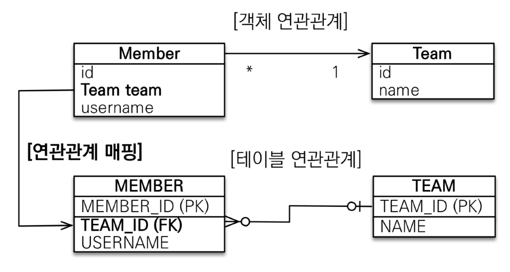
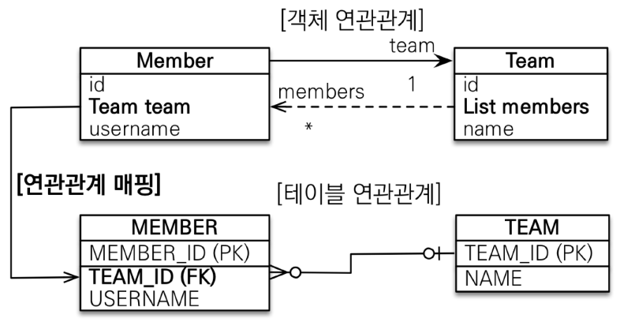
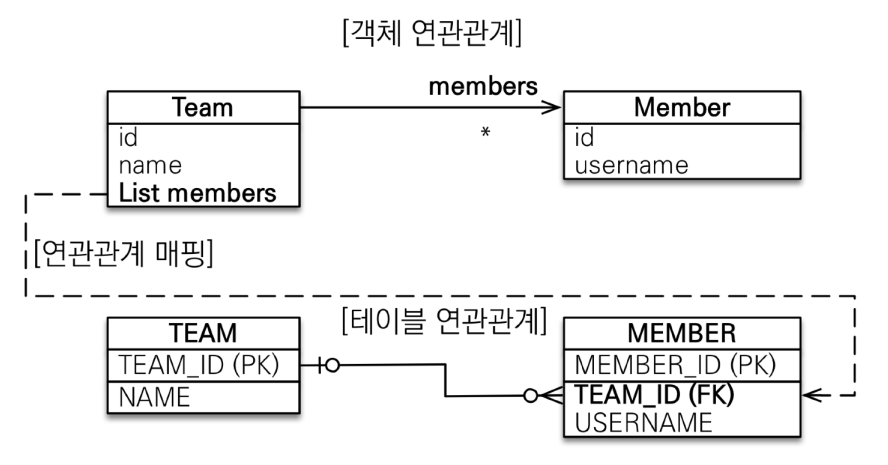
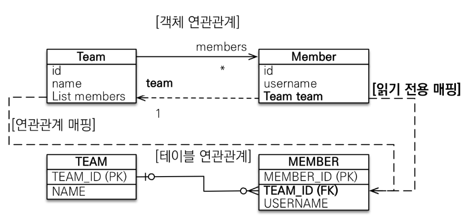
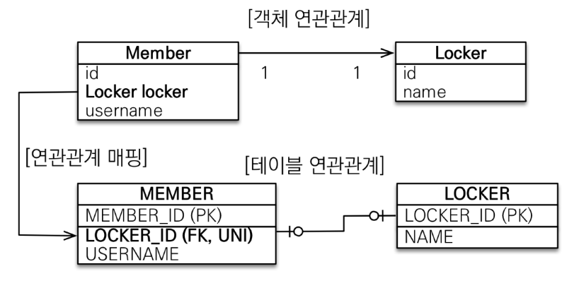
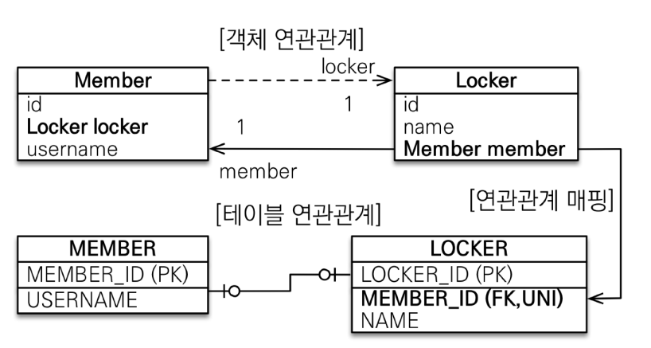

## 다양한 연관관계 매핑

- **연관관계 매핑시 고려사항 3가지**
  - 다중성
    - 다대다, 일대다, 일대일, 다대다
  - 단방향, 양방향
  - 연관관계 주인

- **다대일 [N:1]**

  - **다대일 단방향**

    

  - **다대일 양방향**

    

- 일대다 [1:N]

  - 권장하지 않음

  - update 쿼리를 두 번 날려야 해서 성능이 조금 떨어짐

  - team 엔티티를 손대도 member 엔티티가 업데이트됨

    - 혼란

    

- **일대다 단방향 정리**
  - 일대다에서 일이 연관관계 주인
  - 테이블은 항상 다 쪽에 외래키가 있음
  - 객체와 테이블의 차이 때문에 반대편 테이블의 외래 키를 관리하는 특이한 구조
  - `@JoinColumn`을 꼭 넣어주어야 함
    - 그렇지 않으면 조인 테이블 방식을 사용함(중간에 테이블을 하나 추가함)
  - 단점
    - 엔티티가 관리하는 외래 키가 다른 테이블에 있음
    - 연관관계 관리를 위해 추가로 UPDATE SQL 실행
  - **다대일 양방향 매핑**을 사용하자
    - 객체 지향적으로 손해를 보더라도...

- **일대다 양방향**

  - 공식 존재 X
  - `@JoinColumn(insertable=false, updatable=false)`
  - 읽기 전용 필드를 사용해서 양방향 처럼 사용하는 방법

  

- **일대일 [1:1]**

  - 주 테이블이나 대상 테이블 중에 외래 키 선택 가능
  - 외래 키에 DB 유니크(UNI) 제약조건 추가

- **일대일 : 주 테이블에 외래 키 단방향**

  - 외래키가 있는 곳이 연관관계 주인
  - 반대편은 `mappedBy`

  

- **일대일 : 대상 테이블에 외래 키 단방향**

  - JPA 지원X

- **일대일 :  대상 테이블에 외래 키 양방향**

  

- **외래키를 어디 두면 좋을까**
  - 개발자 입장에서는 Member에 두는게 좋음
    - Member객체가 자주 조회되고 Locker도 함께 가져오기 때문
    - 테이블은 Locker에 외래키가 있음
    - JPA에서는 양방향 걸면 됨

- **일대일 정리**
  - 테이블에 외래 키
    - 주 객체가 대상 객체의 참조를 가지는 것 처럼 주 테이블에 외래 키를 두고 대상 테이블을 찾음
    - 객체지향 개발자 선호
    - JPA 매핑 편리
    - 장점: 주 테이블만 조회해도 대상 테이블에 데이터가 있는지 확인 가능
    - 단점: 값이 없으면 외래 키에 null 허용
  - 대상 테이블에 외래 키
    - 대상 테이블에 외래 키가 존재
    - 전통적인 데이터베이스 개발자 선호
    - 장점: 주 테이블과 대상 테이블을 일대일에서 일대다 관계로 변경할 때 테이블 구조 유지
    - 단점: 프록시 기능의 한계로 **지연 로딩으로 설정해도 항상 즉시 로딩**됨

- **다대다 [N:M]**
  - RDB는 정규화된 테이블 2개로 다대다 표현할 수 없음
  - 연결 테이블을 추가해서 일대다, 다대일 관계로 풀어내야 함
  - 객체는 컬렉션을 사용해서 객체 2개로 다대다 관계 가능
    - 실무에서 사용하지 말자
    - 연결 테이블이 단순히 연결만 하고 끝나지 않음(값 추가 불가)
    - 쿼리가 이상해짐
    - 연결 테이블을 엔티티로 승격 시키자