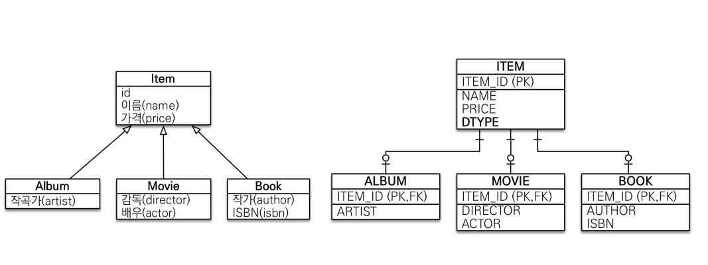
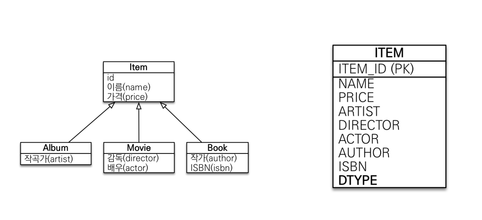
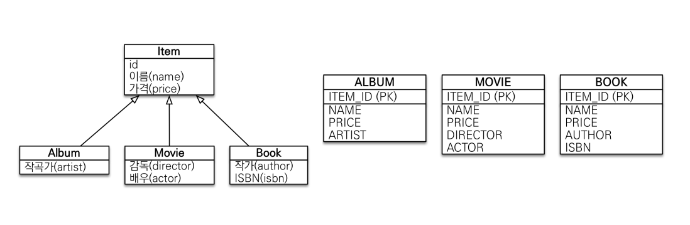
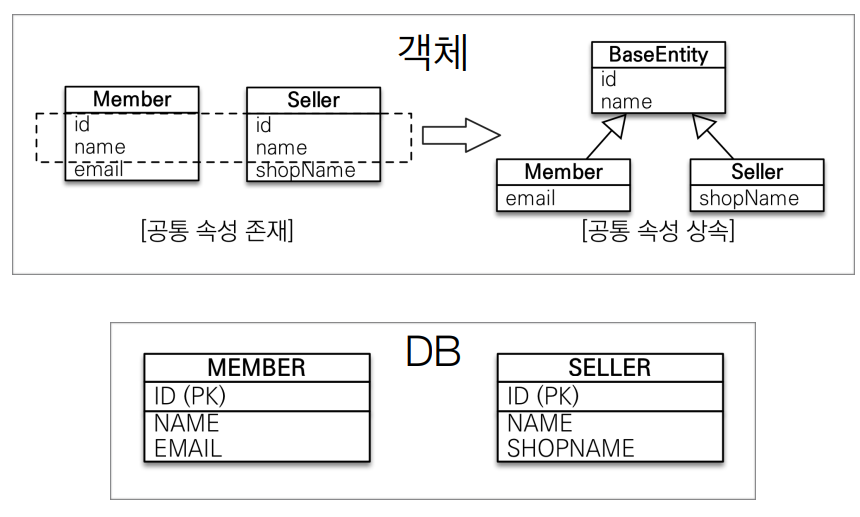

## 고급 매핑

- **상속 관계 매핑**
  - 관계형 DB는 상속 관계 X
  - 슈퍼타입 서브타입 관계라는 모델링 기법이 객체 상속과 유사
  - 상속 관계 매핑 : 객체의 상속 구조와 DB의 슈퍼타입 서브타입 관계를 매핑

- **슈퍼타입 서브타입 관계를 매핑하는 방법**

  - 기본적으로 조인 전략을 가지고 DBA와 단일 테이블 전략 고려하자

  - 조인 전략

    

    - 데이터 중복이 적음
    - ITEM을 상속하는 객체들을 만들고 `@Inheritance` 전략을 조인 전략으로 함
    - `DTYPE` 함께 넣어주면 좋음 - 쿼리가 어떤 종류 때문에 들어온건지 모르니까
    - 장점
      - 데이터 정규화
      - 외래 키 참조 무결성 제약 조건 활용가능
        - 외래키는 참조할 수 없는 키를 가질 수 없다.
      - 저장공간 효율화
    - 단점
      - 조회시 조인을 많이 사용, 성능 저하
      - **조회 쿼리가 복잡함**
      - 데이터 저장시 INSERT SQL 2번 호출

  - 단일 테이블 전략

    - `DTYPE` 필수
    - 장점
      - 조인이 필요 없으므로 일반적으로 조회 성능 빠름
      - 조회 쿼리 단순
    - 단점
      - 자식 엔티티가 매핑한 컬럼은 모두 null 허용
      - 테이블이 커질 수 있다. 상황에 따라서 조회 성능이 오히려 느려질 수 있다.

    

  - 구현 테이블마다 테이블 전략

    - 비추천
    - 장점
      - 서브 타입을 명확하게 구분해서 처리할 때 효과적
      - not null 제약조건 사용 가능
    - 단점
      - 여러 자식 테이블을 함께 조회할 때 성능이 느림(UNION SQL 필요)
      - 자식 테이블을 통합해서 쿼리하기 어려움
      - 변경 관점에서 추가할 때 많은 수정이 필요

    

  - 주요 애노테이션
    - `@Inheritance(strategy=InheritanceType.XXX)`
      - `JOINED`: 조인 전략
      - `SINGLE_TABLE`: 단일 테이블 전략
      - `TABLE_PER_CLASS`: 구현 클래스마다 테이블 전략
    - `@DiscriminatorColumn(name=“DTYPE”)`
      - 하위 클래스 구분 용도 컬럼
    - `@DiscriminatorValue(“XXX”)`
      - 구분 컬럼에 입력할 값

  

- **@MappedSuperclass**

  - 공통 매핑 정보가 필요할 때 사용(id, name)

  - 테이블과 관계 없음

  - 상속관계 매핑X

  - 엔티티X, 테이블과 매핑X

  - 부모 클래스를 상속 받는 자식 클래스에 매핑 정보만 제공

  - 조회, 검색 불가(`em.find(BaseEntity`) 불가)

  - 직접 생성해서 사용할 일이 없으므로 추상 클래스 권장

    

- **실전 예제 - 상속 관계 매핑**
  - 상속을 나중에는 json으로 변형해서 테이블을 단순하게 유지하는 등
  - 고려해야할 것이 많아짐
  - 일단은 객체지향적으로 설계를 하자