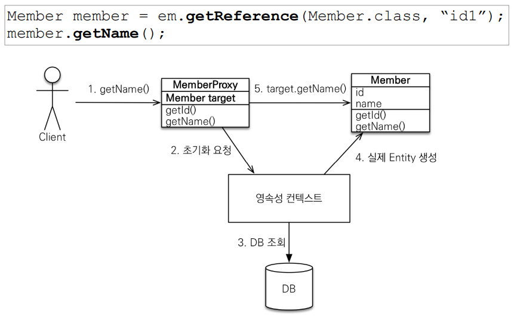

## 프록시와 연관관계 관리

- **프록시 기초**
  -  `em.find()`: 데이터베이스를 통해서 실제 엔티티 객체 조회
  - `em.getReference()`: 데이터베이스 조회를 미루는 가짜(프록시)  엔티티 객체 조회
    - DB에 있는걸 가져오려면 호출 시점에 쿼리를 날림


- **프록시 특징**
  - 프록시 객체는 실제 객체의 참조를 보관
  - 실제 클래스를 상속 받아서 만들어짐
  - 프록시 객체를 호출하면 프록시 객체는 실제 객체의 메소드 호출
  - 프록시 객체는 처음 사용할 때 한번만 초기화
  - 프록시 객체를 초기화  할 때, 프록시 객체가 실제 엔티티로 바뀌는 것은 아님
    - 프록시 객체를 통해서 실제 엔티티에 접근 가능
    - 프록시는 유지가 되고, 타겟이 실제 엔티티로 교체됨
  - 프록시 객체는 원본 엔티티를 상속받음, 따라서 타입 체크시 주의해야함 (`== `비교 실패, 대신 `instance of` 사용)
  - 영속성 컨텍스트에 찾는 엔티티가 이미 있으면 프록시 객체를 호출해도 실제 엔티티 반환
  - 프록시로 한번 반환하면, `em.find()`도 프록시를 반환한다
  - 한 트랜잭션 안에서 같은 객체타입이 되어야 함
  - 영속성 컨텍스트의 도움을 받을 수 없는 준영속 상태일 때, 프록시를 초기화하면 문제 발생
    - `em.detatch()` or `em.close()`


- **프록시 객체 초기화**

  

- **프록시 확인**
  - 프록시 인스턴스의 초기화 여부 확인
    - `PersistenceUnitUtil.isLoaded(Object entity)`
  - 프록시 클래스 확인 방법
    - `entity.getClass().getName() 출력(..javasist.. or  HibernateProxy…)`
  -  프록시 강제 초기화
    - `org.hibernate.Hibernate.initialize(entity);`
  - 참고: JPA 표준은 강제 초기화 없음
    - `강제 호출: member.getName()`


- **지연로딩**

  - `LAZY`를 사용해서 프록시로 조회

    ```java
    @Entity
    public class Member {
        @Id
        @GeneratedValue
        private Long id;
        @Column(name = "USERNAME")
        private String name;
        
        @ManyToOne(fetch = FetchType.LAZY) //**
        @JoinColumn(name = "TEAM_ID")
        private Team team; // 프록시로 가져오게 됨
        ..
    }
    
    ```

- **즉시로딩**

  - `EAGER`를 사용해 한번에 같이 조회

    ```java
    @Entity
    public class Member {
        @Id
        @GeneratedValue
        private Long id;
        @Column(name = "USERNAME")
        private String name;
        
        @ManyToOne(fetch = FetchType.EAGER) //**
        @JoinColumn(name = "TEAM_ID")
        private Team team;
        ..
    }
    
    ```

  - 주의
    - 가급적 지연 로딩만 사용
    - 즉시 로딩을 적용하면 예상하지 못한 SQL 발생
    - 즉시 로딩은 JPQL에서 N+1 문제를 일으킴
      - JPQL은 SQL로 번역이 되어 쿼리를 날림
      - 가져와 보니 즉시 로딩인 team도 가져와야 함
      - 팀을 또 가져옴
      - 즉, 쿼리를 한번 더 날림
      - fatch join으로 한번에 가져올 수 있음
    - `@ManyToOne`, `@OneToOne`은 기본이 즉시 로딩 -> `LAZY`로 설정
    - `@OneToMany`, `@ManyToMany`는 기본이 지연 로딩


- **지연 로딩 활용**
  - 실무에서는 다 지연 로딩 사용


- **영속성 전이(CASCADE)**
  - 특정 엔티티를 영속 상태로 만들 때, 연관 엔티티도 영속 상태로 만들고 싶을 때
  - 영속성 전이는 연관관계 매핑과는 관련 없음
  - 종류
    - `ALL`
    - `PERSIST`
    - `REMOVE`


- **고아 객체**
  - 고아 객체 제거: 부모 엔티티와 연관관계가 끊어진 자식 엔티티를 자동으로 삭제
  - `orphanRemoval = true`
  - 주의
    - 참조하는 곳이 하나일 때 사용해야함!
    - 특정 엔티티가 개인 소유할 때 사용
    - `@OneToOne`, `@OneToMany`만 가능
    - `CascadeType.REMOVE`처럼 동작


- **영속성 전이 + 고아 객체**
  - `CascadeType.ALL` + `orphanRemoval=true`
  -  스스로 생명주기를 관리하는 엔티티는 `em.persist()`로 영속화,  `em.remove()`로 제거
  - 두 옵션을 모두 활성화 하면 부모 엔티티를 통해서 자식의 생명 주기를 관리할 수 있음
  - 도메인 주도 설계(DDD)의 `Aggregate Root`개념을 구현할 때 유용
    - `repository`는 `aggregate root`만 만든다