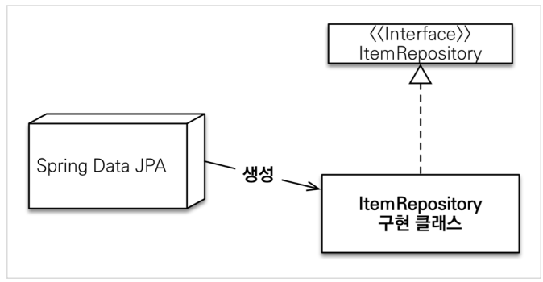
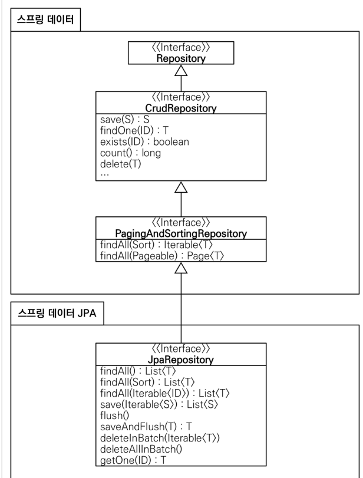

## 스프링 데이터 JPA

- 테스트 라이브러리
  - `spring-boot-starter-test junit`: 테스트 프레임워크, 스프링 부트 2.2부터 junit5( `jupiter` ) 사용 
  - 과거 버전은 `vintage`
- 기타 라이브러리
  - H2 데이터베이스 클라이언트
  - 커넥션 풀: 부트 기본은 HikariCP
  - 로깅 SLF4J & LogBack
  - 테스트

- 쿼리 파라미터 로그 남기기

  - 로그에 다음을 추가하기 `org.hibernate.type` : SQL 실행 파라미터 로그로 남김

  - 외부 라이브러리 사용

    ```
    implementation 'com.github.gavlyukovskiy:p6spy-spring-boot-starter:1.5.7
    ```

- 롬복 설명

  - `@Setter`: 실무에서 가급적 Setter는 사용하지 않기
  - `@NoArgsConstructor AccessLevel.PROTECTED`: 기본 생성자 막고 싶은데, JPA 스팩상 PROTECTED로 열어두어야 함
  - `@ToString`은 가급적 내부 필드만(연관관계 없는 필드만)
    - 무한 루프 생길 수 있음

- `changeTeam()` : 양방향 연관관계 한번에 처리

  - 연관관계 편의 메소드

  ```java
  public void changeTeam(Team team) {
      this.team = team;
      team.getMembers().add(this);
  }
  ```

- 공통 인터페이스 설정

  - `JavaConfig` 설정 - 스프링 부트 사용시 생략 가능

  ```java
  @Configuration
  @EnableJpaRepositories(basePackages = "jpabook.jpashop.repository")
  public class AppConfig {}
  ```

  - 스프링 부트 사용시 `@SpringBootApplication` 위치를 지정(해당 패키지와 하위 패키지 인식)
  - 만약 위치가 달라지면 `@EnableJpaRepositories` 필요

- 스프링 데이터 JPA가 구현 클래스 대신 생성

  

  - `org.springframework.data.repository.Repository` 를 구현한 클래스는 스캔 대상 
    - `MemberRepository` 인터페이스가 동작한 이유
    - 실제 출력해보기(Proxy)
    - `memberRepository.getClass()` -> `class com.sun.proxy.$ProxyXXX`
  - `@Repository` 애노테이션 생략 가능
    - 컴포넌트 스캔을 스프링 데이터 JPA가 자동으로 처리
    - JPA 예외를 스프링 예외로 변환하는 과정도 자동으로 처리


- 공통 인터페이스 분석

  - Repository 인터페이스

    - 공통 CRUD 제공

    ```java
    public interface TeamRepository extends JpaRepository<Team, Long> {
    }
    ```

    ```java
    public interface JpaRepository<T, ID extends Serializable>
        extends PagingAndSortingRepository<T, ID>
    {
        ...
    }
    ```

    - Generic
      - T: 엔티티 타입
      - ID: 식별자 타입(PK)

  - 공통 인터페이스 구성

    

    - 주의
      - `T findOne(ID)` -> `Optional findById(ID)` 변경
      - `boolean exists(ID)` -> `boolean existsById(ID)` 변경
    - 제네릭 타입
      - `T` : 엔티티
      - `ID` : 엔티티의 식별자 타입
      - `S` : 엔티티와 그 자식 타입
    - 주요 메서드
      - `save(S)` : 새로운 엔티티는 저장하고 이미 있는 엔티티는 병합한다.
      - `delete(T)` : 엔티티 하나를 삭제한다. 내부에서 `EntityManager.remove()` 호출 
      - `findById(ID)` : 엔티티 하나를 조회한다. 내부에서 `EntityManager.find()` 호출 
      - `getOne(ID)` : 엔티티를 프록시로 조회한다. 내부에서`EntityManager.getReference()` 호출
      - `findAll(…)` : 모든 엔티티를 조회한다. 정렬( `Sort` )이나 페이징( `Pageable` ) 조건을 파라미터로 제공할 수 있다