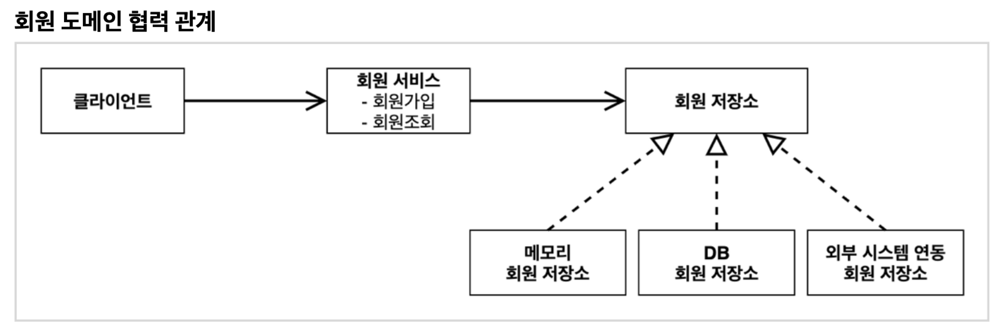
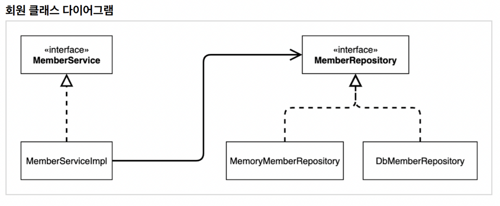
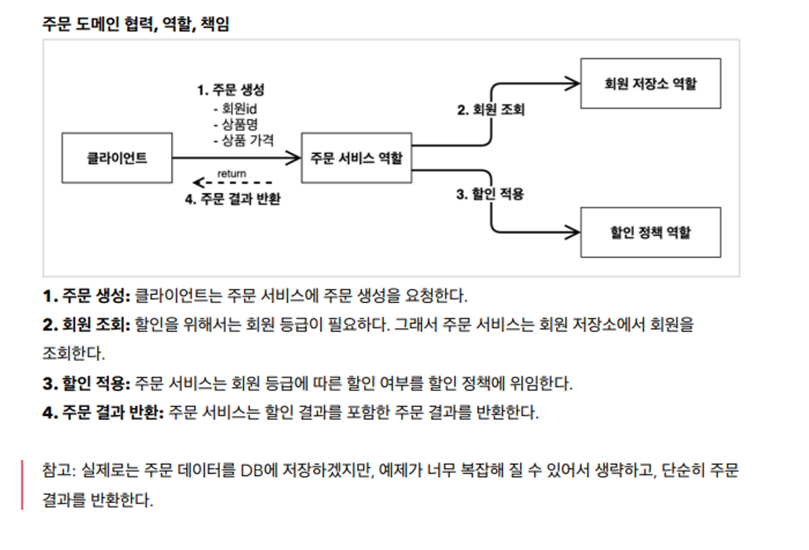
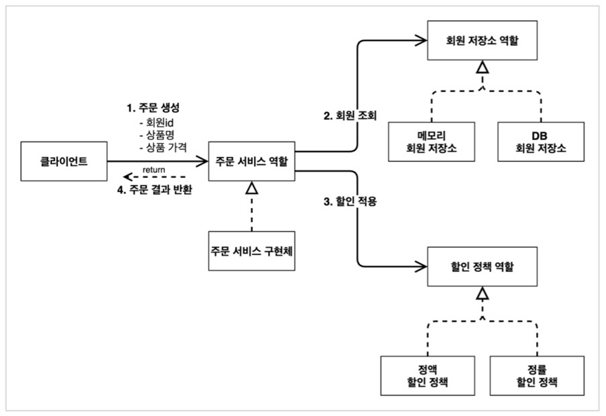
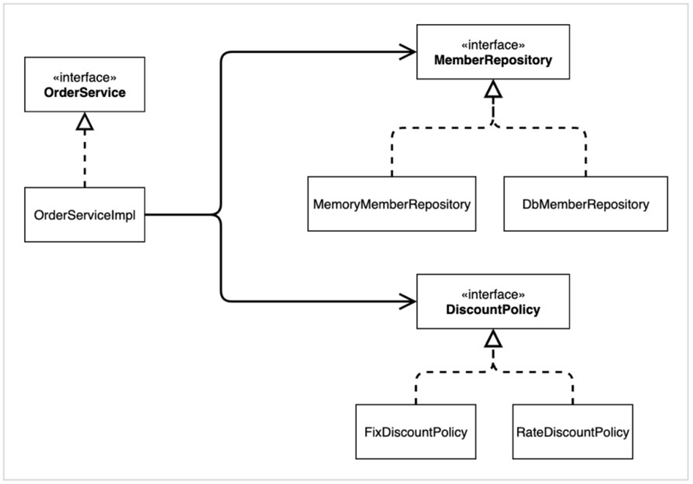

# 스프링 기본 섹션2

- **프로젝트 생성**

- **비즈니스 요구사항과 설계**

  - 인터페이스를 만들고 구현체를 언제든지 갈아끼울 수 있도록 설계
  - 도메인 요구사항
    - 회원을 가입하고 조회할 수 있다
    - 회원은 일반과 VIP 두 가지 등급이 있다
    - 회원 데이터는 자체 DB를 구축할 수 있고, 외부 시스템과 연동할 수 있다(미확정)

- **회원 도메인 설계**

  

  

  - 실제 서비스 구현은 `MemberServiceImpl`에 만들어짐

- **회원 도메인 개발**

  - 구현체가 하나만 있을때는 `Impl`을 관례상 뒤에 붙임

- **회원 도메인 실행과 테스트**

  - 테스트시 `given`, `when`, `then` 세 구간으로 나누는 것이 기본

  - `Assertions.assertThat`으로 검증

  - 회원 도메인 설계의 문제점

    - 추상화와 구체화 모두에 의존 → `DIP` 위반

    ```java
    // MemverServiceImpl
    
    private final MemberRepository memberRepository = new MemoryMemberRepository();
    ```

- **주문과 할인 도메인 설계**

  

  

  

  - 역할과 구현을 분리해서 자유롭게 구현 객체를 조립할 수 있게 설계
    - 회원 저장소는 물론이고, 할인 정책도 유연하게 변경 가능
  - 역할들의 협력 관계를 그대로 재사용할 수 있음
    - 회원을 조회하고, 정액 할인 정책을 지원해도 주문 서비스를 변경하지 않아도 됨

- **주문과 할인 도메인 개발**

  - `Enum`타입은 `==`으로 비교
  - 할인에 대한 변경이 필요하면 할인쪽만 변경
    - 단일 책임 원칙을 지켜서 설계

  ```java
  // OrderServiceImpl
  
  private final MemberRepository memberRepository = new MemoryMemberRepository();
  private final DiscountPolicy discountPolicy = new FixDiscountPolicy();
  // 구현체 부분에 다른 인터페이스 상속 구현체 넣어도 됨
  ```

- **주문과 할인 도메인 실행과 테스트**

  - 스프링 부트 테스트는 오래걸림, 단위 테스트를 잘 만드는게 중요