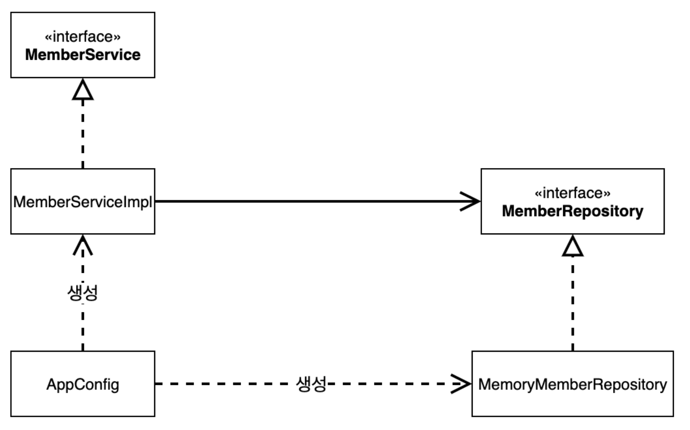
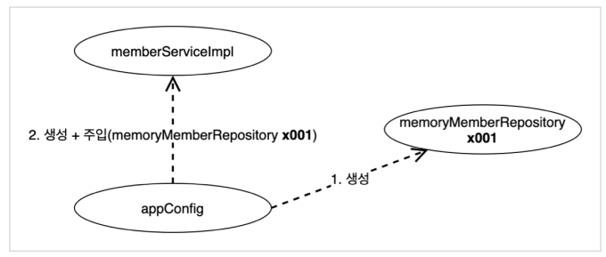
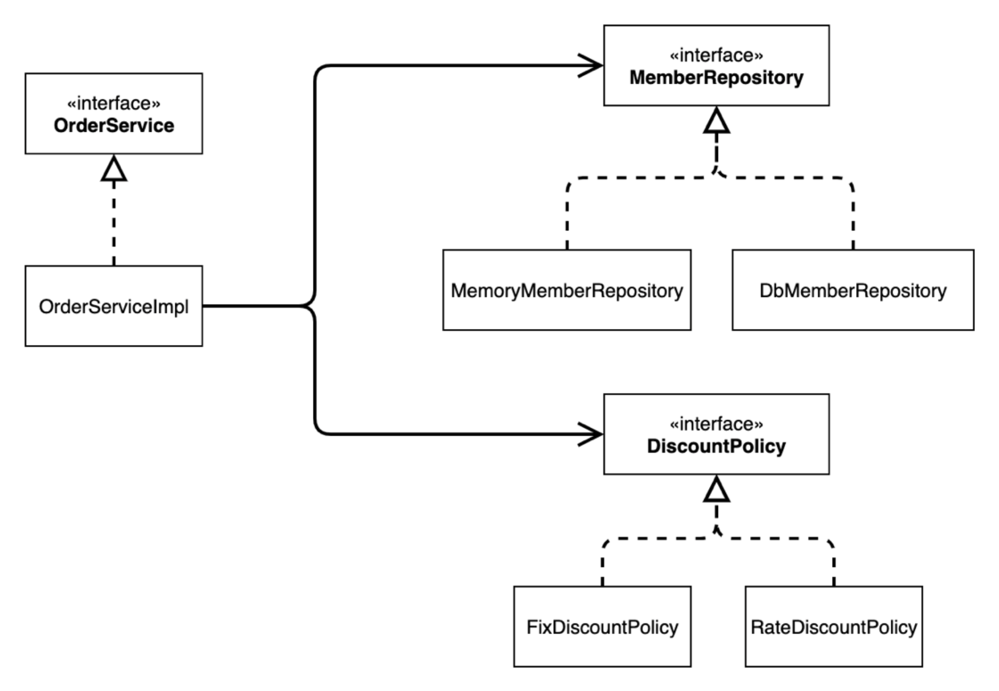
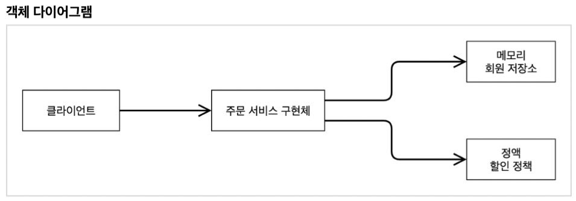

## 스프링 핵심 원리 이해2 - 객체 지향 원리 적용

- **새로운 할인 정책 개발**

  - 할인 정책이 변경돼도 유연한 설계를 통해 갈아 끼울 수 있음

- **새로운 할인 정책 적용과 문제점**

  - 할인 정책을 변경하려면 클라이언트인 `OrderServiceImpl` 코드를 고쳐야 함 -> `OCP`위반
  - 인터페이스와 구체 클래스 둘 다 의존하고 있음 -> `DIP`위반

  ```java
  // OrderServiceImpl
  
  private final DiscountPolicy discountPolicy = new FixDiscountPolicy();
  ```

  - 인터페이스만 의존하도록 설계하자

  ```java
  // OrderServiceImpl
  
  private final DiscountPolicy discountPolicy;
  /* 이러면 NullPointException 에러가 난다 어떻게 할까? */
  ```

- **관심사의 분리**

  - 이전 코드는 `OrderServiceImpl`이 할인 정책까지 직접 선택하는 책임까지 맡은 문제가 있다.

  - 관심사를 분리하자

    - 배우는 본인의 역할인 배역을 수행하는 것에 집중해야 한다.
    - 디카프리오는 어떤 여자 주인공이 선택되더라도 똑같이 공연을 할 수 있어야 한다.
    - 공연 기획자를 만들고, 배우와 공연 기획자의 책임을 확실히 분리하자

  - `AppConfig` 등장

    - 구현 객체를 생성하고 연결하는 책임을 가지는 별도의 생성 클래스
    - 애플리케이션의 실제 동작에 필요한 구현 객체를 생성
      - ex) `MemberServiceImpl` ...
    - 생성한 인스턴스의 참조를 생성자를 통해서 주입(연결)
      - ex) `MemberServiceImpl` -> `MemoryMemberRepository`
    - `MemberServiceImpl`은 이제부터 의존관계에 대한 고민은 외부에 맡기고 실행에만 집중함
    - `DIP`완성 : 추상에만 의존하고 이제 구체 클래스를 몰라도 된다.
    - `관심사의 분리` : 객체를 생성하고 연결하는 역할과 실행하는 역할이 명확히 분리됨

    

    

    - 클라이언트인 `MemberServiceImpl`입장에서 보면 의존 관계를 마치 외부에서 주입 해주는 것 같다고 해서 `DI`라고 한다.

- **AppConfig 리팩터링**

  - 역할과 구현이 드러나야 함
  - 중복을 제거하고 구현체로 변경할 때 한 부분만 변경하면 됨

- **새로운 구조와 할인 정책 적용**

  - `AppConfig`의 등장으로 구성 영역과 사용 영역으로 분리 됨

- **전체 흐름 정리**

  - 기존에는 클라이언트가 의존하는 서버 구현 객체를 직접 생성하고, 실행
  - 구현 객체를 생성하고 연결하는 책임을 가진 `AppConfig` 등장

  

- **좋은 객체 지향 설계의 5가지 원칙의 적용**

  - `SRP : 단일 책임의 원칙`

    - 한 클래스는 하나의 책임만 가져야 함
    - 구현 객체를 생성하고 연결하는 책임은 `AppConfig`가 담당
    - 클라이언트 객체는 실행하는 책임만 담당

  - `DIP : 의존 관계 역전 원칙`

    - 프로그래머는 추상화에 의존해야지, 구체화에 의존하면 안된다.
    - `AppConfig`가 정책 인스턴스를 대신 생성해서 클라이언트 코드에 의존관계를 주입함

  - `OCP : 개방 폐쇄의 원칙`

    - 소프트웨어 요소는 확장에는 열려 있으나 변경에는 닫혀 있어야 함
    - 다형성을 사용하고 클라이언트가 `DIP`를 지킴
    - `AppConfig`가 의존 관계를 클라이언트에 주입하므로 클라이언트 코드는 변경하지 않아도 됨
    - 소프트웨어 요소를 새롭게 확장해도 사용 영역의 변경은 닫혀있다!

    

- **IoC, DI, 그리고 컨테이너**

  - `제어의 역전 IoC(Inversion of Control)`

    - 프로그램의 제어 흐름을 직접 제어하는 것이 아니라 외부에서 제어하는 것
    - 기존 프로그램은 구현 객체가 프로그램의 제어 흐름을 스스로 조종했음
    - 반면에 `AppConfig` 등장 이후는 구현 객체는 자신의 로직을 실행하는 역할만 담당
    - 프로그램에 대한 제어 흐름에 대한 권한은 `AppConfig`가 담당

  - 프레임워크 vs 라이브러리

    - 내가 작성한 코드를 제어하고, 대신 실행하면 프레임워크
      - ex) `JUnit`
    - 내가 작성한 코드가 직접 제어의 흐름을 담당하면 라이브러리
      - ex) 자바 객체를 Json으로 변환 호출

  - `의존관계 주입 DI(Dependency Injection)`

    - 정적인 클래스 의존 관계와, 실행 시점에 실행되는 동적인 객체(인스턴스) 의존 관계들을 분리해서 생각해야 함
    - 정적인 의존 관계는 애플리케이션을 실행하지 않아도 분석 가능

    

    - 실제로 어떤 객체가 `OrderServiceImpl`에 주입 될지 알 수 없음

    

    - `의존관계 주입` : 애플리케이션 실행 시점(런타임)에 외부에서 실제 구현 객체를 생성하고 클라이언트에 전달해서 클라이언트와 서버의 실제 의존 관계가 연결 되는 것
    - 객체 인스턴스를 생성하고, 그 참조값을 전달해서 연결
    - 클라이언트 코드를 변경하지 않고, 클라이언트가 호출하는 대상의 타입 인스턴스를 변경 가능
    - 정적인 클래스 의존관계를 변경하지 않고, 동적인 객체 인스턴스의 의존관계를 쉽게 변경할 수 있음

  - IoC 컨테이너(DI 컨테이너)

    - `AppConfig`처럼 객체를 생성하고 관리하면서 의존관계를 연결해 주는 것
    - 어셈블러, 오브젝트 팩토리 등으로도 불림

    

- **스프링으로 전환하기**

  - 클래스에 `@Configuration`, 메서드에 `@Bean` 달아줌
    - 스프링 컨테이너에 등록됨

  ```java
  ApplicationContext applicationContext = new AnnotationConfigApplicationContext(AppConfig.class);
  applicationContext.getBean("memberService", MemberService.class);
  
  /* 스프링 컨테이너에 Config에 등록된
  memberService라는 Bean을 반환타입 MemberService로 가져옴 
  Bean이름은 기본적으로 메서드 이름 -> name으로 변경 가능*/
  ```

  - `ApplicationContext`를 스프링 컨테이너라 함
  - 스프링 컨테이너는 `@Configuration`이 붙은 `AppConfig`를 설정(구성) 정보로 사용
  -  `@Bean`이라 적힌 메서드를 모두 호출해서 반환된 객체를 스프링 컨테이너에 등록
  - 스프링 컨테이너에 등록된 객체를 스프링 빈이라고 함