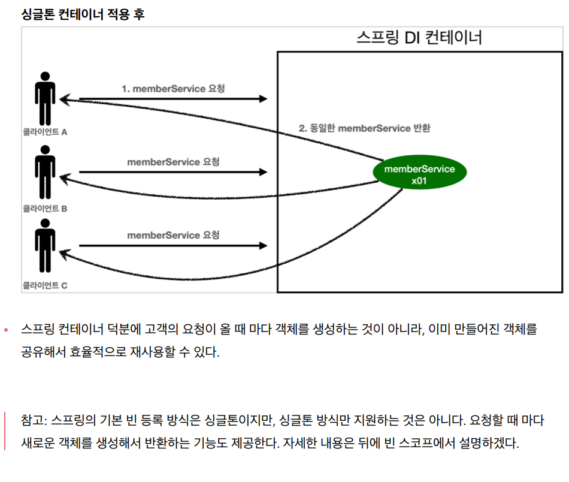
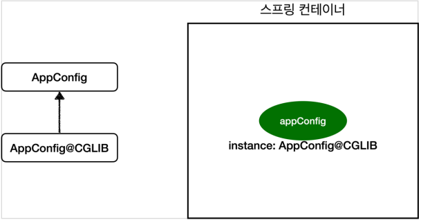

## 싱글톤 컨테이너

- **웹 애플리케이션과 싱글톤**

  - 여러번 요청마다 객체가 만들어지면 메모리 낭비 문제
  - 해결방안은 객체가 1개만 생성되고, 공유하도록 설계하면 됨 -> 싱글톤

- **싱글톤 패턴**

  - 클래스의 인스턴스가 딱 1개만 생성되는 것을 보장하는 디자인 패턴

  ```java
  public class SingletonService{
      
      //1. static영역에 객체를 딱 1개만 생성해둔다.
      private static final SingletonService instance = new SingletonService();
      
      //2. public으로 열어서 객체 인스턴스가 필요하면 이 static 메서드를 통해서만 조회하도록 허용
      public static SingletonService getInstance() {
          return instance;
      }
      
      //3. 생성자는 private으로 선언해서 외부에서 new 키워드를 사용한 객체 생성을 못하게 막음
      private SingletonService() {
          
      }
      
  }
  ```

  - `assertThat.isSameAs` : `==` 인스턴스가 같은지 확인
  - 싱글톤 패턴 구현 방법은 여러가지가 있음
  - 문제점
    - 코드가 많아짐
    - 의존관계상 클라이언트가 구체 클래스에 의존 -> `DIP` 위반
      - ex) `instance.getInstance()`이런 방식으로 객체를 꺼내야함
    - 구체 클래스에 의존하므로 `OCP` 원칙을 위반할 가능성 높은
    - 테스트하기 어려움
    - 내부 속성을 변경하거나 초기화 어려움
    - private 생성자로 자식 클래스를 만들기 어려움
    - 유연성이 떨어짐
    - 안티패턴이라고 불리기도 함
  - 싱글톤 컨테이너로 문제점 해결 가능!

- **싱글톤 컨테이너**

  - 싱글톤 패턴을 적용하지 않아도, 객체 인스턴스를 싱글톤으로 관리
  - 싱글톤 레지스트리 : 싱글톤 객체를 생성하고 관리하는 기능
  - `DIP`, `OCP`, 테스트, private 생성자로 부터 자유롭게 싱글톤 사용

  

- **싱글톤 방식의 주의점**

  - 객체 인스턴스를 공유하기 때문에 상태를 유지(Stateful)하게 설계하면 안됨

  ```java
  //ThreadA
  statefulService1.order("userA", 10000);
  
  //ThreadB
  statefulService2.order("userB", 20000);
  
  System.out.println(statefulService1.getPrice());
  // 20000 출력
  ```

  - 공유 필드를 정말 조심해야 함!
  - 스프링 빈은 항상 무상태(Stateless)로 설계하자

- **@Configuration과 싱글톤**

  - `memberService` 호출 -> `memberRepository()` 호출 -> `new MemoryRepository()` 호출
    - new로 만들면서 싱글톤이 깨진것 처럼 보인다
  - 확인해 보면 `memoryRepository`는 같은 인스턴스를 공유함

- **@Configuration과 바이트코드 조작의 마법**

  - Cofiguration을 등록하면 `CGLIB`가 `AppConfig`를 상속받아서 싱글톤이 보장되도록 보장해줌
  - Bean이 처음 컨테이너에 등록이 안되어 있으면 생성하여 반환하고
  - 이미 스피링 빈이 컨테이너에 있으면 기존 빈 반환

  

  - `AppConfig@CGLIB`는 자식이므로 `AppConfig`로 조회가능
  - `@Configuration`을 빼고 실행하면?
    - 싱글톤 유지 X
    - 빈을 스프링 컨테이너가 관리 X
    - `@Autowired`를 통해 의존성을 주입 해주어야 싱글톤 유지 가능