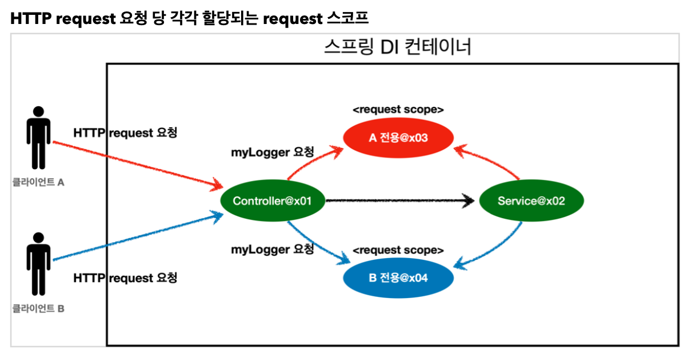

## 빈 스코프

- **빈 스코프란?**
  - 스프링 지원 스코프
    - `@Scope(범위)`
    - 싱글톤: 기본 스코프, 스프링 컨테이너의 시작과 종료까지 유지되는 가장 넓은 범위의 스코프
    - 프로토타입: 스프링 컨테이너는 프로토타입 빈의 생성과 의존관계 주입까지만 관여하고 더는 관리하지 않음
      - 매우 짧은 범위의 스코프
  - 웹 관련 스코프
    - `request` : 웹 요청이 들어오고 나갈때 까지 유지되는 스코프
    - `session` : 웹 세션이 생성되고 종료될 때 까지 유지되는 스코프
    - `application` : 웹의 서블릿 컨텍스트와 같은 범위로 유지되는 스코프


- **프로토타입 스코프**

  - 스프링 컨테이너에서 조회하면 스프링 컨테이너는 항상 새로운 인스턴스를 생성해서 반환

  

  

  - 프로토타입 빈을 관리할 책임은 프로토타입 빈을 받은 클라이언트에 있음
  - 싱글톤과 다르게 요청 후 생성됨
  - `@PreDestroy` 같은 종료 메서드가 호출되지 않음
    - 클라이언트가 직접 해주어야 함


- **프로토타입 스코프 - 싱글톤 빈과 함께 사용시 문제점**
  - 스프링은 일반적으로 싱글톤 빈을 사용하므로, 싱글톤 빈이 프로토타입 빈을 사용하게 됨
  - 싱글톤 빈은 **생성 시점에만 의존관계 주입**을 받기 때문에, 프로토타입 빈이 새로 생성되기는 하지만, 싱글톤 빈과 함께 계속 유지되는 것이 문제
  - 프로토타입 빈은 **주입받을 때 마다 생성**됨


- **프로토타입 스코프 - 싱글톤 빈과 함께 사용시 Provider로 문제 해결**
  - `DL (Dependency Lookup)` : 의존관계를 외부에서 주입(`DI`) 받는게 아니라 직접 필요한 의존관계를 찾는 것
  - 프로토타입 빈을 컨테이너에서 대신 찾아주는 딱 `DL` 기능 하는 무언가 필요
  - `ObjectFactory` , `ObjectProvider`
    - `ObjectFactory`를 확장한 것이 `ObjectProvider`
    -  `ObjectProvider`의 `getObject()`를 호출하면 내부에서는 스프링 컨테이너를 통해 해당 빈을 찾아서 반환(`DL`)
    - 스프링이 제공하는 기능을 사용하지만, 기능이 단순하므로 단위테스트를 만들거나 mock 코드를 만들기 훨씬 쉬워짐
  - `JSR-330 Provider`
    - `javax.inject:javax.inject:1` 라이브러리를 `gradle`에 추가 필요
    - `provider.get()` 을 통해 항상 새로운 프로토타입 빈 생성
      - 내부에서는 스프링 컨테이너를 통해 해당 빈을 찾아서 반환(`DL`)
    - 자바 표준이므로 스프링이 아닌 다른 컨테이너에서 사용 가능
  - `ObjectProvider`, `JSR330 Provider` 등은 프로토타입 뿐만 아니라 `DL`이 필요한 경우 언제든지 사용 가능


- **웹 스코프**

  - 웹 환경에서만 동작

  - 스프링이 해당 스코프의 종료 시점까지 관리

    - 종료 메서드 호출됨

  - 웹 스코프 종류

    - `request` : 웹 요청이 들어오고 나갈때 까지 유지되는 스코프
    - `session` : 웹 세션이 생성되고 종료될 때 까지 유지되는 스코프
    - `application` : 웹의 서블릿 컨텍스트와 같은 범위로 유지되는 스코프
    - `websocket` : 웹 소켓과 동일한 생명주기를 가지는 스코프

    

  - `controller`와 `service`에서 `HTTP request`가 같으면 같은 객체 인스턴스를 바라봄

  - 요청이 끝나면 `destroy`


- **request 스코프 예제 만들기**

  - 동시에 여러 HTTP 요청이 오면 정확히 어떤 요청이 남긴 로그인지 구분하기 어려움
    - 이럴때 사용하기 좋은 request 스코프
  - 기대하는 공통 포멧: `[UUID][requestURL]{message}`
  - 웹과 관련된 부분은 컨트롤러까지만 사용하고 서비스 계층은 웹 기술에 종속되지 않고
    - 가급적 순수하게 유지하는 것이 유지보수 관점에서 좋음
  - 스프링이 뜰 때는 request요청이 없기 때문에 request 스코프 빈은 아직 생성되지 않음
    - 실제 고객 요청이 와야 생성가능

  

- **스코프와 Provider**	

  - `provider.getObject()` 하는 시점에 호출됨
    - 그때까지 request scope 빈의 생성을 지연할 수 있음
    - HTTP 요청이 진행중이므로 request scope 빈의 생성이 정상 처리
  - `ObjectProvider.getObject()`를 `LogDemoController`, `LogDemoService`에서 각각 한번씩 따로 호출해도 같은 HTTP 요청이면 같은 스프링 빈 반환


- **스코프와 프록시**

  ```java
  @Component
  @Scope(value = "request", proxyMode = ScopedProxyMode.TARGET_CLASS)
  public class MyLogger {
      
  }
  ```

  - 적용 대상이 인터페이스가 아닌 클래스면 `TARGET_CLASS`
  - 인터페이스면 `INTERFACES`
  - 가짜 프록시 클래슬르 만들어두고 HTTP request와 상관 없이 가짜 프록시 클래스를 다른 빈에 미리 주입 가능
  - `@Scope`를 `proxyMode = ScopedProxyMode.TARGET_CLASS)` 를 설정하면 스프링 컨테이너는 `CGLIB`라는 바이트코드를 조작하는 라이브러리를 사용해서, 가짜 프록시 객체를 생성
  - 의존관계 주입도 이 가짜 프록시 객체가 주입됨

  

  - 가짜 프록시 객체는 요청이 오면 그때 내부에서 진짜 빈을 요청하는 위임 로직이 들어있음
  - 가짜 프록시 객체는 원본 클래스를 상속받아 만들어짐(다형성)
  - 싱글톤처럼 동작함
    - request scope와 관련없음
  - `Provider`나 프록시 모두 핵심 아이디어는 지연처리
  - 웹 스코프가 아니더라도 프록시 사용 가능
  - 주의점
    - 싱글톤을 사용하는 것 같지만 다르게 동작하므로 주의
    - 이런 특별한 scope는 꼭 필요한 곳에만 사용
      - 유지보수성