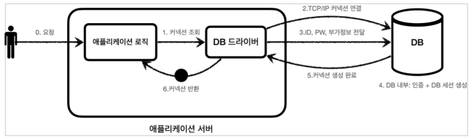
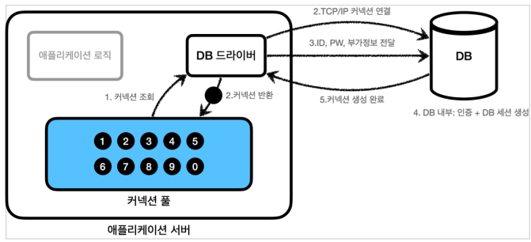
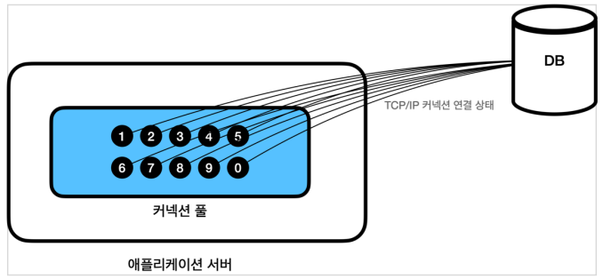
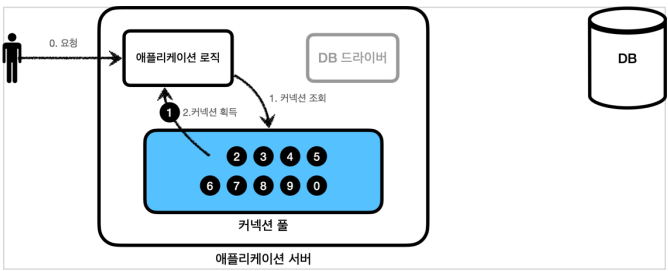
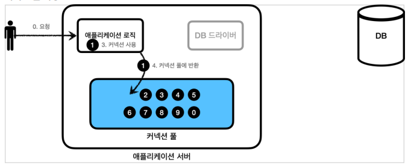
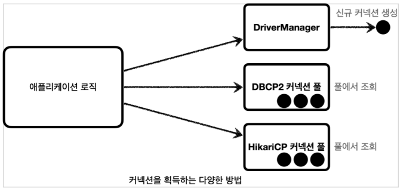
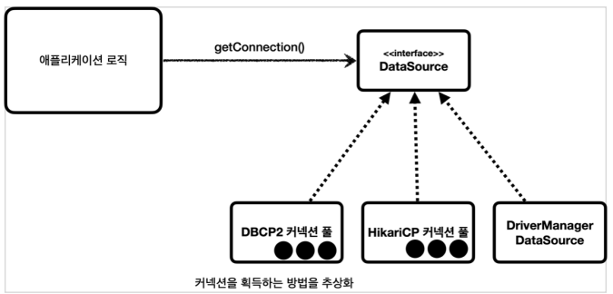

## 커넥션풀과 데이터소스 이해

- DB 커넥션 풀을 매번 획득

  - 복잡한 과정 시간도 많이 소모

  

  1. 애플리케이션 로직은 DB 드라이버를 통해 커넥션을 조회한다
  2. DB 드라이버는 DB와 TCP/IP 커넥션을 연결한다.
     - 이 과정에서 3 way handshake 같은 TCP/IP 연결을 위한 네트워크 동작이 발생한다.
  3. DB 드라이버는 TCP/IP 커넥션이 연결되면 ID, PW와 기타 부가정보를 DB에 전달한다.
  4. DB는 ID, PW를 통해 내부 인증을 완료하고, 내부에 DB 세션을 생성한다.
  5. DB는 커넥션 생성이 완료되었다는 응답을 보낸다.
  6. DB 드라이버는 커넥션 객체를 생성해서 클라이언트에 반환한다

  - 커넥션을 미리 생성해두고 사용하는 커넥션 풀을 사용하자


- 커넥션 풀 초기화

  - 커넥션 풀 : 커넥션을 관리하는 풀

  

  - 애플리케이션 시작 시점에서 필요한 만큼 커넥션을 미리 확보해서 풀에 보관

  

  - 커넥션 풀에 들어 있는 커넥션은 TCP/IP로 DB와 커넥션이 연결되어 있는 상태이기 때문에 언제든지 즉시 SQL을 DB에 전달할 수 있다.

  

  - 애플리케이션 로직에서 이제는 DB 드라이버를 통해서 새로운 커넥션을 획득하는 것이 아니다
  - 이제는 커넥션 풀을 통해 이미 생성되어 있는 커넥션을 객체 참조로 그냥 가져다 쓰기만 하면 된다.
  - 커넥션 풀에 커넥션을 요청하면 커넥션 풀은 자신이 가지고 있는 커넥션 중에 하나를 반환한다.

  

  - 애플리케이션 로직은 커넥션 풀에서 받은 커넥션을 사용해서 SQL을 데이터베이스에 전달하고 그 결과를 받아서 처리한다.
  - 커넥션을 모두 사용하고 나면 이제는 커넥션을 종료하는 것이 아니라, 다음에 다시 사용할 수 있도록 해당 커넥션을 그대로 커넥션 풀에 반환하면 된다.
  - 여기서 주의할 점은 커넥션을 종료하는 것이 아니라 커넥션이 살아있는 상태로 커넥션 풀에 반환해야 한다는 것이다


- 커넥션 풀 정리
  - 적절한 커넥션 풀 숫자는 서비스의 특징과 애플리케이션 서버 스펙, DB 서버 스펙에 따라 다르기 때문에 성능 테스트를 통해서 정해야 한다
  - 커넥션 풀은 서버당 최대 커넥션 수를 제한할 수 있다. 따라서 DB에 무한정 연결이 생성되는 것을 막아주어서 DB를 보호하는 효과도 있다.
  - 이런 커넥션 풀은 얻는 이점이 매우 크기 때문에 실무에서는 항상 기본으로 사용
  - 사용도 편리하고 성능도 뛰어난 오픈소스 커넥션 풀이 많기 때문에 오픈소스를 사용하는 것이 좋다
  - 성능과 사용의 편리함 측면에서 최근에는 `hikariCP` 를 주로 사용한다. 스프링 부트 2.0 부터는 기본 커넥션 풀로 `hikariCP` 를 제공


- DataSource

  - 커넥션을 얻는 방법은 앞서 학습한 JDBC DriverManager 를 직접 사용하거나, 커넥션 풀을 사용하는 등 다양한 방법이 존재한다

  

  - 커넥션을 획득하는 방법을 추상화

    

    - `javax.sql.DataSource` 라는 인터페이스를 제공
    - 이 인터페이스의 핵심 기능은 커넥션 조회 하나이다. (다른 일부 기능도 있지만 크게 중요하지 않다.)

  - DataSource 핵심 기능만 축약

    ```java
    public interface DataSource {
        Connection getConnection() throws SQLException;
    }
    ```

    

- DataSource 정리
  - 커넥션 풀 구현 기술을 변경하고 싶으면 해당 구현체로 갈아끼우기만 하면 된다
  - `DriverManager` 는 `DataSource` 인터페이스를 사용하지 않는다. 따라서 `DriverManager` 는 직접 사용
  - 스프링은 `DriverManager` 도 `DataSource` 를 통해서 사용할 수 있도록 `DriverManagerDataSource` 라는 `DataSource` 를 구현한 클래스를 제공

- 파라미터 차이

  - 기존 `DriverManager` 를 통해서 커넥션을 획득하는 방법과 `DataSource` 를 통해서 커넥션을 획득하는 방법에는 큰 차이가 있다

  - `DriverManager`

    ```java
    DriverManager.getConnection(URL, USERNAME, PASSWORD)
    DriverManager.getConnection(URL, USERNAME, PASSWORD)
    ```

  - `DataSource`

    ```java
    void dataSourceDriverManager() throws SQLException {
        DriverManagerDataSource dataSource =
            new DriverManagerDataSource(URL, USERNAME, PASSWORD);
        useDataSource(dataSource);
    }
    private void useDataSource(DataSource dataSource) throws SQLException {
        Connection con1 = dataSource.getConnection();
        Connection con2 = dataSource.getConnection();
        log.info("connection={}, class={}", con1, con1.getClass());
        log.info("connection={}, class={}", con2, con2.getClass());
    }
    ```

  - `DriverManager` 는 커넥션을 획득할 때 마다 파라미터를 계속 전달해야 한다
  - `DataSource` 를 사용하는 방식은 처음 객체를 생성할 때만 필요한 파리미터를 넘겨두고, 커넥션을 획득할 때는 단순히 `dataSource.getConnection()` 만 호출


- 설정과 사용의 분리
  - `dataSource.getConnection()` 만 호출하면 되므로, `URL` , `USERNAME` , `PASSWORD` 같은 속성들에 의존하지 않아도 된다
  - 쉽게 이야기해서 리포지토리(Repository)는 `DataSource` 만 의존하고, 이런 속성을 몰라도 된다.
  - 애플리케이션을 개발해보면 보통 설정은 한 곳에서 하지만, 사용은 수 많은 곳에서 하게 된다
  - 덕분에 객체를 설정하는 부분과, 사용하는 부분을 좀 더 명확하게 분리할 수 있다.


- DataSource - 커넥션 풀

  ```java
  @Test
  void dataSourceConnectionPool() throws SQLException, InterruptedException {
      //커넥션 풀링: HikariProxyConnection(Proxy) -> JdbcConnection(Target)
      HikariDataSource dataSource = new HikariDataSource();
      dataSource.setJdbcUrl(URL);
      dataSource.setUsername(USERNAME);
      dataSource.setPassword(PASSWORD);
      dataSource.setMaximumPoolSize(10);
      dataSource.setPoolName("MyPool");
      
      useDataSource(dataSource);
      Thread.sleep(1000); //커넥션 풀에서 커넥션 생성 시간 대기
  }
  ```

  - HikariCP 커넥션 풀을 사용한다. `HikariDataSource` 는 `DataSource` 인터페이스를 구현하고 있다
  - 커넥션 풀 최대 사이즈를 10으로 지정하고, 풀의 이름을 MyPool 이라고 지정했다.
  - 커넥션 풀에서 커넥션을 생성하는 작업은 애플리케이션 실행 속도에 영향을 주지 않기 위해 별도의 쓰레드에서 작동
    - 별도의 쓰레드에서 동작하기 때문에 테스트가 먼저 종료되어 버린다
    - `Thread.sleep` 을 통해 대기 시간을 주어야 쓰레드 풀에 커넥션이 생성되는 로그를 확인할 수 있다.


- `JdbcUtils` 편의 메서드

  - 스프링은 JDBC를 편리하게 다룰 수 있는 `JdbcUtils` 라는 편의 메서드를 제공한다
  - `JdbcUtils` 을 사용하면 커넥션을 좀 더 편리하게 닫을 수 있다

  ```java
  private void close(Connection con, Statement stmt, ResultSet rs) {
      JdbcUtils.closeResultSet(rs);
      JdbcUtils.closeStatement(stmt);
      JdbcUtils.closeConnection(con);
  }
  ```

  

- HikariDataSource 사용
  - 커넥션 풀 사용시 `conn0` 커넥션이 재사용 된 것을 확인할 수 있다.
  - 테스트는 순서대로 실행되기 때문에 커넥션을 사용하고 다시 돌려주는 것을 반복한다. 따라서 `conn0` 만 사용된다.
  - 웹 애플리케이션에 동시에 여러 요청이 들어오면 여러 쓰레드에서 커넥션 풀의 커넥션을 다양하게 가져가는 상황을 확인할 수 있다.