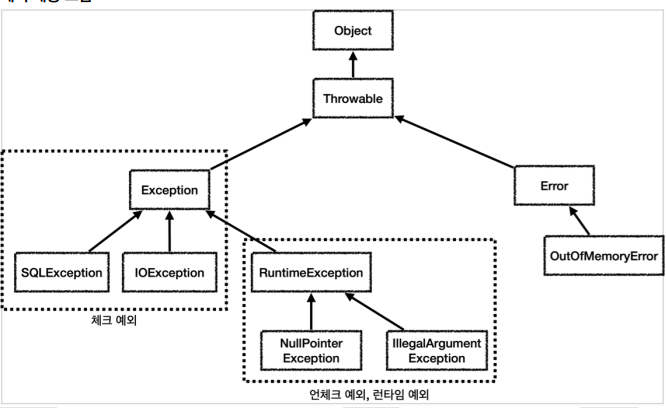
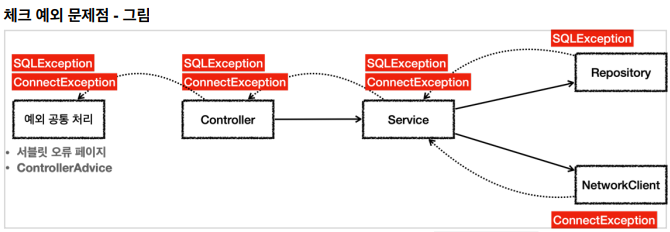
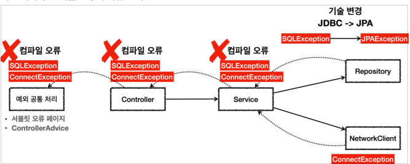
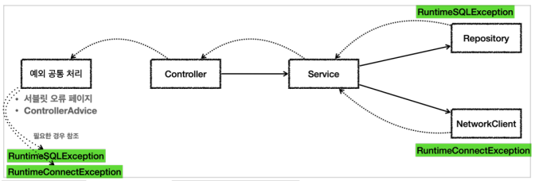
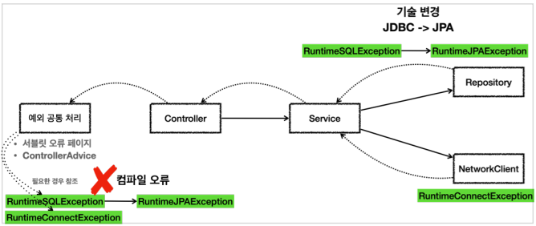

## 자바 예외 이해

- 예외 계층

  

  - `Object` : 예외도 객체이다. 모든 객체의 최상위 부모는 `Object` 이므로 예외의 최상위 부모도 `Object` 이다
  - `Throwable` : 최상위 예외이다. 하위에 `Exception` 과 `Error` 가 있다.
  - `Error` : 메모리 부족이나 심각한 시스템 오류와 같이 애플리케이션에서 복구 불가능한 시스템 예외이다.  애플리케이션 개발자는 이 예외를 잡으려고 해서는 안된다
    - 상위 예외를 잡으면 하위까지 잡을 수 있음
      - `Throwable`예외를 잡으면 안됨
    - 언체크 예외
  - `Exception` : 체크 예외
    - 애플리케이션 로직에서 사용할 수 있는 실질적인 최상위 예외이다.
    - `Exception` 과 그 하위 예외는 모두 컴파일러가 체크하는 체크 예외
    - `RuntimeException` 은 예외
  - `RuntimeException` : 언체크 예외, 런타임 예외
    - 컴파일러가 체크 하지 않는 언체크 예외이다.
    - `RuntimeException` 과 그 자식 예외는 모두 언체크 예외이다


- 예외 기본 규칙
  - 예외는 폭탄 돌리기와 같다. 잡아서 처리하거나, 처리할 수 없으면 밖으로 던져야한다
  - 예외를 처리하지 못하고 계속 던지면 어떻게 될까?
    - 자바 ` main()` 쓰레드의 경우 예외 로그를 출력하면서 시스템이 종료
    - 웹 애플리케이션의 경우 WAS가 해당 예외를 받아서 처리
      - 주로 사용자에게 개발자가 지정한, 오류 페이지를 보여줌


- 체크 예외 기본 이해

  - `Exception` 과 그 하위 예외는 모두 컴파일러가 체크하는 체크 예외
  - `RuntimeException` 은 예외

  ```java
  static class MyCheckedException extends Exception {
      public MyCheckedException(String message) {
          super(message);
      }
  }
  ```

  - 체크 예외를 잡아서 처리하는 코드

    ```java
    try {
        repository.call();
    } catch (MyCheckedException e) {
        //예외 처리 로직
    }
    ```

    - `catch`는 해당 타입과 그 해당 타입을 모두 잡을 수 있음

  - 체크 예외를 밖으로 던지는 코드

    ```java
    public void callThrow() throws MyCheckedException {
        repository.call();
    }
    ```

    - `throws` 를 지정하지 않으면 컴파일 오류가 발생한다
    - 체크 예외의 경우 예외를 잡아서 처리하거나 또는 예외를 밖으로 던진다는 선언을 필수로 해주어야 한다.

  - 장점
    - 개발자가 실수로 예외를 누락하지 않도록 컴파일러를 통해 문제를 잡아주는 훌륭한 안전 장치이다
  - 단점
    - 번거로움
    - 크게 신경 쓰고 싶지 않은 예외까지 모두 챙겨야 함
    - 의존관계에 딸느 단점도 있음


- 언체크 예외 기본 이해

  - RuntimeException 과 그 하위 예외

  - 컴파일러가 예외를 체크하지 않는다는 뜻

  - 예외를 던지는 throws 를 선언하지 않고,  생략할 수 있다

    - 자동으로 예외를 던짐

  - 언체크 예외를 밖으로 던지는 코드 - 생략

    ```java
    public void callThrow() {
        repository.call();
    }
    ```

    - 언체크 예외는 체크 예외와 다르게 `throws` 예외 를 선언하지 않아도 된다
    - 말 그대로 컴파일러가 이런 부분을 체크하지 않기 때문에 언체크 예외이다.
    - 참고로 언체크 예외도 `throws` 예외 를 선언해도 된다.

  - 장점

    - 신경쓰고 싶지 않은 언체크 예외를 무시할 수 있다
    - 의존관계를 참조하지 않아도 되는 장점이 있음

  - 단점

    - 개발자가 실수로 예외를 누락할 수 있다


- 체크 예외 활용

  - 기본적으로 언체크(런타임) 예외를 사용하자.

  - 체크 예외는 비즈니스 로직상 의도적으로 던지는 예외에만 사용하자.

    - 해당 예외를 반드시 잡아서 처리해야 하는 문제일 때

  - 체크 예외의 문제점

    

    - 이런 문제들은 보통 사용자에게 어떤 문제가 발생했는지 자세히 설명하기가 어렵다
    - API라면 보통 HTTP 상태코드 500(내부 서버 오류)을 사용해서 응답을 내려준다
    - 예를 들어서 `SQLException` 이 잘못된 SQL을 작성해서 발생했다면, 개발자가 해당 SQL을 수정해서 배포하기 전까지 사용자는 같은 문제를 겪게 된다

  - 2가지 문제

    1. 복구 불가능한 예외
       - 대부분의 예외는 복구가 불가능
       - 이런 문제들은 일관성 있게 공통으로 처리해야 한다.
       - 서블릿 필터, 스프링 인터셉터, 스프링의 `ControllerAdvice` 를 사용하면 이런 부분을 깔끔하게 공통으로 해결할 수 있다
    2. 의존 관계에 대한 문제
       - 서비스, 컨트롤러에서 `java.sql.SQLException` 을 의존하기 때문에 문제가 된다.
       - 향후 리포지토리를 JDBC 기술이 아닌 다른 기술로 변경한다면 예외도 변경됨
       - 서비스나 컨트롤러 입장에서는 어차피 본인이 처리할 수 도 없는 예외를 의존해야 하는 큰 단점
       - 결과적으로 OCP, DI를 통해 클라이언트 코드의 변경 없이 대상 구현체를 변경할 수 있다는 장점이 체크 예외 때문에 발목을 잡게 된다.

  - 체크 예외 구현 기술 변경시 파급 효과

    

  - 최상위 예외인 `Exception`을 던졌을 때 발생하는 문제점

    - 최상위 타입이므로 모든 체크 예외를 다 밖으로 던지는 문제가 발생
    - 다른 체크 예외를 체크할 수 있는 기능이 무효화
    - 중요한 체크 예외를 다 놓치게 된다
    - 꼭 필요한 경우가 아니라면 던지지 말자

    

- 언체크 예외 활용

  - 런타임 예외 사용

    

    - SQLException 을 런타임 예외인 RuntimeSQLException 으로 변환했다.
    - ConnectException 대신에 RuntimeConnectException 을 사용하도록 바꾸었다.
    - 런타임 예외이기 때문에 서비스, 컨트롤러는 해당 예외들을 처리할 수 없다면 별도의 선언 없이 두면 됨

  - 런타임 예외 - 대부분 복구 불가능한 예외

    - 서비스나 컨트롤러가 이런 복구 불가능한 예외를 신경쓰지 않아도 됨
    - 복구 불가능한 예외는 일관성 있게 공통으로 처리해야 함

  - 런타임 예외 - 의존 관계에 대한 문제

    - 해당 객체가 처리할 수 없는 예외는 무시하면 됨
    - 체크 예외처럼 예외를 강제로 의존하지 않아도 됨

  - thorws 생략

    ```java
    class Controller {
        public void request() {
            service.logic();
        }
    }
    class Service {
        public void logic() {
            repository.call();
            networkClient.call();
        }
    }
    
    ```

  - 구현 기술 변경

    

    - 구현 기술이 변경되어도 컨트롤러, 서비스 코드를 변경하지 않아도 됨
    - 예외를 공통으로 처리하는 곳에서는 예외에 따른 다른 처리가 필요할 수 있음
      - 공통 처리하는 한곳만 변경하면 됨
      - 변경의 영향 범위 최소화


- 런타임 예외 문서화

  - 런타임 예외는 문서화를 잘 해야함

  - 예시 - 스프링 JdbcTemplate

    ```java
    /**
     * Issue a single SQL execute, typically a DDL statement.
     * @param sql static SQL to execute
     * @throws DataAccessException if there is any problem
     */
    void execute(String sql) throws DataAccessException;
    ```

    

- 예외 포함과 스택 트레이스

  - 예외를 전환할 때는 꼭 기존 예외를 포함해야 한다
  - 아니면 스택 트레이스를 확인할 때 심각한 문제 발생

  ```java
  @Test
  void printEx() {
      Controller controller = new Controller();
      try {
          controller.request();
      } catch (Exception e) {
          //e.printStackTrace();
          log.info("ex", e);
      }
  }
  ```

  - 기존 예외 포함하는 경우

    ```JAVA
    public void call() {
        try {
            runSQL();
        } catch (SQLException e) {
            throw new RuntimeSQLException(e); //기존 예외(e) 포함
        }
    }
    ```

    - 예외를 포함해서 기존에 발생한 `java.sql.SQLException` 과 스택 트레이스를 확인할 수 있다

  - 기존 예외 포함하지 않는 경우

    ```JAVA
    public void call() {
        try {
            runSQL();
        } catch (SQLException e) {
            throw new RuntimeSQLException(); //기존 예외(e) 제외
        }
    }
    ```

    - 기존에 발생한 `java.sql.SQLException` 과 스택 트레이스를 확인할 수 없다.
    - 변환한 `RuntimeSQLException` 부터 예외를 확인할 수 있다
    - 실제 DB에 연동했다면 DB에서 발생한 예외를 확인할 수 없는 심각한 문제 발생

  - **예외를 전환할 때는 꼭! 기존 예외를 포함하자**