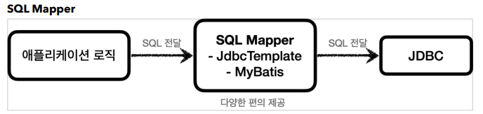

## JDBC 이해

- 애플리케이션 서버와 DB - 일반적인 사용법

  

  1. 커넥션 연결: 주로 TCP/IP를 사용해서 커넥션을 연결한다.
  2.  SQL 전달: 애플리케이션 서버는 DB가 이해할 수 있는 SQL을 연결된 커넥션을 통해 DB에 전달한다.
  3. 결과 응답: DB는 전달된 SQL을 수행하고 그 결과를 응답한다. 애플리케이션 서버는 응답 결과를 활용한다.

- 문제는 각각의 데이터베이스마다 커넥션을 연결하는 방법, SQL을 전달하는 방법, 그리고 결과를 응답 받는 방법이 모두 다르다는 점

  - 문제점

    1.데이터베이스를 다른 종류의 데이터베이스로 변경하면 애플리케이션 서버에 개발된 데이터베이스 사용 코드도 함께 변경해야 함

    2.개발자가 각각의 데이터베이스마다 커넥션 연결, SQL 전달, 그리고 그 결과를 응답 받는 방법을 새로 학습해야 한다.

  - 이런 문제를 해결하기 위해 JDBC 라는 자바 표준 등장

  

- JDBC 표준 인터페이스

  > JDBC(Java Database Connectivity)는 자바에서 데이터베이스에 접속할 수 있도록 하는 자바 API
  >
  > JDBC는 데이터베이스에서 자료를 쿼리하거나 업데이트하는 방법을 제공

  

  - 대표적으로 다음 3가지 기능을 표준 인터페이스로 정의해서 제공

    - `java.sql.Connection` - 연결
    - `java.sql.Statement` - SQL을 담은 내용
    - `java.sql.ResultSet` - SQL 요청 응답	

  - JDBC 드라이버

    - JDBC 인터페이스를 각각의 DB 벤더 (회사)에서 자신의 DB에 맞도록 구현해서 라이브러리로 제공
    - MySQL DB에 접근할 수 있는 것은 MySQL JDBC 드라이버
    - Oracle DB에 접근할 수 있는 것은 Oracle JDBC 드라이버

    

  - 정리
    - JDBC의 등장으로 다음 2가지 문제가 해결되었다
    - 데이터베이스를 다른 종류의 데이터베이스로 변경하면 애플리케이션 서버의 데이터베이스 사용 코드도 함께 변경해야하는 문제
      - 애플리케이션 로직은 이제 JDBC 표준 인터페이스에만 의존\
    - 개발자가 각각의 데이터베이스마다 커넥션 연결, SQL 전달, 그리고 그 결과를 응답 받는 방법을 새로 학습해야하는 문제
      - 개발자는 JDBC 표준 인터페이스 사용법만 학습하면 된다
  - 참고 - 표준화의 한계
    - 각각의 데이터베이스마다 SQL, 데이터타입 등의 일부 사용법 다르다
    - ANSI SQL이라는 표준이 있기는 하지만 일반적인 부분만 공통화했기 때문에 한계가 있다
    - 데이터베이스를 변경하면 JDBC 코드는 변경하지 않아도 되지만 SQL은 해당 데이터베이스에 맞도록 변경해야한다
    - JPA를 사용하면 많은 부분 해결 가능


- JDBC와 최신 데이터 접근 기술

  - 최근에는 JDBC를 직접 사용하기 보다는 JDBC를 편리하게 사용하는 다양한 기술이 존재

  

  

  - SQL Mapper 장점
    - JDBC를 편리하게 사용하도록 도와준다
    -  SQL 응답 결과를 객체로 편리하게 변환해준다. 
    - JDBC의 반복 코드를 제거해준다.
  - SQL Mapper 단점
    - 개발자가 SQL을 직접 작성해야한다
    - 대표 기술: 스프링 `JdbcTemplate`, `MyBatis`

  

  - ORM은 객체를 관계형 데이터베이스 테이블과 매핑해주는 기술
    - 반복적인 SQL을 직접 작성하지 않고, ORM 기술이 개발자 대신에 SQL을 동적으로 만들어 실행
    - 추가로 각각의 데이터베이스마다 다른 SQL을 사용하는 문제도 중간에서 해결
    - 대표 기술: `JPA`, 하이버네이트, 이클립스링크
    - JPA는 자바 진영의 ORM 표준 인터페이스


- SQL Mapper vs ORM 기술
  - SQL Mapper는 SQL만 작성할 줄 알면 금방 배워서 사용
    - 나머지 번거로운 일은 SQL Mapper가 대신 해결
  - ORM기술은 SQL 자체를 작성하지 않아도 되어서 개발 생산성이 매우 높아진다
    - 실무에서 사용하려면 깊이있게 학습해야 한다
  - JDBC는 자바 개발자라면 꼭 알아두어야 하는 필수 기본 기술


- DB 연결

  - `DBConnectionUtil`

    ```java
    @Slf4j
    public class DBConnectionUtil {
        public static Connection getConnection() {
            try {
                Connection connection = DriverManager.getConnection(URL, USERNAME, PASSWORD);
                log.info("get connection={}, class={}", connection, connection.getClass());
                return connection;
            } catch (SQLException e) {
                throw new IllegalStateException(e);
            }
        }
    }
    ```

    - `DriverManager.getConnection(..)`
      - 라이브러리에 있는 데이터베이스 드라이버를 찾아서 해당 드라이버가 제공하는 커넥션을 반환
      - 여기서는 H2 데이터베이스
        - ` org.h2.jdbc.JdbcConnection`
      - 이 커넥션은 JDBC 표준 커넥션 인터페이스인 `java.sql.Connection` 인터페이스를 구현

- 

  - JDBC는 `java.sql.Connection` 표준 커넥션 인터페이스를 정의한다.
  - H2 데이터베이스 드라이버는 JDBC Connection 인터페이스를 구현한 `org.h2.jdbc.JdbcConnection` 구현체를 제공한다

  - `DriverManager` 커넥션 요청 흐름

    

    - JDBC가 제공하는 `DriverManager` 는 라이브러리에 등록된 DB 드라이버들을 관리하고, 커넥션을 획득하는 기능을 제공한다.

  - 순서

    1. 애플리케이션 로직에서 커넥션이 필요하면 `DriverManager.getConnection()` 을 호출
    2. `DriverManager` 는 라이브러리에 등록된 드라이버 목록을 자동으로 인식
       - 이 드라이버들에게 순서대로 다음 정보를 넘겨서 커넥션을 획득할 수 있는지 확인
       - URL: 예) `jdbc:h2:tcp://localhost/~/test`
       - 이름, 비밀번호 등 접속에 필요한 추가 정보
       - 각각의 드라이버는 URL 정보를 체크해서 본인이 처리할 수 있는 요청인지 확인
    3. 이렇게 찾은 커넥션 구현체가 클라이언트에 반환


- `MemberRepositoryV0` - 회원 등록

  ```java
  /**
   * JDBC - DriverManager 사용
   */
  @Slf4j
  public class MemberRepositoryV0 {
  
      public Member save(Member member) throws SQLException {
          String sql = "insert into member(member_id, money) values(?, ?)";
  
          Connection con = null;
          PreparedStatement pstmt = null;
  
          try {
              con = getConnection();
              pstmt = con.prepareStatement(sql);
              pstmt.setString(1, member.getMemberId());
              pstmt.setInt(2, member.getMoney());
              pstmt.executeUpdate();
              return member;
          } catch (SQLException e) {
              log.error("db error", e);
              throw e;
          } finally {
              close(con, pstmt, null);
          }
      }
  
      private void close(Connection con, Statement stmt, ResultSet rs) {
          if (rs != null) {
              try {
                  rs.close();
              } catch (SQLException e) {
                  log.info("error", e);
              }
          }
          if (stmt != null) {
              try {
                  stmt.close();
              } catch (SQLException e) {
                  log.info("error", e);
              }
          }
          if (con != null) {
              try {
                  con.close();
              } catch (SQLException e) {
                  log.info("error", e);
              }
          }
      }
  
      private Connection getConnection() {
          return DBConnectionUtil.getConnection();
      }
  }
  ```

  - 커넥션 획득
    - `getConnection()` : 이전에 만들어둔 `DBConnectionUtil` 를 통해서 데이터베이스 커넥션을 획득한다.
  - `save()` - SQL 전달
    - `sql` : 데이터베이스에 전달할 SQL을 정의한다. 여기서는 데이터를 등록해야 하므로 `insert sql` 을 준비했다
    - `con.prepareStatement(sql)` : 데이터베이스에 전달할 SQL과 파라미터로 전달할 데이터들을 준비한다
      - `sql `: `insert into member(member_id, money) values(?, ?)"`
      - `pstmt.setString(1, member.getMemberId())` : SQL의 첫번째 `?` 에 값을 지정한다. 문자이므로 `setString` 을 사용한다.
      - `pstmt.setInt(2, member.getMoney())` : SQL의 두번째 `?` 에 값을 지정한다. `Int `형 숫자이므로 `setInt` 를 지정한다
    - `pstmt.executeUpdate()` : `Statement` 를 통해 준비된 SQL을 커넥션을 통해 실제 데이터베이스에 전달
      - `int` 를 반환하는데 영향받은 DB row 수를 반환

  - 리소스 정리
    - 쿼리를 실행하고 나면 리소스를 정리해야 한다 - 항상 역순
    - `Connection` 을 먼저 획득하고 `Connection` 을 통해 `PreparedStatement` 를 만들었기 때문에
    - 리소스를 반환할 때는 `PreparedStatement` 를 먼저 종료하고, 그 다음에 `Connection` 을 종료
    - 예외가 발생하든, 하지 않든 항상 수행되어야 하므로 `finally` 구문에 주의해서 작성
    - 이 부분을 놓치게 되면 커넥션이 끊어지지 않고 계속 유지되는 문제
      - 리소스 누수라고 하는데, 결과적으로 커넥션 부족으로 장애가 발생할 수 있음
  - 참고
    - `PreparedStatement` 는 `Statement` 의 자식 타입인데,` ?` 를 통한 파라미터 바인딩을 가능하게 해준다
      - `SQL Injection` 공격을 예방하려면 `PreparedStatement` 를 통한 파라미터 바인딩 방식을 사용해야 한다.
      - 그냥 변수로 하면 변수에 SQL이 들어올 수 있음
      - 파라미터 바인딩을하면 단순 데이터 취급이라 `SQL Injection `공격 예방 가능


- 데이터 조회

  - `rs = pstmt.executeQuery()` : `executeQuery()` 는 결과를 `ResultSet` 에 담아서 반환한다

  - `ResultSet`

    - `ResultSet` 은 다음과 같이 생긴 데이터 구조이다. 보통 select 쿼리의 결과가 순서대로 들어간다. 
      - 예를 들어서 `select member_id, money` 라고 지정하면 `member_id` , `money `라는 이름으로 데이터가 저장된다.
      - 참고로 `select *` 을 사용하면 테이블의 모든 컬럼을 다 지정한다.
    - `ResultSet` 내부에 있는 커서( `cursor` )를 이동해서 다음 데이터를 조회할 수 있다.
    - `rs.next()` : 이것을 호출하면 커서가 다음으로 이동한다. 참고로 최초의 커서는 데이터를 가리키고 있지 않기 때문에 `rs.next()` 를 최초 한번은 호출해야 데이터를 조회할 수 있다. 
      - `rs.next()` 의 결과가 `true` 면 커서의 이동 결과 데이터가 있다는 뜻이다.
      - `rs.next()` 의 결과가 `false` 면 더이상 커서가 가리키는 데이터가 없다는 뜻이다. 
    - `rs.getString("member_id")` : 현재 커서가 가리키고 있는 위치의 `member_id` 데이터를 `String` 타입으로 반환한다.
    - `rs.getInt("money")` : 현재 커서가 가리키고 있는 위치의 `money` 데이터를 ` int` 타입으로 반환한다.

  - `ResultSet` 결과 예시

    

  - 참고
    - `isEqualTo()` : `findMember.equals(member)` 를 비교한다. 결과가 참인 이유는 롬복의 `@Data` 는 해당 객체의 모든 필드를 사용하도록 `equals()` 를 오버라이딩 하기 때문


- 