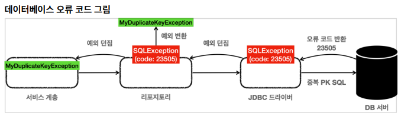
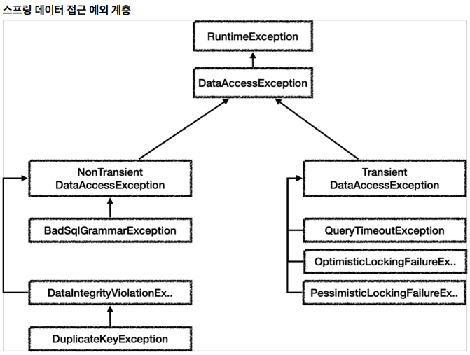

## 스프링과 문제 해결 - 예외 처리, 반복

- 체크 예외와 인터페이스
  - 체크 예외를 사용하려면 인터페이스에도 해당 체크 예외가 선언되어 있어야 함
  - 특정 기술에 종속되는 인터페이스
    - 특정 구현 기술에 종속적인 체크 예외를 사용하게 되면 인터페이스에도 해당 예외를 포함해야 한다
    - 인터페이스가 특정 구현 기술에 오염이 되어 버렸다
    - 향후 JDBC가 아닌 다른 기술로 변경한다면 인터페이스 자체를 변경해야 한다
  - 런타임 예외와 인터페이스
    - 런타임 예외는 이런 부분에서 자유로움
    - 인터페이스에 런타임 예외를 따로 선언하지 않아도 됨


- 데이터 접근 예외 직접 만들기

  - DB 오류에 따라 특정 예외는 복구하고 싶을 수 있음

  - 예를 들어, 중복 아이디가 있으면 임의의 숫자를 붙여서 가입시키기

    

    - 오류 코드 얻기 : `e.getErrorCode()`
    - DB에 어떤 문제가 발생했는지 확인할 수 있음

  - H2 데이터베이스 예

    - `23505` : 키 중복 오류
    - `42000` : SQL 문법 

  - 같은 오류여도 각각 DB마다 정의된 오류 코드가 다름

  - 리포지토리에서 예외 변환

    - `SQLException` -> `MyDuplicateKeyException`
    - 서비스 계층으로 `SQLException`을 던지면 서비스 계층이 JDBC 기술에 의존하게 됨
    - 예외를 변환해서 던지자

  - `MyDuplicateKeyException`

    ```java
    public class MyDuplicateKeyException extends MyDbException {
        public MyDuplicateKeyException() {
        }
        public MyDuplicateKeyException(String message) {
            super(message);
        }
        public MyDuplicateKeyException(String message, Throwable cause) {
            super(message, cause);
        }
        public MyDuplicateKeyException(Throwable cause) {
            super(cause);
        }
    }
    ```

  - 복구할 수 없는 예외는 공통 예외 처리하는 곳에서 로그를 남겨줌


- 스프링 예외 추상화 이해

  - 스프링은 데이터 접근 계층에 대한 예외들을 특정 기술에 종속적지 않계 설계

    

    - 일부 계층 생략
    - `Transient` 는 일시적이라는 뜻이다. `Transient` 하위 예외는 동일한 SQL을 다시 시도했을 때 성공할 가능성이 있다
      - 예를 들어서 쿼리 타임아웃, 락과 관련된 오류들이다
    - `NonTransient` 는 일시적이지 않다는 뜻이다. 같은 SQL을 그대로 반복해서 실행하면 실패한다.
      - SQL 문법 오류, 데이터베이스 제약조건 위배 등이 있다


- 스프링 예외 변환기

  ```java
  SQLExceptionTranslator exTranslator = 
      new SQLErrorCodeSQLExceptionTranslator(dataSource);
  DataAccessException resultEx = exTranslator.translate("select", sql, e);
  ```

  - `translate()` 메서드의 첫번째 파라미터는 읽을 수 있는 설명
  - 두번째는 실행한 `sql`
  - 마지막은 발생된 `SQLException` 을 전달
  - 적절한 스프링 데이터 접근 계층의 예외로 변환해서 반환해준다

- 각각 DB가 제공하는 SQL ErrorCode를 고려해서 예외를 변환할 수 있는 이유

  - `org.springframework.jdbc.support.sql-error-code.xml`

    ```xml
    <bean id="H2" class="org.springframework.jdbc.support.SQLErrorCodes">
        <property name="badSqlGrammarCodes">
            <value>42000,42001,42101,42102,42111,42112,42121,42122,42132</value>
        </property>
        <property name="duplicateKeyCodes">
            <value>23001,23505</value>
        </property>
    </bean>
    <bean id="MySQL" class="org.springframework.jdbc.support.SQLErrorCodes">
        <property name="badSqlGrammarCodes">
            <value>1054,1064,1146</value>
        </property>
        <property name="duplicateKeyCodes">
            <value>1062</value>
        </property>
    </bean>
    ```

    - 스프링 SQL 예외 변환기는 SQL ErrorCode를 이 파일에 대입해서 어떤 스프링 데이터 접근 예외로 전환해야 할지 찾아낸다

  - 정리

    - 스프링 예외 추상화 덕분에 특정 기술에 종속적이지 않게 되었다
    - 스프링이 제공하는 예외를 사용하기 때문에 스프링에 대한 기술 종속성은 발생한다
      - 스프링에 대한 기술 종속성까지 완전히 제거하려면 예외를 모두 직접 정의하고 예외 변환도 직접 하면 됨
      - 실용적인 방법은 아니다


- 스프링 예외 추상화 적용

  ```java
  public class MemberRepositoryV4_2 implements MemberRepository {
      
      private final DataSource dataSource;
      private final SQLExceptionTranslator exTranslator;
      
      public MemberRepositoryV4_2(DataSource dataSource) {
          this.dataSource = dataSource;
          this.exTranslator = new SQLErrorCodeSQLExceptionTranslator(dataSource);
      }
      
      ...
  ```

  ```java
  } catch (SQLException e) {
      throw exTranslator.translate("save", sql, e);
  }
  ```


- JDBC 반복 문제 해결 - JdbcTemplate

  - 스프링은 JDBC의 반복 문제를 해결하기 위해 `JdbcTemplate` 이라는 템플릿을 제공한다.

  - 트랜잭션을 위한 커넥션 동기화

  - 예외 발생시 스프링 예외 변환기도 자동으로 실행

    ```java
    /**
     * JdbcTemplate 사용
     */
    @Slf4j
    public class MemberRepositoryV5 implements MemberRepository {
        private final JdbcTemplate template;
        
        public MemberRepositoryV5(DataSource dataSource) {
            template = new JdbcTemplate(dataSource);
        }
        
        @Override
        public Member save(Member member) {
            String sql = "insert into member(member_id, money) values(?, ?)";
            template.update(sql, member.getMemberId(), member.getMoney());
            return member;
        }
        
        @Override
        public Member findById(String memberId) {
            String sql = "select * from member where member_id = ?";
            return template.queryForObject(sql, memberRowMapper(), memberId);
        }
        
        @Override
        public void update(String memberId, int money) {
            String sql = "update member set money=? where member_id=?";
            template.update(sql, money, memberId);
        }
        
        @Override
        public void delete(String memberId) {
            String sql = "delete from member where member_id=?";
            template.update(sql, memberId);
        }
        
        private RowMapper<Member> memberRowMapper() {
            return (rs, rowNum) -> {
                Member member = new Member();
                member.setMemberId(rs.getString("member_id"));
                member.setMoney(rs.getInt("money"));
                return member;
            };
        }
    }
    ```

    