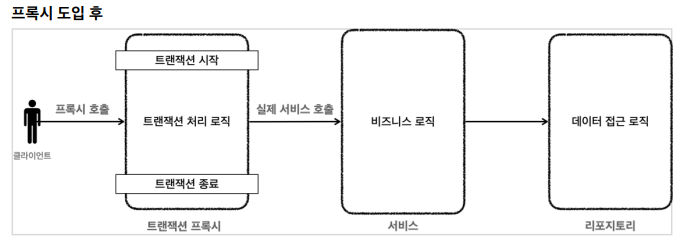

## 스프링과 문제 해결 -  트랜잭션

- 애플리케이션 구조

  

- 순수한 서비스 계층

  -  비즈니스 로직은 최대한 변경없이 유지되어야 한다
  - 서비스 계층을 특정 기술에 종속적이지 않게 개발해야 한다
  - 프레젠테이션 계층은 클라이언트가 접근하는 UI와 관련된 기술인 웹, 서블릿, HTTP와 관련된 부분을 담당
  - 데이터 접근 계층은 데이터를 저장하고 관리하는 기술을 담당
  - 서비스 계층에서 데이터 접근 계층을 직접 접근하는 것이 아니라, 인터페이스를 제공하고 서비스 계층은 이 인터페이스에 의존하는 것이 좋다
  - 정리하자면 서비스 계층은 가급적 비즈니스 로직만 구현하고 특정 구현 기술에 직접 의존해서는 안된다.
    - 향후 구현 기술이 변경될 때 변경의 영향 범위를 최소화


- 문제 정리
  - 트랜잭션 문제
    - JDBC 구현 기술이 서비스 계층에 누수되는 문제
      - 데이터 접근 계층에 JDBC 코드를 다 몰아두었지만 서비스 계층에 결국 JDBC 구현 기술 누수 발생
    - 커넥션을 파라미터로 넘기므로
      - 똑같은 기능도 트랜잭션용 기능과 트랜잭션을 유지하지 않아도 되는 기능으로 분리해야 한다
    - 트랜잭션 적용 반복 문제
      - 트랜잭션 적용 코드를 보면 반복이 많다. `try` , `catch` , `finally` ..
  - 예외 누수 문제
    - 데이터 접근 계층의 JDBC 구현 기술 예외가 서비스 계층으로 전파
    - `SQLException` 은 체크 예외이기 때문에 데이터 접근 계층을 호출한 서비스 계층에서 해당 예외를 잡아서 처리하거나 명시적으로 `throws` 를 통해서 다시 밖으로 던져야한다
  - JDBC 반복 문제
    - 유사 코드 반복이 너무 많음


- 트랜잭션 추상화

  - 구현 기술마다 트랜잭션을 사용하는 방법이 다르다

    - `JDBC : con.setAutoCommit(false)`
    - `JPA : transaction.begin()`

  - 서비스 계층 코드를 변경하지 않고 트랜잭션 기능을 추상화하자

    - 트랜잭션 추상화 인터페이스

    ```java
    public interface TxManager {
        begin();
        commit();
        rollback();
    }
    
    ```

    

    - 원하는 구현체를 DI를 통해서 주입
    - 트랜잭션을 사용하는 서비스 코드를 전혀 변경하지 않고, 트랜잭션 기술을 마음껏 변경할 수 있다.

  - 스프링의 트랜잭션 추상화

    - 스프링이 이미 만들어 두었음

    

    - `PlatformTransactionManager` 인터페이스

    ```java
    package org.springframework.transaction;
    public interface PlatformTransactionManager extends TransactionManager {
        
        TransactionStatus getTransaction(@Nullable TransactionDefinition definition)
            throws TransactionException;
        
        void commit(TransactionStatus status) throws TransactionException;
        
        void rollback(TransactionStatus status) throws TransactionException;
        
    }
    ```

    - `getTransaction()` : 트랜잭션을 시작한다. 
      - 기존에 이미 진행중인 트랜잭션이 있는 경우 해당 트랜잭션에 참여 가능
    - `commit()` : 트랜잭션을 커밋한다.
    - `rollback()` : 트랜잭션을 롤백한다.


- 트랜잭션 동기화

  

  - 스프링은 트랜잭션 동기화 매니저를 제공
    - 쓰레드 로컬( `ThreadLocal` )을 사용해서 커넥션을 동기화해준다
      - 쓰레드를 안전하게 잘 보관(멀티쓰레드 상황에서도)
    - 커넥션이 필요하면 트랜잭션 동기화 매니저를 통해 커넥션을 획득
  - 동작 방식
    1. 트랜잭션을 시작하려면 커넥션이 필요하다. 트랜잭션 매니저는 데이터소스를 통해 커넥션을 만들고 트랜잭션을 시작한다. 
    2. 트랜잭션 매니저는 트랜잭션이 시작된 커넥션을 트랜잭션 동기화 매니저에 보관한다. 
    3. 리포지토리는 트랜잭션 동기화 매니저에 보관된 커넥션을 꺼내서 사용한다. 따라서 파라미터로 커넥션을 전달하지 않아도 된다.
    4. 트랜잭션이 종료되면 트랜잭션 매니저는 트랜잭션 동기화 매니저에 보관된 커넥션을 통해 트랜잭션을 종료하고, 커넥션도 닫는다

- `DataSourceUtils.getConnection()`

  ```java
  private Connection getConnection() throws SQLException {
      //주의! 트랜잭션 동기화를 사용하려면 DataSourceUtils를 사용해야 한다.
      Connection con = DataSourceUtils.getConnection(dataSource);
      log.info("get connection={} class={}", con, con.getClass());
      return con;
  }
  ```

  - 트랜잭션 동기화 매니저가 관리하는 커넥션이 있으면 해당 커넥션을 반환한다
  - 트랜잭션 동기화 매니저가 관리하는 커넥션이 없는 경우 새로운 커넥션을 생성해서 반환한다

- `DataSourceUtils.releaseConnection()`

  ```java
  private void close(Connection con, Statement stmt, ResultSet rs) {
      JdbcUtils.closeResultSet(rs);
      JdbcUtils.closeStatement(stmt);
      //주의! 트랜잭션 동기화를 사용하려면 DataSourceUtils를 사용해야 한다.
      DataSourceUtils.releaseConnection(con, dataSource);
  }
  ```

  - `con.close()` 를 사용해서 직접 닫아버리면 커넥션이 유지되지 않는 문제가 발생
    - 이 커넥션은 이후 로직은 물론이고, 트랜잭션을 종료(커밋, 롤백)할 때 까지 살아있어야 한다.
  - 트랜잭션을 사용하기 위해 동기화된 커넥션은 커넥션을 닫지 않고 그대로 유지해준다
  - 트랜잭션 동기화 매니저가 관리하는 커넥션이 없는 경우 해당 커넥션을 닫는다

- `MemberServiceV3_1`

  ```java
  /**
   * 트랜잭션 - 트랜잭션 매니저
   */
  @Slf4j
  @RequiredArgsConstructor
  public class MemberServiceV3_1 {
      private final PlatformTransactionManager transactionManager;
      private final MemberRepositoryV3 memberRepository;
      public void accountTransfer(String fromId, String toId, int money) throws
          SQLException {
          //트랜잭션 시작
          TransactionStatus status = transactionManager.getTransaction(new
                                                                       DefaultTransactionDefinition());
          try {
              //비즈니스 로직
              bizLogic(fromId, toId, money);
              transactionManager.commit(status); //성공시 커밋
          } catch (Exception e) {
              transactionManager.rollback(status); //실패시 롤백
              throw new IllegalStateException(e);
          }
      }
      private void bizLogic(String fromId, String toId, int money) throws
          SQLException {
          Member fromMember = memberRepository.findById(fromId);
          Member toMember = memberRepository.findById(toId);
          memberRepository.update(fromId, fromMember.getMoney() - money);
          validation(toMember);
          memberRepository.update(toId, toMember.getMoney() + money);
      }
      private void validation(Member toMember) {
          if (toMember.getMemberId().equals("ex")) {
              throw new IllegalStateException("이체중 예외 발생");
          }
      }
  }
  ```

  - `private final PlatformTransactionManager transactionManage`
    - 트랜잭션 매니저를 주입 받는다
    - JDBC : `DataSourceTransactionManager`
    - JPA : `JpaTransactionManager`
  - `transactionManager.getTransaction()`
    - 트랜잭션 시작
    - `TransactionStatus status` 를 반환
      - 현재 트랜잭션의 상태 정보가 포함되어 있다. 이후 트랜잭션을 커밋, 롤백할 때 필요하다
  - `new DefaultTransactionDefinition()`
    - 트랜잭션과 관련된 옵션을 지정
  - `transactionManager.commit(status)`
    - 트랜잭션이 성공하면 이 로직을 호출해서 커밋하면 된다
  - `transactionManager.rollback(status)`
    - 문제가 발생하면 이 로직을 호출해서 트랜잭션을 롤백
  - `release`가 따로 필요 없이 커밋이나 롤백하면 자동으로 트랜잭션 릴리즈


- 트랜잭션 매니저 동작 흐름

  

  클라이언트의 요청으로 서비스 로직을 실행한다.

  1. 서비스 계층에서 `transactionManager.getTransaction()` 을 호출해서 트랜잭션을 시작한다. 
  2. 트랜잭션을 시작하려면 먼저 데이터베이스 커넥션이 필요하다. 트랜잭션 매니저는 내부에서 데이터소스를 사용해서 커넥션을 생성한다.
  3. 커넥션을 수동 커밋 모드로 변경해서 실제 데이터베이스 트랜잭션을 시작한다
  4. 커넥션을 트랜잭션 동기화 매니저에 보관한다.
  5. 트랜잭션 동기화 매니저는 쓰레드 로컬에 커넥션을 보관한다. 따라서 멀티 쓰레드 환경에 안전하게 커넥션을 보관할 수 있다

- 

  		6. 서비스는 비즈니스 로직을 실행하면서 리포지토리의 메서드들을 호출한다. 이때 커넥션을 파라미터로 전달하지 않는다

  7. 리포지토리 메서드들은 트랜잭션이 시작된 커넥션이 필요하다`DataSourceUtils.getConnection()` 을 사용해서 트랜잭션 동기화 매니저에 보관된 커넥션을 꺼내서 사용한다.
     - 이 과정을 통해서 자연스럽게 같은 커넥션을 사용하고, 트랜잭션도 유지된다.

  8. 획득한 커넥션을 사용해서 SQL을 데이터베이스에 전달해서 실행한다

- 트랜잭션 종료

- '

  9. 비즈니스 로직이 끝나고 트랜잭션을 종료한다. 트랜잭션은 커밋하거나 롤백하면 종료된다.

  10. 트랜잭션을 종료하려면 동기화된 커넥션이 필요하다. 트랜잭션 동기화 매니저를 통해 동기화된 커넥션을 획득한다.

  11. 획득한 커넥션을 통해 데이터베이스에 트랜잭션을 커밋하거나 롤백한다.

  12. 전체 리소스를 정리한다

      - 트랜잭션 동기화 매니저를 정리한다. 쓰레드 로컬은 사용후 꼭 정리해야 한다.

      - `con.setAutoCommit(true)` 로 되돌린다. 커넥션 풀을 고려해야 한다.

      - `con.close()` 를 호출해셔 커넥션을 종료한다.

      - 커넥션 풀을 사용하는 경우 `con.close()` 를 호출하면 커넥션 풀에 반환된다

      - 트랜잭션 동기화 매니저 덕분에 커넥션을 파라미터로 넘기지 않아도 된다


- 트랜잭션 문제 해결 - 트랜잭션 템플릿

  - 템플릿 콜백 패턴을 활용하면 반복 문제를 해결할 수 있음

  - 스프링은 `TransactionTemplate` 라는 템플릿 클래스를 제공한다

  - `TransactionTemplate`

    ```java
    public class TransactionTemplate {
        
        private PlatformTransactionManager transactionManager;
        
        public <T> T execute(TransactionCallback<T> action){..}
        void executeWithoutResult(Consumer<TransactionStatus> action){..}
    }
    ```

    - `execute()` : 응답 값이 있을 때 사용한다.
    - `executeWithoutResult()` : 응답 값이 없을 때 사용한다

  - 트랜잭션 템플릿 사용 로직

    ```java
    private final TransactionTemplate txTemplate;
    private final MemberRepositoryV3 memberRepository;
    public MemberServiceV3_2(PlatformTransactionManager transactionManager,
                             MemberRepositoryV3 memberRepository) {
        this.txTemplate = new TransactionTemplate(transactionManager);
        this.memberRepository = memberRepository;
    }
    
    txTemplate.executeWithoutResult((status) -> {
        try {
            //비즈니스 로직
            bizLogic(fromId, toId, money);
        } catch (SQLException e) {
            throw new IllegalStateException(e);
        }
    });
    ```

    - 트랜잭션 템플릿 덕분에 트랜잭션을 시작하고, 커밋하거나 롤백하는 코드가 모두 제거되었다.
    - 트랜잭션 템플릿의 기본 동작
      - 비즈니스 로직이 정상 수행되면 커밋한다.
      - 언체크 예외가 발생하면 롤백한다. 그 외의 경우 커밋
    - `bizLogic()` 메서드를 호출하면 `SQLException` 체크 예외를 넘겨준다.
      - 해당 람다에서 체크 예외를 밖으로 던질 수 없기 때문에 언체크 예외로 바꾸어 던지도록 예외를 전환

- 정리

  - 애플리케이션을 구성하는 로직을 핵심 기능과 부가 기능으로 구분하자면 서비스 입장에서 비즈니스 로직은 핵심 기능이고, 트랜잭션은 부가 기능이다
  - 서비스 로직은 가급적 핵심 비즈니스 로직만 있어야 한다. 하지만 트랜잭션 기술을 사용하려면 어쩔 수 없이 트랜잭션 코드가 나와야 한다. 어떻게 하면 이 문제를 해결할 수 있을까?


- 트랜잭션 AOP 이해

  - `@Transactional` 을 사용하면 스프링이 AOP를 사용해서 트랜잭션을 편리하게 처리해준다

  

  - 프록시를 사용하면 트랜잭션을 처리하는 객체와 비즈니스 로직을 처리하는 서비스 객체를 명확하게 분리할 수 있다
  - 프록시 도입 전: 서비스에 비즈니스 로직과 트랜잭션 처리 로직이 함께 섞여있다.
  - 프록시 도입 후: 트랜잭션 프록시가 트랜잭션 처리 로직을 모두 가져간다. 
    - 트랜잭션을 시작한 후에 실제 서비스를 대신 호출한다.
    - 트랜잭션 프록시 덕분에 서비스 계층에는 순수한 비즈니즈 로직만 남길 수 있다
  - 스프링이 제공하는 트랜잭션 AOP
    - 개발자는 트랜잭션 처리가 필요한 곳에 `@Transactional` 애노테이션만 붙여주면 된다
      - 스프링이 프록시를 만들고 트랜잭션 처리를 프록시가 해줌
    - 스프링의 트랜잭션 AOP는 이 애노테이션을 인식해서 트랜잭션 프록시를 적용해준다

- AOP 테스트

  - `@SpringBootTest` : 스프링 AOP를 적용하려면 스프링 컨테이너가 필요하다. 

    - 테스트시 스프링 부트를 통해 스프링 컨테이너를 생성한다.
    - `@Autowired` 등을 통해 스프링 컨테이너가 관리하는 빈들을 사용할 수 있다

  - `@TestConfiguration`

    - 테스트 안에서 내부 설정 클래스를 만들어서 사용하면서 이 에노테이션을 붙이면,  스프링 부트가 자동으로 만들어주는 빈들에 추가로 필요한 스프링 빈들을 등록하고 테스트를 수행할 수 있다

  - `TestConfig`

    - `DataSource` 스프링에서 기본으로 사용할 데이터소스를 스프링 빈으로 등록
      - 추가로 트랜잭션 매니저에서도 사용
    - `DataSourceTransactionManager` 트랜잭션 매니저를 스프링 빈으로 등록한다
      - 스프링이 제공하는 트랜잭션 AOP는 스프링 빈에 등록된 트랜잭션 매니저를 찾아서 사용하기 때문에 트랜잭션 매니저를 스프링 빈으로 등록해두어야 한다.

    ```java
    @TestConfiguration
    static class TestConfig {
        @Bean
        DataSource dataSource() {
            return new DriverManagerDataSource(URL, USERNAME, PASSWORD);
        }
        @Bean
        PlatformTransactionManager transactionManager() {
            return new DataSourceTransactionManager(dataSource());
        }
        @Bean
        MemberRepositoryV3 memberRepositoryV3() {
            return new MemberRepositoryV3(dataSource());
        }
        @Bean
        MemberServiceV3_3 memberServiceV3_3() {
            return new MemberServiceV3_3(memberRepositoryV3());
        }
    }
    
    ```

    

- 트랜잭션 AOP 전체 흐름

  

- 선언적 트랜잭션 관리 vs 프로그래밍 방식 트랜잭션 관리

  - 선언적 트랜잭션 관리(Declarative Transaction Management)
    - `@Transactional` 애노테이션 하나만 선언해서 매우 편리하게 트랜잭션을 적용
  - 프로그래밍 방식의 트랜잭션 관리(programmatic transaction management)
    - 트랜잭션 매니저 또는 트랜잭션 템플릿 등을 사용해서 트랜잭션 관련 코드를 직접 작성하는 것
  - 선언적 트랜잭션 관리가 프로그래밍 방식에 비해서 훨씬 간편하고 실용적이기 때문에 실무에서는 대부분 선언적 트랜잭션 관리를 사용
  - 실무에서는 대부분 스프링 컨테이너와 스프링 AOP를 사용하기 때문에 프로그래밍 방식은 거의 사용하지 않음
  - 프로그래밍 방식 트랜잭션 관리는 테스트 시에 가끔 사용될 때는 있다.


- 스프링 부트의 자동 리소스 등록

  - 스프링 부트는 데이터소스( `DataSource` )를 스프링 빈에 자동으로 등록한다.

  - 자동으로 등록되는 스프링 빈 이름: `dataSource `

  - 개발자가 직접 데이터소스를 빈으로 등록하면 스프링 부트는 데이터소스를 자동으로 등록하지 않는다.

  - `application.properties`

    ```
    spring.datasource.url=jdbc:h2:tcp://localhost/~/test
    spring.datasource.username=sa
    spring.datasource.password=
    ```

    - `spring.datasource.url` 속성이 없으면 내장 데이터베이스(메모리 DB)를 생성하려고 시도

- 트랜잭션 매니저 - 자동 등록
  - 스프링 부트는 적절한 트랜잭션 매니저( `PlatformTransactionManager` )를 자동으로 스프링 빈에 등록한다.
  - 자동으로 등록되는 스프링 빈 이름: `transactionManager `
  - 개발자가 직접 트랜잭션 매니저를 빈으로 등록하면 스프링 부트는 트랜잭션 매니저를 자동으로 등록하지 않는다
  - 어떤 트랜잭션 매니저를 선택할지는 현재 등록된 라이브러리를 보고 판단
  - JDBC, JPA 둘 다 사용하는 경우 JpaTransactionManager 를 등록
    - `JpaTransactionManager` 는 `DataSourceTransactionManager` 가 제공하는 기능도 대부분 지원