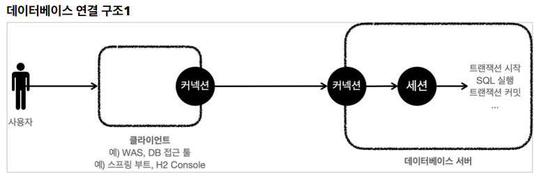
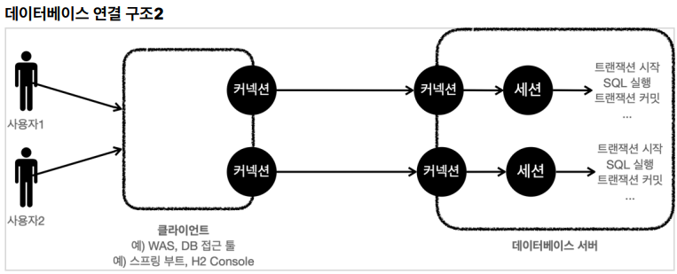
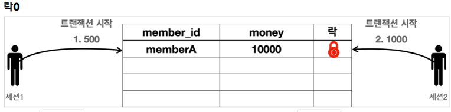
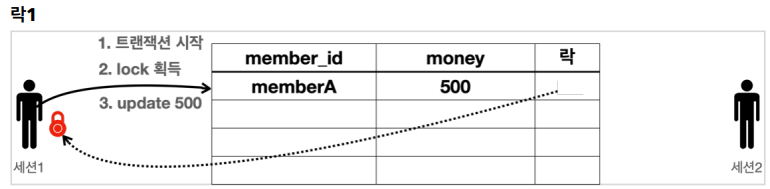
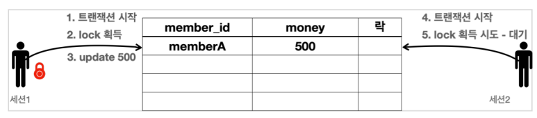
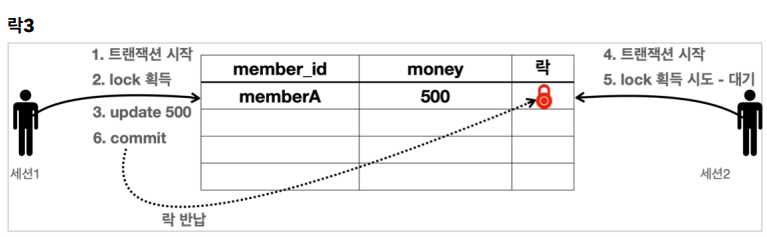
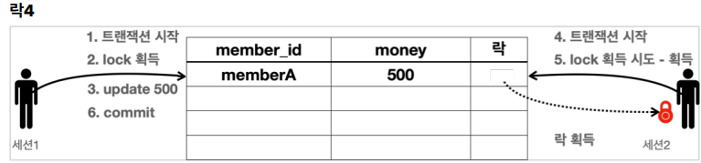
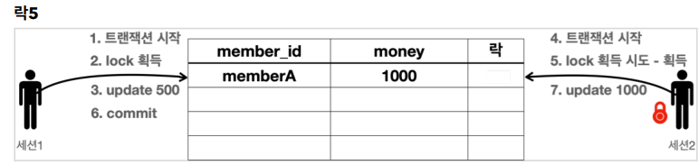
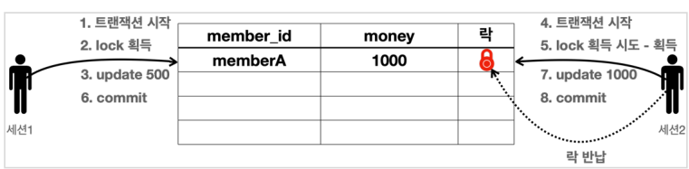
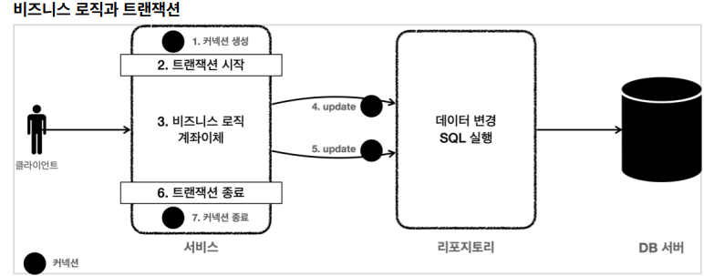

## 트랜잭션 이해

> DB에서 트랜잭션은 하나의 거래를 안전하게 처리하도록 보장해주는 것

- 개념 이해

  - 커밋 : 모든 작업이 성공해서 DB에 정상 반영하는 것
  - 롤백 : 작업 중 하나라도 실패해서 거래 이전으로 되돌리는 것

- 트랜잭션 ACID

  > 트랜잭션은 원자성, 일관성, 지속성을 보장
  >
  > 격리성을 완벽히 보장하려면 트랜잭션을 거의 순서대로 실행해야 한다
  >
  > -> 동시 처리 성능 매우 나빠짐

  - 원자성(`Atomicity`)
    - 트랜잭션 내에서 실행한 작업들은 마치 하나의 작업인 것처럼 모두 성공 하거나 모두 실패해야 한다.
  - 일관성(`Consistency`)
    - 모든 트랜잭션은 일관성 있는 데이터베이스 상태를 유지해야 한다. 예를 들어 데이터베이스에서 정한 무결성 제약 조건을 항상 만족해야 한다.
  - 격리성(`Isolation`)
    - 동시에 실행되는 트랜잭션들이 서로에게 영향을 미치지 않도록 격리한다. 예를 들어 동시에 같은 데이터를 수정하지 못하도록 해야 한다. 격리성은 동시성과 관련된 성능 이슈로 인해 트랜잭션 격리 수준 (Isolation level)을 선택할 수 있다.
  - 지속성(`Durability`)
    - 트랜잭션을 성공적으로 끝내면 그 결과가 항상 기록되어야 한다. 중간에 시스템에 문제가 발생해도 데이터베이스 로그 등을 사용해서 성공한 트랜잭션 내용을 복구해야 한다.

- ANSI 표준 트랜잭션의 격리 수준
  - READ UNCOMMITED(커밋되지 않은 읽기)
  - READ COMMITTED(커밋된 읽기)
  - REPEATABLE READ(반복 가능한 읽기)
  - SERIALIZABLE(직렬화 가능) 
  - 강의에서는 일반적으로 많이 사용하는 READ COMMITTED(커밋된 읽기) 트랜잭션 격리 수준을 기준으로 설명


- 데이터베이스 연결 구조와 DB 세션

  

  - 클라이언트는 데이터베이스 서버에 연결을 요청하고 커넥션을 맺게 된다. 이때 데이터베이스 서버는 내부에 세션이라는 것을 만든다
  - 앞으로 해당 커넥션을 통한 모든 요청은 이 세션을 통해서 실행하게 된다
  - 쉽게 이야기해서 개발자가 클라이언트를 통해 SQL을 전달하면 현재 커넥션에 연결된 세션이 SQL을 실행한다.
  - 세션은 트랜잭션을 시작하고, 커밋 또는 롤백을 통해 트랜잭션을 종료한다. 그리고 이후에 새로운 트랜잭션을 다시 시작할 수 있다
  - 사용자가 커넥션을 닫거나, 또는 DBA(DB 관리자)가 세션을 강제로 종료하면 세션은 종료된다

  

  - 커넥션 풀이 10개의 커넥션을 생성하면, 세션도 10개 만들어진다


- 트랜잭션 사용법
  - 커밋을 호출하기 전까지는 임시로 데이터를 저장
  - 해당 트랜잭션을 시작한 세션(사용자) 에게만 변경 데이터가 보이고 다른 세션(사용자)에게는 변경 데이터가 보이지 않는다
  - 등록, 수정, 삭제 모두 같은 원리로 동작

- 자동 커밋, 수동 커밋
  - 자동 커밋으로 설정하면 각각의 쿼리 실행 직후에 자동으로 커밋을 호출
  - `commit` , `rollback` 을 직접 호출하면서 트랜잭션 기능을 제대로 수행하려면 자동 커밋을 끄고 수동 커밋을 사용해야 한다
  - 수동 커밋 모드로 설정하는 것을 트랜잭션을 시작한다고 표현할 수 있다
  - 참고로 수동 커밋 모드나 자동 커밋 모드는 한번 설정하면 해당 세션에서는 계속 유지된다. 중간에 변경하는 것은 가능하다


- 문제 상황
  - 중간에 문제가 발생했을 때는 커밋을 호출하면 안된다
  - 중간에 문제가 발생했을 때 롤백을 호출해서 트랜잭션 시작 시점으로 데이터를 원복 필요
  - 오토 커밋
    - 쿼리를 하나 실행할 때 마다 바로바로 커밋
    - 수동 커밋 모드를 사용해서 수동으로 커밋, 롤백 할 수 있도록 해야 한다
  - 트랜잭션을 시작한다
    - 자동 커밋 모드에서 수동 커밋 모드로 전환 하는 것을 의미


- DB 락

  - 락을 획득해야 데이터를 변경할 수 있음

  

  - 세션1은 memberA 의 금액을 500원으로 변경하고 싶고, 세션2는 같은 memberA 의 금액을 1000원으로 변경하고 싶다.
  - 데이터베이스는 이런 문제를 해결하기 위해 락(Lock)이라는 개념을 제공한다

  

  1. 세션1은 트랜잭션을 시작한다.
  2. 세션1은 memberA 의 money 를 500으로 변경을 시도한다.
     - 이때 해당 로우의 락을 먼저 획득해야 한다.
     - 락이 남아 있으므로 세션1은 락을 획득한다. (세션1이 세션2보다 조금 더 빨리 요청했다.)
  3. 세션1은 락을 획득했으므로 해당 로우에 update sql을 수행한다.

- 락2

  

  4. 세션2는 트랜잭션을 시작한다.
  5. 세션2도 memberA 의 money 데이터를 변경하려고 시도한다.
     - 이때 해당 로우의 락을 먼저 획득해야 한다.  락이 없으므로 락이 돌아올 때 까지 대기한다.
     - 참고로 세션2가 락을 무한정 대기하는 것은 아니다. 락 대기 시간을 넘어가면 락 타임아웃 오류가 발생한다.  락 대기 시간은 설정할 수 있다.

  

  6. 세션1은 커밋을 수행한다. 커밋으로 트랜잭션이 종료되었으므로 락도 반납한다

  

  - 락을 획득하기 위해 대기하던 세션2가 락을 획득한다.

  

  7. 세션2는 UPDATE sql을 수행

  

  8. 세션2는 커밋을 수행하고 트랜잭션이 종료되었으므로 락을 반납한다

  - `SET LOCK_TIMEOUT <milliseconds>`  : 락 타임아웃 시간을 설정한다.


- DB 락 - 조회

  - 일반적인 조회는 락을 사용하지 않는다
  - 데이터를 조회할 때도 락을 획득하고 싶을 때가 있다. 이럴 때는 `select for update` 구문을 사용하면 된다.
    - 로우의 락을 획득

  ```sql
  set autocommit false;
  select * from member where member_id='memberA' for update;
  ```

  - 조회 시점에 락이 필요한 경우는?
    - 트랜잭션 종료 시점까지 해당 데이터를 다른 곳에서 변경하지 못하도록 강제로 막아야 할 때 사용한다
    - 조회한 금액 정보로 계산을 완료할 때 까지 memberA 의 금액을 다른곳에서 변경하면 안된다. 이럴 때 조회 시점에 락을 획득하면 된다


- 트랜잭션 - 해결

  

  - 트랜잭션은 비즈니스 로직이 있는 서비스 계층에서 시작해야 한다. 비즈니스 로직이 잘못되면 해당 비즈니스 로직으로 인해 문제가 되는 부분을 함께 롤백해야 하기 때문이다.
  - 그런데 트랜잭션을 시작하려면 커넥션이 필요하다. 결국 서비스 계층에서 커넥션을 만들고, 트랜잭션 커밋 이후에 커넥션을 종료해야 한다.
  - 애플리케이션에서 DB 트랜잭션을 사용하려면 트랜잭션을 사용하는 동안 같은 커넥션을 유지해야한다
    - 그래야 같은 세션을 사용할 수 있다

  

  -  가장 단순한 방법은 커넥션을 파라미터로 전달해서 같은 커넥션이 사용되도록 유지하는 것

  - 주의

    1. 커넥션 유지가 필요한 두 메서드는 파라미터로 넘어온 커넥션을 사용해야 한다

       - 따라서 `con =  getConnection()` 코드가 있으면 안된다.

    2. 커넥션 유지가 필요한 두 메서드는 리포지토리에서 커넥션을 닫으면 안된다.

       - 커넥션을 전달 받은 리포지토리 뿐만 아니라 이후에도 커넥션을 계속 이어서 사용하기 때문이다.

       - 이후 서비스 로직이 끝날 때 트랜잭션을 종료하고 닫아야 한다

    - 서비스에서 커넥션을 시작해서 넘겨주고 종료

- `MemberServiceV2`

  ```java
  /**
   * 트랜잭션 - 파라미터 연동, 풀을 고려한 종료
   */
  @Slf4j
  @RequiredArgsConstructor
  public class MemberServiceV2 {
      private final DataSource dataSource;
      private final MemberRepositoryV2 memberRepository;
      public void accountTransfer(String fromId, String toId, int money) throws
              SQLException {
          
          Connection con = dataSource.getConnection();
          try {
              con.setAutoCommit(false); //트랜잭션 시작
              //비즈니스 로직
              bizLogic(con, fromId, toId, money);
              con.commit(); //성공시 커밋
          } catch (Exception e) {
              con.rollback(); //실패시 롤백
              throw new IllegalStateException(e);
          } finally {
              release(con);
          }
      }
      
      private void bizLogic(Connection con, String fromId, String toId, int money) throws SQLException {
          Member fromMember = memberRepository.findById(con, fromId);
          Member toMember = memberRepository.findById(con, toId);
          memberRepository.update(con, fromId, fromMember.getMoney() - money);
          validation(toMember);
          memberRepository.update(con, toId, toMember.getMoney() + money);
      }
      
      private void validation(Member toMember) {
          if (toMember.getMemberId().equals("ex")) {
              throw new IllegalStateException("이체중 예외 발생");
          }
      }
      
      private void release(Connection con) {
          if (con != null) {
              try {
                  con.setAutoCommit(true); //커넥션 풀 고려
                  con.close();
              } catch (Exception e) {
                  log.info("error", e);
              }
          }
      }
  }
  ```

  - `Connection con = dataSource.getConnection();`
    - 트랜잭션을 시작하려면 커넥션이 필요하다
  - `con.setAutoCommit(false);`
    - 트랜잭션 시작 트랜잭션을 시작하려면 자동 커밋 모드를 꺼야한다
    - 자동 커밋 모드를 수동 커밋 모드로 변경하는 것을 트랜잭션을 시작한다고 보통 표현
  - `bizLogic(con, fromId, toId, money);`
    - 트랜잭션이 시작된 커넥션을 전달하면서 비즈니스 로직을 수행한다.
    - 이렇게 분리한 이유는 트랜잭션을 관리하는 로직과 실제 비즈니스 로직을 구분하기 위함
  - `con.commit();`
    - 성공시 커밋
    - 비즈니스 로직이 정상 수행되면 트랜잭션을 커밋한다
  - `con.rollback();`
    - 실패시 롤백
    - `catch(Ex){..}` 를 사용해서 비즈니스 로직 수행 도중에 예외가 발생하면 트랜잭션을 롤백한
  - `release(con);`
    - `finally {..}` 를 사용해서 커넥션을 모두 사용하고 나면 안전하게 종료
    - 커넥션 풀을 사용하면 `con.close()` 를 호출 했을 때 커넥션이 종료되는 것이 아니라 풀에 반납된다
    - 현재 수동 커밋 모드로 동작하기 때문에 풀에 돌려주기 전에 기본 값인 자동 커밋 모드로 변경하는 것이 안전
      - `con.setAutoCommit(true); //커넥션 풀 고려`