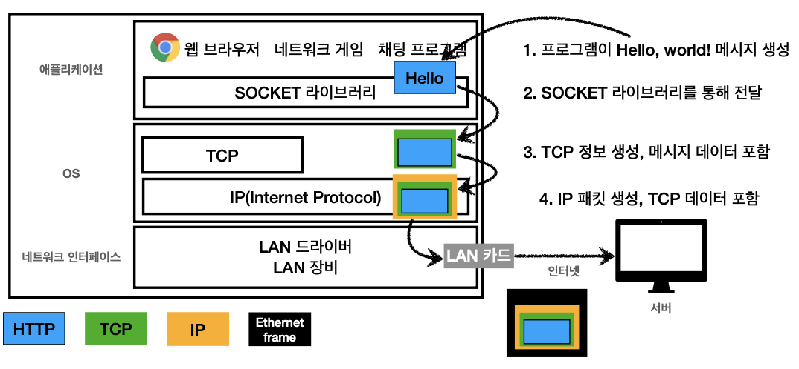

## 인터넷 네트워크

- **IP(인터넷 프로토콜)**

  - 지정한 IP 주소에 데이터 전달

  - 패킷이라는 통신 단위로 데이터 전달

  - IP 패킷 정보

    - 출발지IP, 목적지 IP, 기타...

  - IP 프로토콜의 한계

    - 비연결성

      - 패킷을 받을 대상이 없거나 서비스 불능 상태여도 패킷 전송

    - 비신뢰성

      - 서버를 거치면서 패킷 유실될 수 있음

      - 패킷 전달 순서 문제 발생
        - 패킷들이 서로 다른 노드를 타면서 순서가 바뀜 

    - 프로그램 구분

      - 같은 IP를 사용하는 서버에서 통신하는 애플리케이션이 둘 이상이라면?

- **TCP**

  > 전송 제어 프로토콜(Transmission Control Protocol)

  - 인터넷 프로토콜 스택의 4계층

    - 애플리케이션 계층 - `HTTP`, `FTP`
    - 전송 계층 - `TCP`,`UDP`
    - 인터넷 계층 - `IP`
    - 네트워크 인터페이스 계층

  - 프로토콜 계층

    

    - LAN 카드에서 나갈때 이더넷 프레임이 포함되어 나감
    - `TCP 세그먼트` : 출발지 PORT, 목적지 PORT, 전송제어, 순서, 검증정보...

  - TCP 특징

    - 연결지향 - `TCP 3 way handshake`(가상 연결)
    - 데이터 전달 보증
    - 순서 보장 -> 기본적으로는 재전송 요청
    - 신뢰할 수 있는 프로토콜
    - 현재는 대부분 TCP 사용

  - TCP 3 way handshake
    - 논리적 개념적으로만 연결, 실제로 연결이 된 것은 아님
    - 메시지를 3번 주고받음
    - 클라이언트와 서버 모두 신뢰할 수 있는 연결가능
    - `SYN`: 접속 요청, `ACK`: 요청 수락
    - 참고: `3. ACK` 와 함께 데이터 전송 가능

-  **UDP**

  > `사용자 데이터그램 프로토콜(User Datagram Protocol)`

  - 하얀 도화지에 비유 (기능이 거의 없음)
  - 연결지향 X
  - 데이터 전달 보증 X
  - 순서 보장 X
  - 데이터 전달 및 순서가 보장되지 않지만, 단순하고 빠름
  - 정리
    - IP와 거의 같다 + PORT역할 + 체크섬 정도만 추가
    - 애플리케이션에서 추가 작업 필요

- **PORT**

  - 같은 IP 내에서 프로세스 구분 가능
    - 각 port를 다른 서버로 연결할 수 있음
    - 0 ~ 65535 할당 가능
      - 0 ~ 1023 : 잘 알려진 포트, 사용하지 않는 것이 좋음

- **DNS**

  > 도메인 네임 시스템(Domain Name System)

  - DNS 서버에 도메인 명을 등록 가능
  - IP는 기억하기 어렵다는 문제, IP주소가 바뀔 수 있다는 문제 해결