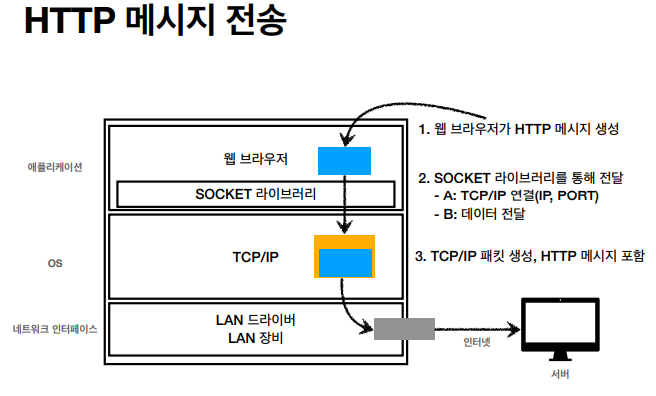

## URI와 웹 브라우저 요청 흐름

- **URI**

  > Uniform Resource Indentifier
  >
  > - Uniform : 리소스 식별하는 통일된 방식
  > - Resource : 자원, URI로 식별할 수 있는 모든 것(제한 없음)
  > - Indentifier : 다른 항목과 구분하는데 필요한 정보

  - `URL`과 `URN`으로 나누어짐

    - `URL(Uniform Resource Locator)`
      - 리소스가 있는 위치를 지정

    - `URN(Uniform Resource Name)`

      - 리소스에 이름을 부여

      

- **웹 브라우저 요청 흐름**

  - DNS 서버 조회 후

