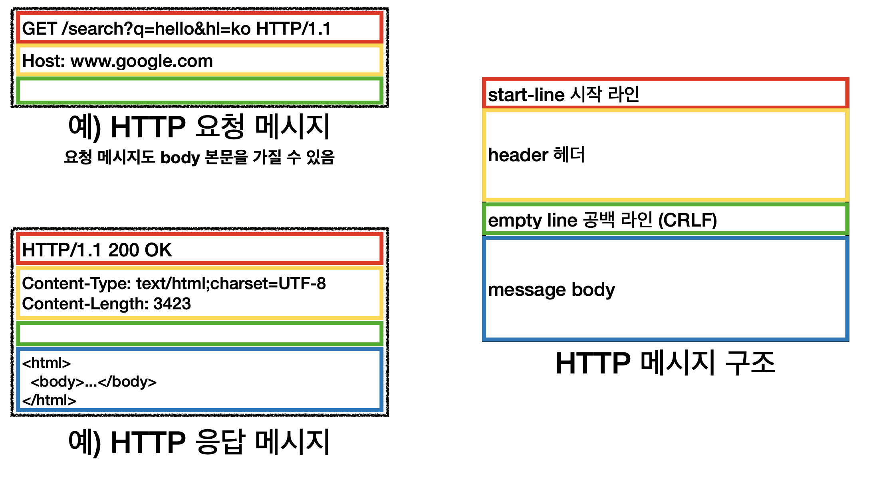

## HTTP 기본

- 모든 것이 HTTP

  - 거의 모든 형태의 데이터 전송할 때 HTTP사용

  - `HTTP/1.1`

     : 가장 많이 사용, 우리에게 가장 중요한 버전

    - `HTTP/2`나 `HTTP/3`는 성능 개선에 초점

  - 기반 프로토콜

    - TCP: `HTTP/1.1`, `HTTP/2`
    - UDP: `HTTP/3`

  - HTTP 특징

    - 클라이언트 서버 구조
    - 무상태 프로토콜(스테이스리스), 비연결성
    - HTTP 메시지
    - 단순함, 확장 가능

- 클라이언트 서버 구조

  - 비즈니스 로직이나 데이터는 서버, UI나 사용성은 클라이언트
  - 응답을 주고받음

- **Stateful, Stateless**

  - 상태 유지 - `Stateful`
    - 바뀔 때 마다 상태 정보를 미리 알려줘야 한다.

    - 서버 장애가나면 상태가 날아감
  - 무상태 - `Stateless`
    - 갑자기 클라이언트 요청이 증가해도 서버를 대거 투입할 수 있다.
  
    - 계속 상태 정보를 함께 넘겨줌
  
    - 상태를 보관하지 않음
  
    - 응답 서버를 쉽게 바꿀 수 있음 -> __무한한 서버 증설 가능__
      - `스케일 아웃` - 수평 확장 유리
  - `Stateless` 실무 한계
    - 무상태로 설계 할 수 있는 것도 있고 없는 것도 있음
    - 로그인의 경우 로그인했다는 상태를 서버에 유지
    - 상태 유지는 최소한 사용
    - 데이터를 너무 많이 보내야 함
  
- **비 연결성(connectionless)**

  - 연결을 유지하는 모델은 서버 자원을 계속 소모
  - 연결을 유지하지 않는 모델은 최소한의 자원 사용
  - HTTP는 기본이 연결을 유지하지 않음
  - 한계와 극복
    - `TCP/IP` 연결을 새로 맺어야 함 - 3 way handshake 시간 추가
    - 초기 HTTP는 리소스마다 연결/종료 작업
    - 현재는 지속적인 연결을 통해 한페이지마다 연결을 유지함
  - 같은 시간에 발생하는 대용량 트래픽에서 `Stateless`최대한 사용

- **HTTP 메시지**

  

  - 공백 라인은 필수
  - 시작 라인
    - `HTTP 메서드`
    - `요청 대상`
      - 보통 절대경로[?쿼리]
    - `HTTP Version`
    - `HTTP 상태코드`
  - 헤더
    - `header-fiels = field-name ":" OWS field-value OWS (OWS:띄어쓰기 허용)`
    - HTTP 전송에 필요한 모든 부가정보
      -  필요한 메타정보가 다 들어있음
  - 바디
    - 실제 전송할 데이터
    - byte로 표현할 수 있는 모든 데이터
  - HTTP는 단순하고 확장이 가능하다.