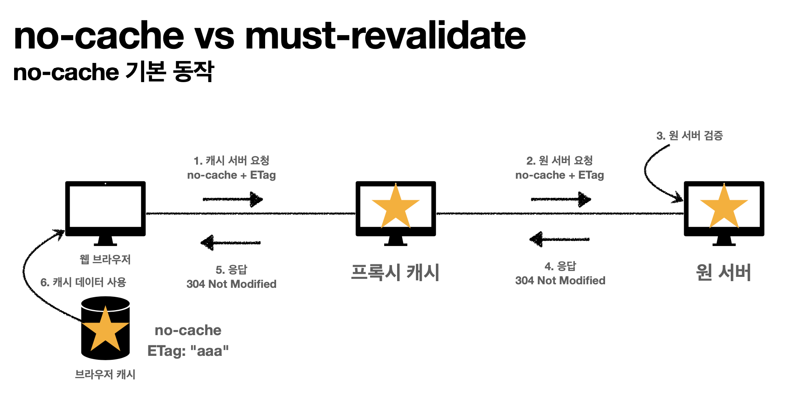

## HTTP 헤더2 - 캐시와 조건부 요청

- **캐시 기본 동작**

  - 캐시가 없을 때
    - 데이터가 변경되지 않아도 계속 데이터를 다운로드
    - 인터넷 네트워크는 느리고 비쌈, 느린 사용자 경험
  - 캐시 적용
    - `Cache-Control` : 캐시 유지할 시간
    - 캐시 가능 시간동안 네트워크를 사용하지 않아도 됨
    - 브라우저 로딩 속도가 매우 빠름, 빠른 사용자 경험
    - 캐시 시간 초과되면, 서버를 통해 데이터를 다시 조회, 캐시 갱신

  

- **검증 헤더와 조건부 요청1**

  - 캐시 만료후에도 서버에서 데이터를 변경하지 않을 수 있음
    - 저장 캐시 재사용
    - 단, 클라이언트 데이터와 서버의 데이터가 같다는 사실 확인 필요
  - `Last-Modifed` : 서버 -> 클라이언트, 데이터 최종 수정일
  - `if-modified-since` : 클라이언트 -> 서버, 데이터 최종 수정일
  - `304 Not Modified` : 서버 데이터 최종 수정일과 클라이언트의 데이터 최종 수정일이 같으면 전송
    - body없이 헤더 메타 정보만 전송
    - 클라이언트는 캐시에 저장되어 있는 데이터 재활용
  - 네트워크 다운로드가 발생하지만 용량이 적은 헤더 정보만 다운로드
    - 매우 실용적

- **검증 헤더와 조건부 요청2**

  - `Last-Modifed`, `If-Modified-Since` 단점

    - 1초 미만 단위로 캐시 조정 불가능
    - 날짜 기반 로직 사용
    - 데이터를 수정해서 날짜가 다르지만, 같은 데이터를 수정해서 데이터 결과가 똑같은 경우
    - 서버에서 별도의 캐시 로직을 관리하고 싶은 경우
      - ex) 스페이스나 주석처럼 크게 영향이 없는 변경에서 캐시를 유지하고 싶은 경우

  - `E-Tag`, `If-None-Match`

    > ETag : Entity Tag

    - 캐시용 데이터에 임의의 고유한 버전 이름을 달아둠
    - 데이터가 변경되면 이 이름을 바꾸어서 변경(Hash 다시 생성)
      - ex) `ETag : "aaaaa"` -> `ETag : "Bbbbb"`
    - `ETag`만 보내서 같으면 유지, 다르면 다시 받기
    - **캐시 제어 로직을 서버에서 완전히 관리**
      - 클라이언트는 캐시 메커니즘을 모름(블랙박스)

  - `If-None-Match` : 클라이언트 -> 서버

    - `ETag` 일치하면 `304 NotModifed` 전송

- **캐시와 조건부 요청 헤더**

  - 캐시 제어 헤더
    - `Cache-Control` : 캐시 제어
      - `Cache-Control : max-age` - 캐시 유효 시간, 초 단위
      - `Cache-Control : no-cache` - 데이터는 캐시해도 되지만, 원(origin) 서버에 검증하고 사용
        - 중간 캐시 서버에서 검증 x
        - `프록시 캐시` 참고
      - `Cache-Control : no-store` - 메모리에서 사용하고 저장하지마
    - `Pragma` : 캐시 제어(하위 호환)
    - `Expires` : 캐시 유효 기간(하위 호환)
      - 캐시 만료일을 정확한 날짜로 지정
      - `Cache-Control : max-age` 권장
      - `Cache-Control : max-age`와 함께 사용하면 `Expires`는 무시
  - 검증헤더와 조건부 요청 헤더
    - 검증 헤더 (Validator)
      - `ETag`
      - `Last-Modified`
    - 조건부 요청 헤더
      - `If-Match`, `If-None-Match : ETag`
      - `If-Modified-Since`, `If-Unmodified-Since : Last-Modified`

  

- **프록시 캐시**

  - 원 서버 말고 프록시 캐시 서버에 요청(빠름)
    - private 캐시 : 개인 웹 브라우저
    - public 캐시 : 프록시 캐시 서버

  

  - 캐시 지시어
    - `Cache-Control : public` - 응답이 public 캐시에 저장되어도 됨
    - `Cache-Control : private` - 응답이 해당 사용자만을 위한 것임, private 캐시에 저장해야 함(기본값)
    - `Cache-Control : s-maxage` - 프록시 캐시에먼 적용되는 `max-age`
    - `Age: 60`(HTTP헤더) - 오리진 서버에서 응답 후 프록시 캐시 내에 머문 시간(초)

- **캐시 무효화**

  - 캐시 지시어 - 확실한 캐시 무효화

    - 밑에 것 다 넣어주면 확실히 캐시 무효화 됨
    - `Cache-Control : no-cache`
    - `Cache-Control : no-store`
    - `Cache-Control : must-revalidate`
      - 캐시 만료 후 최초 조회시 원 서버에 검증
      - 원 서버 접근 실패시 반드시 오류 발생 - `504(Gateway Timeout)`
      - 캐시 유호 시간이라면 캐시를 사용
    - `Pragma: no-cache`

  - `no-cache` vs `must-revalidate`

    

    

    - `no-cache`는 설정에 따라 프록시 캐시를 반환하는 경우도 있음

    

    - `must-revalidate`는 원 서버 접근 불가시 무조건 오류발생

    

​		