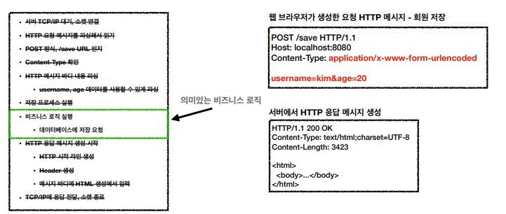
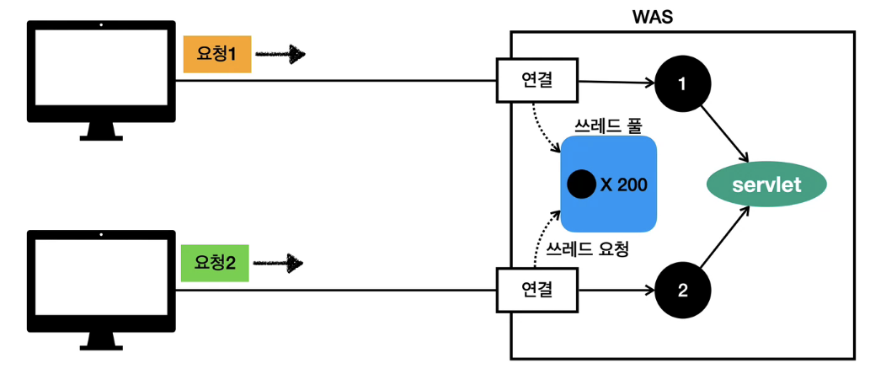

## 웹 애플리케이션 이해

- **웹 서버, 웹 애플리케이션 서버**
  - 웹 서버
    - HTTP 기반 동작
    - 정적 리소스 제공
  - 웹 애플리케이션 서버
    - HTTP 기반 동작
    - 웹 서버 기능 포함+애플리케이션 로직 수행
  - 차이
    - 웹 서버는 정적 리소스, WAS는 애플리케이션 로직
    - 웹 서버도 프로그램을 실행하는 기능을 포함하기도 함
    - 웹 애플리케이션 서버도 웹 서버의 기능을 제공
    - WAS는 애플리케이션 코드를 실행하는데 더 특화
  - 웹 시스템 구성 - WAS, DB
    - WAS, DB 만으로 시스템 구성 가능
    - WAS가 너무 많은 역할 담당, 서버 과부하 우려
    - 가장 비싼 애플리케이션 로직이 정적 리소스 때문에 수행이 어려울 수 있음
    - WAS 장애시 오류 화면도 노출 불가능
  - 웹 시스템 구성 - WEB, WAS, DB
    - 정적 리소스는 웹 서버가 처리
    - 동적인 처리는 WAS에 요청을 위임
    - WAS는 중요한 애플리케이션 로직 처리 전담
    - 효율적인 리소스 관리
    - 정적 리소스만 제공하는 웹 서버는 잘 죽지 않음
    - 애플리케이션 로직이 동작하는 WAS 서버는 잘 죽음

- **서블릿**

  

  - 서블릿이 의미있는 비즈니스 로직 제외 자동화 해줌
  - URL이 호출되면 서블릿 코드가 실행
  - `HttpServletRequest` : HTTP 요청 정보 사용
  - `HttpSeervletResponse` : HTTP 응답 정보 사용
  - HTTP 요청시
    - WAS는 Request, Response 객체를 새로 만들어서 서블릿 객체 호출
    - 개발자는 Request 객체에서 HTTP 요청 정보를 편리하게 꺼내서 사용
    - 개발자는 Response 객체에 HTTP 응답 정보를 편리하게 입력
    - WAS는 Response 객체에 담겨있는 내용으로 HTTP 응답 정보를 생성
  - 서블릿 컨테이너
    - 톰캣처럼 서블릿을 지원하는 WAS를 서블릿 컨테이너라고 함
    - 서블릿 컨테이너는 서블릿 객체를 생성, 초기화, 호출, 종료하는 생명주기 관리
    - 서블릿 객체는 싱글톤으로 관리
      - 최초 로딩 시점에 서블릿 객체를 미리 만들어두고 재활용
      - 공유 변수 사용 주의
      - 서블릿 컨테이너 종료시 함께 종료
    - JSP도 서블릿으로 변환 되어서 사용
    - 동시 요청을 위한 멀티 쓰레드 처리 지원

- **동시 요청 - 멀티 쓰레드**

  - 쓰레드

    - 애플리케이션 코드를 하나하나 순차적으로 실행하는 것은 쓰레드
    - 자바 메인 메서드를 처음 실행하면 main이라는 이름의 쓰레드 실행
    - 쓰레드가 없다면 자바 애플리케이션 실행 불가능
    - 쓰레드는 한번에 하나의 코드 라인만 수행
    - 동시 처리가 필요하면 쓰레드를 추가 생성

  - 단일 요청 - 쓰레드 하나 사용

    - 요청 -> 쓰레드 할당 -> 서블릿 -> 연결

  - 다중 요청 - 쓰레드 하나 사용

    - 요청1 처리중일때, 요청2 쓰레드 대기

    - 요청 마다 쓰레드 생성하자

  - 요청 마다 쓰레드 생성

    - 장점
      - 동시 요청 처리 가능
      - 리소스가 허용할 때 까지 처리가능
      - 하나의 쓰레드가 지연 되어도, 나머지 쓰레드는 정상 작동
    - 단점
      - 쓰레드는 생성 비용이 매우 비쌈
        - 요청이 올 때 마다 쓰레드를 생성하면, 응답 속도가 늦어짐
      - 쓰레드는 컨텍스트 스위칭 비용 발생
      - 쓰레드 생성에 제한이 없음
        - 고객 요청이 너무 많이 오면, CPU, 메모리 임계점을 넘어서 서버가 죽을 수 있음

  - 쓰레드 풀

    

    - 쓰레드 풀에서 쓰고 반납

    - 쓰레드 풀에 쓰레드 없으면 대기하거나 거절

    - 장점

      - 쓰레드가 미리 생성되어 있으므로, 쓰레드를 생성하고 종료하는 비용이 절약, 응답 시간이 빠름
      - 생성 가능한 쓰레드의 최대치가 있으므로 너무 많은 요청이 들어와도 기존 요청 안전하게 처리

    - 실무 팁

      - 주요 튜닝 포인트는 최대 쓰레드 수

      - 최대 쓰레드를 너무 낮게 설정하면, 서버 리소스는 여유롭지만 응답이 지연
      - 최대 쓰레드를 너무 높게 설정하면, CPU/메모리 리소스 임계점 초과로 인해 서버가 다운
      - 장애 발생시
        - 클라우드면 일단 서버 늘리고, 이후에 튜닝
        - 클라우드가 아니면 열심히 튜닝

    - 쓰레드 풀의 적정 숫자

      - 상황에 따라 다름
      - 최대한 실제 서비스와 유사하게 성능 테스트

  - WAS의 멀티 쓰레드 지원

    - 멀티 쓰레드에 대한 부분은 WAS가 처리
    - 개발자가 멀티 쓰레드 관련 코드를 신경쓰지 않아도 됨
    - 멀티 쓰레드 환경이므로 싱글톤 객체(서블릿, 스프링 빈)는 주의해서 사용

- **HTML, HTTP API, CSR, SSR**

  - HTML 페이지

    - 동적으로 필요한 HTML 파일을 생성해서 웹 브라우저로 전달
    - 웹 브라우저는 HTML 해석

  - HTTP API

    - HTML이 아니라 데이터 전달(주로 JSON)
    - 데이터만 주고 받음, UI는 클라이언트가 별도 처리

  - `SSR` - 서버 사이드 렌더링

    - 서버에서 최종 HTML을 생성해서 클라이언트에 전달
    - 주로 정적인 화면에 사용
    - ex) JSP, 타임리프

    

  - `CSR` - 클라이언트 사이드 렌더링

    - HTML 결과를 자바스크립트를 사용해 웹 브라우저에서 동적으로 생성해서 적용
    - 웹 환경을 마치 앱 처럼 부분부분 변경 가능
    - ex) React, Vue.js

    

  - `CSR` + `SSR` 동시 지원 프레임워크도 존재

- **자바 백엔드 웹 기술 역사**

  - 과거 기술

    - 서블릿 - HTML 생성 어려움
    - JSP - HTML 생성은 편리하지만, 비즈니스 로직까지 너무 많은 역할 담당
    - 서블릿, JSP 조합 MVC 패턴 사용
    - MVC 프레임워크 춘추 전국 시대 - 2000년 초 ~ 2010년 초
      - MVC 패턴 자동화 등 다양한 기능 지원

  - 애노테이션 기반의 스프링 MVC 등장

    - MVC 프레임워크의 춘추 전국 시대 마무리

  - 스프링 부트의 등장

    - 서버를 내장
    - 과거에는 WAS를 직접 설치하고, 소스는 War 파일을 만들어서 설치한 WAS에 배포
    - 스프링 부트는 빌드 결과(Jar)에 WAS 서버 포함
      - 빌드 배포 단순화

  - 최신 기술 - 스프링 웹 기술의 분화

    - `Web Servlet` - `Spring MVC`
    - `Web Reactive` - `Spring WebFlux`
      - 비동기 넌 블러킹 처리
      - 최소 쓰레들 최대 성능 - 쓰레드를 CPU 코어 수에 맞추어 사용
      - 함수형 스타일로 개발 - 동시처리 코드 효율화
      - 서블릿 기술 사용X
      - 단점
        - 기술적 난이도 매우 높음
        - 아직은 RDB 지원 부족
        - 일반 MVC의 쓰레드 모델도 충분히 빠름
        - 실무에서 잘 사용하지 않음

  - 자바 뷰 템플릿 역사

    > HTML을 편리하게 생성하는 뷰

    - JSP : 속도 느림, 기능 부족
    - 프리마커, 벨로시티 : 속도 문제 해결, 다양한 기능
      - 코드가 그대로 노출
    - 타임 리프
      - 네추럴 템플릿: HTML의 모양을 유지하면서 뷰 템플릿 적용 
      - 스프링 MVC와 강력한 기능 통합
      - 최선의 선택, 단 성능은 프리마커, 벨로시티가 더 빠름