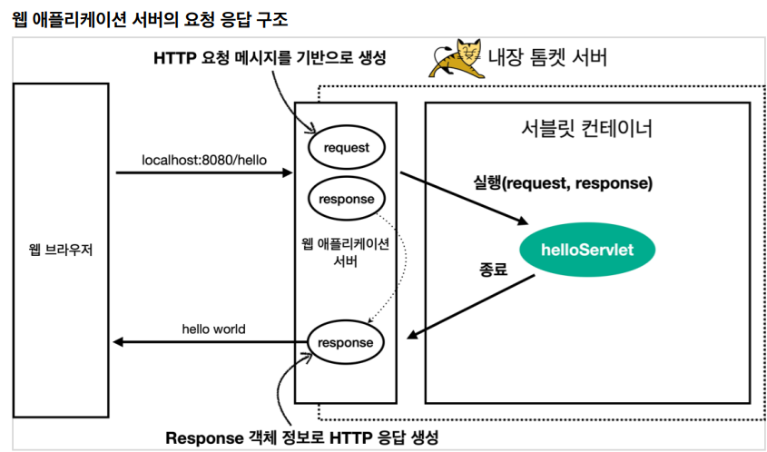

## 서블릿

- `@ServletComponentScan` : 서블릿 자동등록
- `@WebServlet` : 서블릿 애노테이션
  - name : 서블릿 이름
  - urlPatterns: URL 매핑



- `HttpServletRequest` : 서블릿은 개발자가 HTTP 요청 메시지를 편리학 사용할 수 있도록 파싱해주고 결과를 `HttpServletRequest` 객체에 담아서 제공
- 임시 저장소 기능
  - 해당 HTTP 요청이 시작부터 끝날 때 까지 유지되는 임시 저장소
  - `request.setAttribute(name, value)` : 저장
  - `request.getAttribute(name)` : 조회
- 세션 관리 기능
  - `request.getSession(create: true)`

```java
//http://localhost:8080/request-header?username=hello
@WebServlet(name = "requestHeaderServlet", urlPatterns = "/request-header")
public class RequestHeaderServlet extends HttpServlet {
     @Override
     protected void service(HttpServletRequest request, HttpServletResponse 
    response) throws ServletException, IOException {
         printStartLine(request);
         printHeaders(request);
         printHeaderUtils(request);
         printEtc(request);
         response.getWriter().write("ok");
     }
}

```

- start-line 정보

  ```java
  //start line 정보
  private void printStartLine(HttpServletRequest request) {
       System.out.println("--- REQUEST-LINE - start ---");
       System.out.println("request.getMethod() = " + request.getMethod()); //GET
       System.out.println("request.getProtocol() = " + request.getProtocol()); //HTTP/1.1
       System.out.println("request.getScheme() = " + request.getScheme()); //http
       // http://localhost:8080/request-header
       System.out.println("request.getRequestURL() = " + request.getRequestURL());
       // /request-header
       System.out.println("request.getRequestURI() = " + request.getRequestURI());
       //username=hi
       System.out.println("request.getQueryString() = " + request.getQueryString());
       System.out.println("request.isSecure() = " + request.isSecure()); //https 사용 유무
       System.out.println("--- REQUEST-LINE - end ---");
       System.out.println();
  }
  ```

- HTTP 요청 데이터 - GET 쿼리 파라미터

  - 쿼리 파라미터 조회 메서드

    ```java
    String username = request.getParameter("username"); //단일 파라미터 조회
    Enumeration<String> parameterNames = request.getParameterNames(); //파라미터 이름들 모두 조회
    Map<String, String[]> parameterMap = request.getParameterMap(); //파라미터를 Map으로 조회
    String[] usernames = request.getParameterValues("username"); //복수 파라미터 조회
    ```

  - 복수 파라미터에서 단일 파라미터 조회
    - `request.getParameter()` : 하나의 파라미터 이름에 대해서 단 하나의 값만 있을 때 사용
      - 중복일 떄 사용하면 첫번째 값 반환 
    - `request.getParameterValues()` : 중복 파라미터 조회 가능

- HTTP 요청 데이터 - POST HTML Form

  - 특징
    - `content-type: application/x-www-form-urlencoded`
    -  메시지 바디에 쿼리 파리미터 형식으로 데이터를 전달한다.
      - `username=hello&age=20`

  - `request.getParameter()` 는 GET URL 쿼리 파라미터 형식도 지원하고, POST HTML Form  형식도 둘 다 지원
  - 참고
    - GET URL 쿼리 파라미터 형식은 바디가 없으므로 content-type 없음

- HTTP 요청 데이터 - API 메시지 바디 - 단순 텍스트

  - `POST`, `PUT`, `PATCH`
  - HTTP 메시지 바디의 데이터를 `InputSteream`을 사용해 직접 읽을 수 있음

  ```java
  WebServlet(name = "requestBodyStringServlet", urlPatterns = "/request-bodystring")
  public class RequestBodyStringServlet extends HttpServlet {
       @Override
       protected void service(HttpServletRequest request, HttpServletResponse response) throws ServletException, IOException {
  
           ServletInputStream inputStream = request.getInputStream();
           String messageBody = StreamUtils.copyToString(inputStream, StandardCharsets.UTF_8);
           // nputStream은 byte 코드를 반환한다. byte 코드를 우리가 읽을 수 있는 문자(String)로 보려면 문자표 (Charset)를 지정해주어야 한다.
           System.out.println("messageBody = " + messageBody);
           response.getWriter().write("ok");
   }
  ```

- 참고
  - JSON 결과를 파싱해서 사용할 수 있는 자바 객체로 변환하려면 Jackson, Gson 같은 JSON 변환 라이브러리를 추가
  - 스프링 부트로 Spring MVC를 선택하면 기본으로 Jackson  라이브러리( ObjectMapper )를 함께 제공


- HttpServletResponse - 기본 사용법
  - 헤더, Cotent-Type, 쿠키, Redirect 지정 메서드 지원


- HTTP 응답 데이터 - 단순 텍스트, HTML

  - HTTP 응답으로 HTML을 반환할 때는 content-type을 `text/html`로 지정
  - HTTP 응답으로 JSON을 반환할 때는 content-type을 `application/json` 로 지정

  - Jackson 라이브러리가 제공하는 `objectMapper.writeValueAsString()` 를 사용하면 객체를 JSON  문자로 변경할 수 있다.