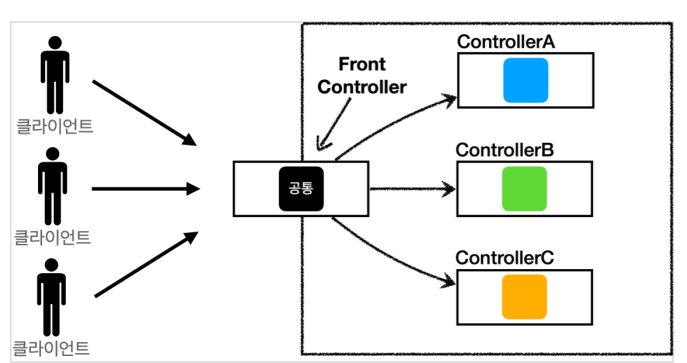
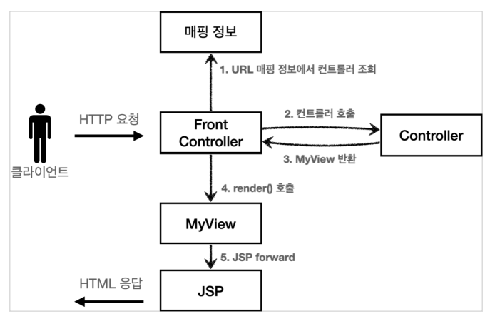
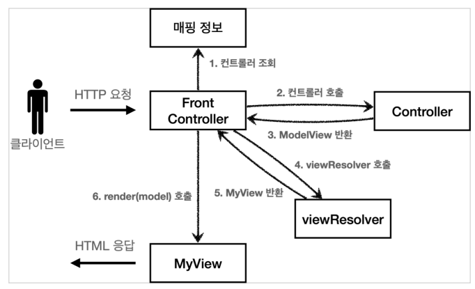
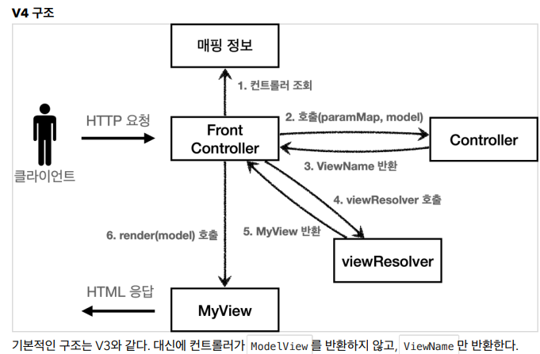
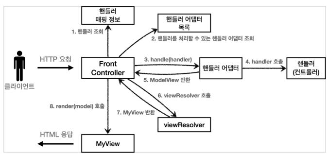

## MVC 프레임워크 만들기



- FrontController 패턴 특징
  - 프론트 컨트롤러 서블릿 하나로 클라이언트의 요청을 받음
  - 프론트 컨트롤러가 요청에 맞는 컨트롤러를 찾아서 호출 입구를 하나로!
  - 공통 처리 가능
  - 프론트 컨트롤러를 제외한 나머지 컨트롤러는 서블릿을 사용하지 않아도 됨
- 스프링 웹 MVC의 `DispatcherServlet`이 `FrontController` 패턴으로 구현되어 있음


- 프론트 컨트롤러 도입 - v1

  - 서블릿과 비슷한 모양의 컨트롤러 인터페이스 도입, 각 컨트롤러들은 이 인터페이스 구현

  - 프론트 컨트롤러는 이 인터페이스를 호출해서 로직의 일관성 가짐

    ```java
    package hello.servlet.web.frontcontroller.v1;
    import javax.servlet.ServletException;
    import javax.servlet.http.HttpServletRequest;
    import javax.servlet.http.HttpServletResponse;
    import java.io.IOException;
    
    public interface ControllerV1 {
     void process(HttpServletRequest request, HttpServletResponse response) throws ServletException, IOException;
    }
    ```

    

  - 프론트 컨트롤러

    ```java
    package hello.servlet.web.frontcontroller.v1;
    import hello.servlet.web.frontcontroller.v1.controller.MemberFormControllerV1;
    import hello.servlet.web.frontcontroller.v1.controller.MemberListControllerV1;
    import hello.servlet.web.frontcontroller.v1.controller.MemberSaveControllerV1;
    import javax.servlet.ServletException;
    import javax.servlet.annotation.WebServlet;
    import javax.servlet.http.HttpServlet;
    import javax.servlet.http.HttpServletRequest;
    import javax.servlet.http.HttpServletResponse;
    import java.io.IOException;
    import java.util.HashMap;
    import java.util.Map;
    
    @WebServlet(name = "frontControllerServletV1", urlPatterns = "/front-controller/v1/*")
    public class FrontControllerServletV1 extends HttpServlet {
     private Map<String, ControllerV1> controllerMap = new HashMap<>();
     public FrontControllerServletV1() {
     controllerMap.put("/front-controller/v1/members/new-form", new MemberFormControllerV1());
     controllerMap.put("/front-controller/v1/members/save", new MemberSaveControllerV1());
     controllerMap.put("/front-controller/v1/members", new MemberListControllerV1());
     }
        
     @Override
     protected void service(HttpServletRequest request, HttpServletResponse 
    response) throws ServletException, IOException {
     	System.out.println("FrontControllerServletV1.service");
     	String requestURI = request.getRequestURI();
     	ControllerV1 controller = controllerMap.get(requestURI);
     	if (controller == null) {
    		 response.setStatus(HttpServletResponse.SC_NOT_FOUND);
     		 return;
     	}
     	controller.process(request, response);
     	}
    }
    ```

    

- View 분리 - v2

  

  ```java
  public class MyView {
   private String viewPath;
   public MyView(String viewPath) {
   this.viewPath = viewPath;
   }
      
   public void render(HttpServletRequest request, HttpServletResponse response) throws ServletException, IOException {
   RequestDispatcher dispatcher = request.getRequestDispatcher(viewPath);
   dispatcher.forward(request, response);
   }
  }
  ```

  ```java
  public class MemberFormControllerV2 implements ControllerV2 {
   @Override
   public MyView process(HttpServletRequest request, HttpServletResponse response) throws ServletException, IOException {
   return new MyView("/WEB-INF/views/new-form.jsp");
   }
  }
  ```

  ```java
  public interface ControllerV2 {
   MyView process(HttpServletRequest request, HttpServletResponse response) throws ServletException, IOException;
  }
  ```

  - 컨트롤러는 `MyView` 객체를 생성하고 거기에 뷰 이름만 넣고 반환하면 됨
  - `ControllerV1` 구현 클래스와 `ControllerV2` 구현 클래스를 비교해보면, 중복이 확실하게 재거된 것을 확인 가능

  ```java
  // 프론트 컨트롤러 v2
  
  @WebServlet(name = "frontControllerServletV2", urlPatterns = "/frontcontroller/v2/*")
  public class FrontControllerServletV2 extends HttpServlet {
      
   private Map<String, ControllerV2> controllerMap = new HashMap<>();
   public FrontControllerServletV2() {
   controllerMap.put("/front-controller/v2/members/new-form", new MemberFormControllerV2());
   controllerMap.put("/front-controller/v2/members/save", new MemberSaveControllerV2());
   controllerMap.put("/front-controller/v2/members", new MemberListControllerV2());
   }
      
   @Override
   protected void service(HttpServletRequest request, HttpServletResponse response)
   throws ServletException, IOException {
       
   String requestURI = request.getRequestURI();
   ControllerV2 controller = controllerMap.get(requestURI);
       
   if (controller == null) {
   response.setStatus(HttpServletResponse.SC_NOT_FOUND);
   return;
   }
       
   MyView view = controller.process(request, response);
   view.render(request, response);
   }
      
  }
  ```

  - 프론트 컨트롤러는 컨트롤러의 호출 결과로 `MyView` 반환 받음
  - `view.render()`를 호출하면 `forward` 로직을 수행해서 JSP 실행

  ```java
  // MyView.render()
  
  public void render(HttpServletRequest request, HttpServletResponse response)
  throws ServletException, IOException {
      
   RequestDispatcher dispatcher = request.getRequestDispatcher(viewPath);
   dispatcher.forward(request, response);
  }
  ```

  

- Model 추가 - v3

  - 서블릿 종속성 제거
    - 컨트롤러가 서블릿 기술을 사용하지 않도록 변경하면, 구현 코드도 단순해지고, 테스트 코드 작성이 쉽다
  - 뷰 이름 중복 제거
    - 컨트롤러는 뷰의 논리 이름을 반환하고, 물리 위치의 이름은 프론트 컨트롤러에서 처리하도록 단순화
      - `/WEB-INF/views/new-form.jsp` -> `new-form`
      - `/WEB-INF/views/save-result.jsp` -> `save-result`

  

  - ModelView

    - 프론트 컨트롤러가 `HttpServletRequest`가 제공하는 파라미터를 `paramMap`에 담아서 호출
    - 응답 결과로 뷰 이름과 뷰에 전달할 Model 데이터를 포함하는 `ModelView` 객체를 반환

    ```java
    // Model View
    
    public class ModelView {
     private String viewName;
     private Map<String, Object> model = new HashMap<>();
        
     public ModelView(String viewName) {
         this.viewName = viewName;
     }
        
     public String getViewName() {
     	return viewName;
     }
        
     public void setViewName(String viewName) {
     	this.viewName = viewName;
     }
        
     public Map<String, Object> getModel() {
     	return model;
     }
        
     public void setModel(Map<String, Object> model) {
     	this.model = model;
     }
    }
    ```

    ```java
    // ControllerV3
    
    public interface ControllerV3 {
    	ModelView process(Map<String, String> paramMap);
    }
    
    ```

    ```java
    // MemberFormControllerV3 - 회원 등록 폼
    
    public class MemberFormControllerV3 implements ControllerV3 {
        
        @Override
        public ModelView process(Map<String, String> paramMap) {
            return new ModelView("new-form");
     	}
        
    }
    ```

    - `ModelView` 생성할 때 `new-form` 이라는 view의 논리적인 이름 지정
    - 실제 물리적인 이름은 프론트 컨트롤러에서 처리

    ```java
    // FrontControllerServletV3
    
    @WebServlet(name = "frontControllerServletV3", urlPatterns = "/front-controller/v3/*")
    public class FrontControllerServletV3 extends HttpServlet {
        
     private Map<String, ControllerV3> controllerMap = new HashMap<>();
        public FrontControllerServletV3() {
            controllerMap.put("/front-controller/v3/members/new-form", new MemberFormControllerV3());
            controllerMap.put("/front-controller/v3/members/save", new MemberSaveControllerV3());
            controllerMap.put("/front-controller/v3/members", new MemberListControllerV3());
        }
        
     @Override
     protected void service(HttpServletRequest request, HttpServletResponse response) throws ServletException, IOException {
         String requestURI = request.getRequestURI();
         ControllerV3 controller = controllerMap.get(requestURI);
         if (controller == null) {
             response.setStatus(HttpServletResponse.SC_NOT_FOUND);
             return;
     		}
         Map<String, String> paramMap = createParamMap(request);
         ModelView mv = controller.process(paramMap);
         String viewName = mv.getViewName();
         MyView view = viewResolver(viewName);
         view.render(mv.getModel(), request, response);
     	}
        
        private Map<String, String> createParamMap(HttpServletRequest request) {
            Map<String, String> paramMap = new HashMap<>();
            request.getParameterNames().asIterator()
                .forEachRemaining(paramName -> paramMap.put(paramName,
                                                            request.getParameter(paramName)));
            return paramMap;
     	}
        
        private MyView viewResolver(String viewName) {
            return new MyView("/WEB-INF/views/" + viewName + ".jsp");
        }
    }
    ```

  - 뷰 리졸버

    - `MyView view = viewResolver(viewName)`
      - 컨트롤러가 반환한 논리 뷰 이름을 실제 물리 뷰 경로로 변경
      - 실제 물리 경로가 있는 `MyView` 객체를 반환
    - `view.render(mv.getModel(), request, response)`
      - 뷰 객체를 통해서 HTML 화면을 렌더링 한다
      - 뷰 객체의 `render()` 는 모델 정보도 함께 받음
      - JSP로 포워드 해서 JSP를 렌더링

  ```java
  // MyView
  
  public class MyView {
  
      private String viewPath;
  
      public MyView(String viewPath) {
          this.viewPath = viewPath;
      }
  
      public void render(HttpServletRequest request, HttpServletResponse response) throws ServletException, IOException {
          RequestDispatcher dispatcher = request.getRequestDispatcher(viewPath);
          dispatcher.forward(request, response);
      }
      
      public void render(Map<String, Object> model, HttpServletRequest request,
                         HttpServletResponse response) throws ServletException, IOException {
          modelToRequestAttribute(model, request);
          RequestDispatcher dispatcher = request.getRequestDispatcher(viewPath);
          dispatcher.forward(request, response);
      }
      
      private void modelToRequestAttribute(Map<String, Object> model,
                                           HttpServletRequest request) {
          model.forEach((key, value) -> request.setAttribute(key, value));
      }
  }
  ```

  

- 단순하고 실용적인 컨트롤러 -v4

  

  - 인터페이스에 ModelView가 없고 model 객체는 파라미터로 전달되기 때문에 결과로 뷰 이름만 반환해주면 됨

  ```java
  // Controller4
  
  public interface ControllerV4 {
      /**
   * @param paramMap
   * @param model
   * @return viewName
   */
      String process(Map<String, String> paramMap, Map<String, Object> model);
  }
  ```

  ```java
  // MemberFormControllerV4
  
  public class MemberFormControllerV4 implements ControllerV4 {
      @Override
      public String process(Map<String, String> paramMap, Map<String, Object> model) {
          return "new-form";
      }
  }
  ```

  ```java
  public class MemberFormControllerV4 implements ControllerV4 {
      @Override
      public String process(Map<String, String> paramMap, Map<String, Object> model) {
          return "new-form";
      }
  }
  ```

  - 모델이 파라미터로 전달되기 때문에, 모델을 직접 생성하지 않아도 됨

  ```java
  // FrontControllerServletV4
  
  @WebServlet(name = "frontControllerServletV4", urlPatterns = "/front-controller/v4/*")
  public class FrontControllerServletV4 extends HttpServlet {
      private Map<String, ControllerV4> controllerMap = new HashMap<>();
      
      public FrontControllerServletV4() {
          controllerMap.put("/front-controller/v4/members/new-form", new MemberFormControllerV4());
          controllerMap.put("/front-controller/v4/members/save", new MemberSaveControllerV4());
          controllerMap.put("/front-controller/v4/members", new MemberListControllerV4());
      }
      
      @Override
      protected void service(HttpServletRequest request, HttpServletResponse 
                             response)
          throws ServletException, IOException {
          String requestURI = request.getRequestURI();
          ControllerV4 controller = controllerMap.get(requestURI);
          if (controller == null) {
              response.setStatus(HttpServletResponse.SC_NOT_FOUND);
              return;
          }
          Map<String, String> paramMap = createParamMap(request);
          Map<String, Object> model = new HashMap<>(); //추가
          String viewName = controller.process(paramMap, model);
          MyView view = viewResolver(viewName);
          view.render(model, request, response);
      }
      
      private Map<String, String> createParamMap(HttpServletRequest request) {
          Map<String, String> paramMap = new HashMap<>();
          request.getParameterNames().asIterator()
              .forEachRemaining(paramName -> paramMap.put(paramName,
                                                          request.getParameter(paramName)));
          return paramMap;
      }
      
      private MyView viewResolver(String viewName) {
          return new MyView("/WEB-INF/views/" + viewName + ".jsp");
      }
  }
  ```

  - 컨트롤러가 직접 뷰의 논리 이름을 반환하므로 이 값을 사용해서 실제 물리 뷰를 찾을 수 있음


- 유연한 컨트롤러1 - v5

  - 다른 인터페이스를 쓰고 싶다면?(`Controller3` , `Controller4` ...)

  - 어댑터 패턴

    

  - `핸들러 어댑터` : 여기서 어댑터 역할을 해주는 덕분에 다양한 종류의 컨트롤러 호출 가능
  - `핸들러` : 컨트롤러의 이름을 더 넓은 범위인 핸들러로 변경, 어댑터가 있기 때문에 컨트롤러 뿐만 아니라 해당하는 종류의 어댑터만 있으면 다 처리가능

  ```java
  public interface MyHandlerAdapter {
      boolean supports(Object handler);
      ModelView handle(HttpServletRequest request, HttpServletResponse response, Object handler)
          throws ServletException, IOException;
  }
  
  ```

  - `boolean supports(Object handler)`
    -  handler는 컨트롤러를 말한다.
    - 어댑터가 해당 컨트롤러를 처리할 수 있는지 판단하는 메서드다.

  - `ModelView handle(HttpServletRequest request, HttpServletResponse response, Object  handler)`
    -  어댑터는 실제 컨트롤러를 호출하고, 그 결과로 ModelView를 반환해야 한다. 
    - 실제 컨트롤러가 ModelView를 반환하지 못하면, 어댑터가 ModelView를 직접 생성해서라도 반환해야 한다.
    - 이전에는 프론트 컨트롤러가 실제 컨트롤러를 호출했지만 이제는 이 어댑터를 통해서 실제 컨트롤러가 호출된다

  ```java
  // MyHandlerAdapter
  
  public class ControllerV3HandlerAdapter implements MyHandlerAdapter {
      
      @Override
      public boolean supports(Object handler) {
          return (handler instanceof ControllerV3);
      } // 어댑터가 해당 컨트롤러를 처리할 수 있는지 판단
      
      @Override
      public ModelView handle(HttpServletRequest request, HttpServletResponse response, Object handler) {
          ControllerV3 controller = (ControllerV3) handler;
          Map<String, String> paramMap = createParamMap(request);
          ModelView mv = controller.process(paramMap);
          return mv;
      } // 핸들러를 컨트롤러 V3로 변환한 뒤 형식에 맞게 호출
      
      private Map<String, String> createParamMap(HttpServletRequest request) {
          Map<String, String> paramMap = new HashMap<>();
          request.getParameterNames().asIterator()
              .forEachRemaining(paramName -> paramMap.put(paramName,
                                                          request.getParameter(paramName)));
          return paramMap;
      }
  }
  ```

  ```java
  @WebServlet(name = "frontControllerServletV5", urlPatterns = "/front-controller/v5/*")
  public class FrontControllerServletV5 extends HttpServlet {
      // 매핑 정보의 값이 아무 값이나 받을 수 있는 Object로 변경
      private final Map<String, Object> handlerMappingMap = new HashMap<>();
      private final List<MyHandlerAdapter> handlerAdapters = new ArrayList<>();
      
      public FrontControllerServletV5() {
          initHandlerMappingMap(); // 핸들러 매핑 초기화
          initHandlerAdapters(); // 어댑터 초기화
      }
      
      private void initHandlerMappingMap() {
          handlerMappingMap.put("/front-controller/v5/v3/members/new-form", new MemberFormControllerV3());
          handlerMappingMap.put("/front-controller/v5/v3/members/save", new MemberSaveControllerV3());
          handlerMappingMap.put("/front-controller/v5/v3/members", new MemberListControllerV3());
      }
      
      private void initHandlerAdapters() {
          handlerAdapters.add(new ControllerV3HandlerAdapter());
      }
      
      @Override
      protected void service(HttpServletRequest request, HttpServletResponse response)
          throws ServletException, IOException {
          Object handler = getHandler(request);
          if (handler == null) {
              response.setStatus(HttpServletResponse.SC_NOT_FOUND);
              return;
          }
          MyHandlerAdapter adapter = getHandlerAdapter(handler);
          ModelView mv = adapter.handle(request, response, handler);
          // 실제 어댑터 호출
          MyView view = viewResolver(mv.getViewName());
          view.render(mv.getModel(), request, response);
      }
      
      private Object getHandler(HttpServletRequest request) {
          String requestURI = request.getRequestURI();
          return handlerMappingMap.get(requestURI);
      } // handlerMappingMap에서 URL에 매핑된 핸들러(컨트롤러) 객체를 찾아서 반환
      
      private MyHandlerAdapter getHandlerAdapter(Object handler) {
          for (MyHandlerAdapter adapter : handlerAdapters) {
              if (adapter.supports(handler)) {
                  return adapter;
              }
          } // 핸들러를 처리할 수 있는 어댑터를 찾음
          throw new IllegalArgumentException("handler adapter를 찾을 수 없습니다. 
                                             handler=" + handler);
      }
                                             
  	private MyView viewResolver(String viewName) {
          return new MyView("/WEB-INF/views/" + viewName + ".jsp");
      }
  }
                                            
  ```


- 유연한 컨트롤러2 - v5

  - `FrontControllerServletV5` 에 `ControllerV4` 기능도 추가해보자

  ```java
  private void initHandlerMappingMap() {
      handlerMappingMap.put("/front-controller/v5/v3/members/new-form", new MemberFormControllerV3());
      handlerMappingMap.put("/front-controller/v5/v3/members/save", new MemberSaveControllerV3());
      handlerMappingMap.put("/front-controller/v5/v3/members", new MemberListControllerV3());
      //V4 추가
      handlerMappingMap.put("/front-controller/v5/v4/members/new-form", new MemberFormControllerV4());
      handlerMappingMap.put("/front-controller/v5/v4/members/save", new MemberSaveControllerV4());
      handlerMappingMap.put("/front-controller/v5/v4/members", new MemberListControllerV4());
  }
  
  private void initHandlerAdapters() {
      handlerAdapters.add(new ControllerV3HandlerAdapter());
      handlerAdapters.add(new ControllerV4HandlerAdapter()); //V4 추가
  }
  ```

  ```java
  // ControllerV4HandlerAdapter
  
  public class ControllerV4HandlerAdapter implements MyHandlerAdapter {
      
      @Override
      public boolean supports(Object handler) {
          return (handler instanceof ControllerV4);
      }// handler가 ControllerV4인 경우에만 처리하는 어댑터
      
      @Override
      public ModelView handle(HttpServletRequest request, HttpServletResponse response, Object handler) {
          ControllerV4 controller = (ControllerV4) handler;
          Map<String, String> paramMap = createParamMap(request);
          Map<String, Object> model = new HashMap<>();
          String viewName = controller.process(paramMap, model);
  
          ModelView mv = new ModelView(viewName);
          mv.setModel(model); // 어댑터 변환
  
          return mv;
      } //handler를 ControllerV4로 케스팅 하고, paramMap, model을 만들어서 해당 컨트롤러를 호출한다.그리고 viewName을 반환 받는다
      
      private Map<String, String> createParamMap(HttpServletRequest request) {
          Map<String, String> paramMap = new HashMap<>();
          request.getParameterNames().asIterator()
              .forEachRemaining(paramName -> paramMap.put(paramName,
                                                          request.getParameter(paramName)));
          return paramMap;
      }
      
  }
  ```

  

  - 어댑터와 ControllerV4

    ```java
    public interface ControllerV4 {
        String process(Map<String, String> paramMap, Map<String, Object> model);
    }
    public interface MyHandlerAdapter {
        ModelView handle(HttpServletRequest request, HttpServletResponse response,
                         Object handler) throws ServletException, IOException;
    }
    ```

    

- 다형성과 어댑터
  - 어댑터를 통해, 기존 구조를 유지하면서 OCP 원칙 등을 다 지킬 수 있음