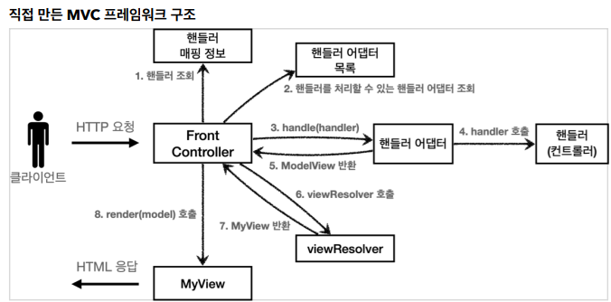
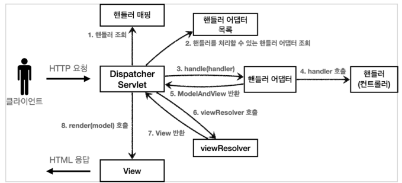
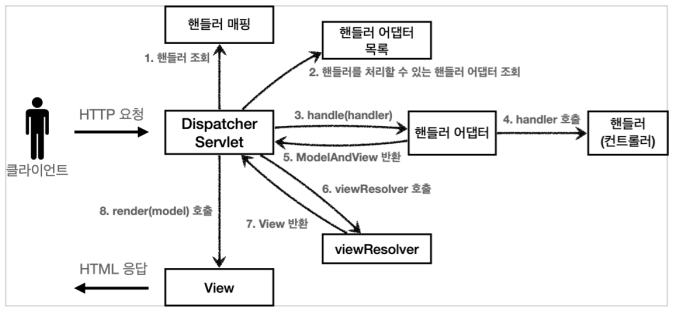

## 스프링 MVC - 구조 이해

- **스프링 MVC 전체 구조**

  

  

  - 직접 만든 프레임워크 -> 스프링 MVC

    - `FrontController` -> `DispatcherServlet`
    - `handlerMappingMap` -> `HandlerMapping`
    - `MyHandlerAdapter` -> `HandlerAdapter`
    - `ModelView` -> `ModelAndView`

    - `viewResolver` ->`ViewResolver` 
    - `MyView` -> `View`

  - DispatcherServlet 구조 살펴보기

    - `org.springframework.web.servlet.DispatcherServlet`
    - 스프링 MVC의 프론트 컨트롤러이자 스프링 MVC의 핵심
    - 부모 클래스에서 `HttpServlet`을 상속 받아서 사용하고, 서플릿으로 동작
      - `DispatcherServlet` ->`FrameworkServlet`-> `HttpServletBean` ->`HttpServlet`
    - 스프링 부트는 `DispatcherServlet`을 서블릿으로 자동으로 등록하면서 모든 경로에 대해서 매핑
      - 더 자세한 경로 우선순위가 높으므로 기존 등록 서블릿도 함께 동작
    - 서블릿 호출되면 `service()` 호출
      - `DispatcherServlet`의 부모인 `FrameworkServlet`에서 `service()` 를 오버라이드 해두었음
      - `FrameworkServlet.service()` 를 시작으로 여러 메서드가 호출되면서 `DispatcherServlet.doDispatch()`가 호출

  ```java
  // DispatcherServlet.doDispatcher()
  
  protected void doDispatch(HttpServletRequest request, HttpServletResponse 
                            response) throws Exception {
      HttpServletRequest processedRequest = request;
      HandlerExecutionChain mappedHandler = null;
      ModelAndView mv = null;
      // 1. 핸들러 조회
      mappedHandler = getHandler(processedRequest);
      if (mappedHandler == null) {
          noHandlerFound(processedRequest, response);
          return;
      }
      
      // 2. 핸들러 어댑터 조회 - 핸들러를 처리할 수 있는 어댑터
      HandlerAdapter ha = getHandlerAdapter(mappedHandler.getHandler());
      
      // 3. 핸들러 어댑터 실행 -> 4. 핸들러 어댑터를 통해 핸들러 실행 -> 5. ModelAndView 반환
      mv = ha.handle(processedRequest, response, mappedHandler.getHandler());
      processDispatchResult(processedRequest, response, mappedHandler, mv,
                            dispatchException);
  }
  
  private void processDispatchResult(HttpServletRequest request,
                                     HttpServletResponse response, HandlerExecutionChain mappedHandler, 	ModelAndView mv, Exception exception) throws Exception {
      // 뷰 렌더링 호출
      render(mv, request, response);
  }
  
  protected void render(ModelAndView mv, HttpServletRequest request,
                        HttpServletResponse response) throws Exception {
      View view;
      String viewName = mv.getViewName();
      // 6. 뷰 리졸버를 통해서 (논리 이름으로)뷰 찾기, 7. View 반환
      view = resolveViewName(viewName, mv.getModelInternal(), locale, request);
      // 8. 뷰 렌더링
      view.render(mv.getModelInternal(), request, response);
  }
  ```

  - SpringMVC 구조

    

  - 인터페이스 살펴보기

    - `DispatcherServlet` 코드의 변경 없이, 원하는 기능을 변경하거나 확장할 수 있음

  - 주요 인터페이스 목록
    - 핸들러 매핑: `org.springframework.web.servlet.HandlerMapping`
    - 핸들러 어댑터: `org.springframework.web.servlet.HandlerAdapter `
    - 뷰 리졸버: `org.springframework.web.servlet.ViewResolver`
    - 뷰: `org.springframework.web.servlet.View`


- **핸들러 매핑과 핸들러 어댑터**

  - 컨트롤러가 호출되려면 핸들러 매핑과 핸들러 어댑터가 필요

  - `HandlerMapping` : 핸들러 매핑에서 컨트롤러 찾을 수 있어야 함

    - ex) 스프링 빈의 이름으로 핸들러를 찾을 수 있는 핸들러 매핑 필요

    ```
    0순위 = RequestMappingHandlerMapping : 애노테이션 기반의 컨트롤러인 @RequestMapping에서 사용
    1순위 = BeanNameUrlHandlerMapping : 스프링 빈의 이름으로 핸들러를 찾는다.
    ```

  - `HandlerAdapter` : 찾은 핸들러를 실행할 수 있는 핸들러 어댑터 필요

    - ex) `Controller` 인터페이스를 실행할 수 있는 핸들러 어댑터를 찾고 실행

    ```
    0 = RequestMappingHandlerAdapter : 애노테이션 기반의 컨트롤러인 @RequestMapping에서 사용
    1 = HttpRequestHandlerAdapter : HttpRequestHandler 처리
    2 = SimpleControllerHandlerAdapter : Controller 인터페이스(애노테이션X, 과거에 사용) 처리
    ```

  - 핸들러 매핑과 핸들러 어댑터를 순서대로 찾고 없으면 다음 순서로 넘어감

  - `@RequestMapping`

    - 지금 스프링에서 주로 사용하는 애노테이션 기반의 컨트롤러를 지원하는 매핑과 어댑터


- **뷰 리졸버**

  - `InternalResourceViewResolver`

    - 스프링 부트가 자동 등록함

    - `spring.mvc.view.prefix` , `spring.mvc.view.suffix` 설정 정보를 사용해서 등록

    - 스프링 부트가 자동 등록하는 리졸버(일부 생략)

      ```
      1 = BeanNameViewResolver : 빈 이름으로 뷰를 찾아서 반환한다. (예: 엑셀 파일 생성기능에 사용)
      2 = InternalResourceViewResolver : JSP를 처리할 수 있는 뷰를 반환한다
      ```

  

  - 뷰 호출
    - `ViewResolver` 호출
      - 논리 이름으로 등록된 뷰를 찾아야 하는데 없음
      - `InternalResourceViewResolver` 호출
    - `InternalResourceViewResolver`
      - `InternalResourceView` 반환
    - 뷰 - `InternalResourceView`
      - JSP 처럼 포워드 `forward()`를 호출해서 처리할 수 있는 경우에 사용
    - `view.render()`
      - `InternalResourceView`는 `forward()`를 사용해서 JSP 실행

  - 참고
    - `InternalResourceViewResolver` 는 만약` JSTL` 라이브러리가 있으면 `InternalResourceView` 를 상속받은 `JstlView` 를 반환한다. `JstlView` 는 `JSTL` 태그 사용시 약간의 부가 기능이 추가된다.
    - JSP의 경우 `forward() `통해서 해당 JSP로 이동(실행)해야 렌더링이 된다. JSP를 제외한 나머지 뷰 템플릿들은 `forward()` 과정 없이 바로 렌더링 된다
    - `Thymeleaf` 뷰 템플릿을 사용하면` ThymeleafViewResolver` 를 등록해야 한다. 최근에는 라이브러리만 추가하면 스프링 부트가 이런 작업도 모두 자동화


- **스프링 MVC - 시작하기**
  - `ModelAndView` : 모델과 뷰 정보를 담아서 반환하면 된다
    - Model 데이터를 추가할 때는 `addObject()` 를 사용
      - 이후 뷰를 렌더링 할 때 사용
  - ``RequestMappingHandlerMapping` : 스프링 빈 중에서 `@RequestMapping` 또는 `@Controller` 가 클래스 레벨에 붙어 있는 경우에 매핑 정보로 인식
  - 주의! - 스프링 3.0 이상
    - 스프링 부트 3.0(스프링 프레임워크 6.0)부터는 클래스 레벨에 `@RequestMapping `이 있어도 스프링 컨트롤러로 인식하지 않는다.
    - 오직 `@Controller` 가 있어야 스프링 컨트롤러로 인식


- **스프링 MVC - 컨트롤러 통합**

  - 조합 결과

    > 클래스 레벨과 메서드 레벨 조합 가능

    - 클래스 레벨 `@RequestMapping("/springmvc/v2/members")`
      - 메서드 레벨 `@RequestMapping("/new-form")` -> `/springmvc/v2/members/new-form`
      - 메서드 레벨 `@RequestMapping("/save")` ->  `/springmvc/v2/members/save`
      - 메서드 레벨 `@RequestMapping` -> `/springmvc/v2/members`


- **스프링 MVC - 실용적인 방식**

  - ViewName 직접 반환 가능(논리 이름)
  - `@RequestParam` 사용
    - `@RequestParam("username")` 은 `request.getParameter("username")`와 거의 같음

  - HTTP 메서드도 함께 구분 가능
    - `@RequestMapping(value = "/new-form", method = RequestMethod.GET)`
      - `@GetMapping(value = "/new-form")`와 같음

- **정리**