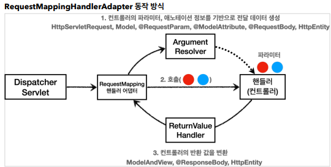
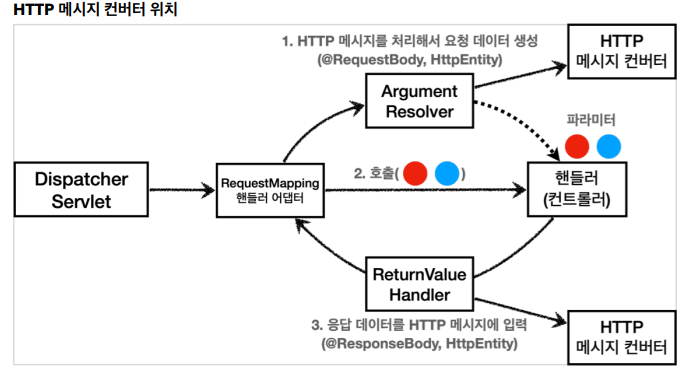

## 스프링 MVC - 기본 기능

- **로깅 간단히 알아보기**

  - 로그 선언

    - `private Logger log = LoggerFactory.getLogger(getClass());`
    - `private static final Logger log = LoggerFactory.getLogger(Xxx.class)`
    - `@Slf4j`: 롬복 사용 가능

  - 로그 호출

    - `log.info("hello")`

    ```java
    //@Slf4j
    @RestController
    public class LogTestController {
        private final Logger log = LoggerFactory.getLogger(getClass());
        @RequestMapping("/log-test")
        public String logTest() {
            String name = "Spring";
    
            log.trace("trace log={}", name);
            log.debug("debug log={}", name);
            log.info(" info log={}", name);
            log.warn(" warn log={}", name);
            log.error("error log={}", name);
            //로그를 사용하지 않아도 a+b 계산 로직이 먼저 실행됨, 이런 방식으로 사용하면 X -> 스트링이 새로 만들어지면서 메모리 낭비
            log.debug("String concat log=" + name);
            return "ok";
        }
    }
    ```

  - `@RestController`

    - `@Controller` 는 반환 값이 String 이면 뷰 이름으로 인식
    - `@RestController` 는 반환 값으로 뷰를 찾는 것이 아니라, HTTP 메시지 바디에 바로 입력

  - 로그 레벨 설정

    - LEVEL: `TRACE` > `DEBUG` > ` INFO` > `WARN` > `ERROR`
    - 개발 서버는 debug 출력 운영 서버는 info 출력

  - `application.properties`

    ```
    #전체 로그 레벨 설정(기본 info)
    logging.level.root=info
    
    #hello.springmvc 패키지와 그 하위 로그 레벨 설정
    logging.level.hello.springmvc=debug
    ```

  - `log.debug("data={}", data)`
    - 로그 출력 레벨을 info로 설정하면 아무일도 발생하지 않는다.


- **요청 매핑**
  - `@RequestMapping("/hello-basic")`
    - `/hello-basic URL` 호출이 오면 이 메서드가 실행되도록 매핑한다.
    - 대부분의 속성을 배열[] 로 제공하므로 다중 설정이 가능하다. {"/hello-basic", "/hello-go"}
  - 스프링 부트 3.0 부터는 마지막 슬래시(`/`) 유지함
    - 매핑: `/hello-basic` -> URL 요청: `/hello-basic` 
    - 매핑: `/hello-basic/` -> URL 요청: `/hello-basic/`
  - HTTP 메서드
    - 설정하지 않으면 method 상관 없이 호출
  - `@PathVariable`
    - 식별자를 매칭하여 편리하게 조회 가능
    - 이름과 파라미터 이름이 같으면 생략 가능
  - 파라미터 조건 추가 매핑 가능
    - `params = "mode=debug"`
  - 특정 헤더 조건 매핑 가능
    - `@GetMapping(value = "/mapping-header", headers = "mode=debug")`
  - 미디어 타입 조건 매핑
    - `@PostMapping(value = "/mapping-consume", consumes = "application/json")`
      - `contents` 타입
    - `@PostMapping(value = "/mapping-produce", produces = "text/html")`
      - `Accpet` 헤더 기반


- **요청 매핑 - API 예시**
  - 회원 목록 조회: `GET` `/users`
  - 회원 등록: `POST` `/users`
  - 회원 조회:` GET` `/users/{userId}`
  - 회원 수정: `PATCH` `/users/{userId}`
  - 회원 삭제: `DELETE` `/users/{userId}`


- **HTTP 요청 - 기본, 헤더 조회**

  ```java
  @Slf4j
  @RestController
  public class RequestHeaderController {
      @RequestMapping("/headers")
      public String headers(HttpServletRequest request,
                            HttpServletResponse response,
                            HttpMethod httpMethod,	// HTTP 메서드 조회
                            Locale locale,	// 언어 정보
                            @RequestHeader MultiValueMap<String, String> headerMap,
                            // 모든 HTTP 헤더를 MultiValueMap 형식으로 조회
                            @RequestHeader("host") String host,
                            // 특정 HTTP 헤더 조회
                            // 필수 값 여부 : required
                            // 기본 값 속성 : defaultValue
                            @CookieValue(value = "myCookie", required = false) String cookie
                            // 특정 쿠키 조회
                            // 필수 값 여부 : required
                            // 기본 값 속성 : defaultValue
                           ) {
          
          log.info("request={}", request);
          log.info("response={}", response);
          log.info("httpMethod={}", httpMethod);
          log.info("locale={}", locale);
          log.info("headerMap={}", headerMap);
          log.info("header host={}", host);
          log.info("myCookie={}", cookie);
          return "ok";
          
      }
  }
  ```

  - `MultiViewMap`

    - MAP과 유사한데, 하나의 키에 여러 값을 받을 수 있다.
    - HTTP header, HTTP 쿼리 파라미터와 같이 하나의 키에 여러 값을 받을 때 사용한다. 
      - `keyA=value1&keyA=value2`

  - `@Slf4j`

    - 다음 코드를 자동으로 생성해서 로그를 선언

      ```java
      private static final org.slf4j.Logger log = 
      org.slf4j.LoggerFactory.getLogger(RequestHeaderController.class);
      ```

      

- **HTTP 요청 파라미터 - 쿼리 파라미터, HTML Form**
  - 클라이언트에서 서버로 요청 데이터를 전달하는 3가지 주요 방법
    - `GET` - 쿼리 파라미터
    - `POST` - `HTML Form`
    - `HTTP message body`


- **HTTP 요청 파라미터 - @RequestParam**

  ```java
  /**
   * @RequestParam 사용
   * - 파라미터 이름으로 바인딩
   * @ResponseBody 추가
   * - View 조회를 무시하고, HTTP message body에 직접 해당 내용 입력
   */
  @ResponseBody
  @RequestMapping("/request-param-v2")
  public String requestParamV2(
      @RequestParam("username") String memberName,
      @RequestParam("age") int memberAge) {
      
      log.info("username={}, age={}", memberName, memberAge);
      return "ok";
  }
  ```

  - String , int , Integer 등의 단순 타입이면 `@RequestParam` 도 생략 가능
    - 요청 파라미터 이름과 변수 이름 같아야 함
  
  - `@RequestParam` 애노테이션을 생략하면 스프링 MVC는 내부에서 `required=false` 를 적용
  - 명시적으로 사용하고 생략하지 말자
  
  ```java
  // 파라미터 필수 여부 - requestParamRequired
  
  /**
   * @RequestParam.required - 기본값 true
   * /request-param-required -> username이 없으므로 예외
   *
   * 주의! - 파라미터 이름만 사용
   * /request-param-required?username= -> 빈문자로 통과
   *
   * 주의! - 기본형에 null 입력
   * /request-param-required
   * int age -> null을 int에 입력하는 것은 불가능, 따라서 Integer 변경해야 함(또는 다음에 나오는
  defaultValue 사용)
   */
  @ResponseBody
  @RequestMapping("/request-param-required")
  public String requestParamRequired(
      @RequestParam(required = true) String username,
      @RequestParam(required = false) Integer age) {
      log.info("username={}, age={}", username, age);
      return "ok";
  }
  ```
  
  - 파라미터를 Map으로 조회하기
    - `@RequestParam Map `
      - `Map(key=value)`
    - `@RequestParam MultiValueMap`
      - `MultiValueMap(key=[value1, value2, ...] ex) (key=userIds, value=[id1, id2]`
    - 파라미터의 값이 1개가 확실하다면 `Map`, 아니라면 `MultiValueMap`을 사용하자


- **HTTP 요청 파라미터 - @ModelAttribute**
  - `@Data`
    - `@Getter` , `@Setter`,  `@ToString` , `@EqualsAndHashCode` , `@RequiredArgsConstructor` 를 자동으로 적용
  - `@ModelAttribute `
    - HelloData 객체를 생성한다. 
    - 요청 파라미터의 이름으로 HelloData 객체의 프로퍼티를 찾는다. 
    - 그리고 해당 프로퍼티의 `setter`를 호출해서 파라미터의 값을 입력(바인딩) 한다. 
      - 예) 파라미터 이름이 username 이면 `setUsername()` 메서드를 찾아서 호출하면서 값을 입력한다.
    - 생략 가능, `@RequestParam`도 생략할 수 있으니 혼란이 발생할 수 있음
  - 생략시 규칙
    - String , int , Integer 같은 단순 타입 = `@RequestParam`
    - 나머지 = `@ModelAttribute`


- **HTTP 요청 메시지 - 단순 텍스트**

  - HTTP 메시지 바디를 통해 데이터가 직접 넘어오는 경우는 `@RequestParam` , `@ModelAttribute` 를 사용할 수 없다

    - `HTML Form` 형식으로 전달되는 경우는 요청 파라미터로 인정

  - Input, Output 스트림

    ```java
    /**
     * InputStream(Reader): HTTP 요청 메시지 바디의 내용을 직접 조회
     * OutputStream(Writer): HTTP 응답 메시지의 바디에 직접 결과 출력
     */
    @PostMapping("/request-body-string-v2")
    public void requestBodyStringV2(InputStream inputStream, Writer responseWriter)
        throws IOException {
        String messageBody = StreamUtils.copyToString(inputStream,
                                                      StandardCharsets.UTF_8);
        log.info("messageBody={}", messageBody);
        responseWriter.write("ok");
    }
    ```

  - HttpEntity - requestBodyStringV3

    ```java
    /**
     * HttpEntity: HTTP header, body 정보를 편리하게 조회
     * - 메시지 바디 정보를 직접 조회(@RequestParam X, @ModelAttribute X)
     * - HttpMessageConverter 사용 -> StringHttpMessageConverter 적용
     *
     * 응답에서도 HttpEntity 사용 가능
     * - 메시지 바디 정보 직접 반환(view 조회X)
     * - 헤더 정보 포함 가능
     * - HttpMessageConverter 사용 -> StringHttpMessageConverter 적용
     */
    @PostMapping("/request-body-string-v3")
    public HttpEntity<String> requestBodyStringV3(HttpEntity<String> httpEntity) {
        String messageBody = httpEntity.getBody();
        log.info("messageBody={}", messageBody);
        
        return new HttpEntity<>("ok");
    }
    ```

  - `RequestEntity`
    - HttpMethod, url 정보가 추가, 요청에서 사용
  - `ResponseEntity`
    - HTTP 상태 코드 설정 가능, 응답에서 사용
    - `return new ResponseEntity("Hello World", responseHeaders,  HttpStatus.CREATED`


- **HTTP 요청 메시지 - JSON**
  - 문자로 된 JSON 데이터를 `Jackson` 라이브러리인 `objectMapper` 를 사용해서 자바 객체로 변환
  - `HttpEntity` , `@RequestBody` 를 사용하면 HTTP 메시지 컨버터가 HTTP 메시지 바디의 내용을 우리가 원하는 문자나 객체 등으로 변환
  - `@RequestBody`는 생략 불가
    - 생략해버리면 `@ModelAttribute`가 적용되어 파라미터를 처리하게 됨
  - `@RequestBody` 요청
    - `JSON 요청` -> `HTTP 메시지 컨버터` ->  `객체`
  - `@ResponseBody` 응답
    - `객체` -> `HTTP 메시지 컨버터` -> `JSON 응답`


- **HTTP 응답 - 정적 리소스, 뷰 템플릿**
  - 스프링에서 응답 데이터를 만드는 주요 방법 3가지
    - 정적 리소스
      - 파일 변경 없이 그대로 서비스
      - `/static/...`
    - 뷰 템플릿 사용
      - HTML이 생성되고 뷰가 응답을 만들어서 전달
      - `/templates/...`
    - HTTP 메시지 사용
  - 컨트롤러에서 void를 반환하는 경우
    - 요청 URL을 참고해서 논리 뷰 이름으로 사용
    - 명시성이 떨어지고 딱 맞는 경우도 많이 없어서, 권장하지 않음


- **HTTP 응답 - HTTP API, 메시지 바디에 직접 입력**

  ```java
  @Slf4j
  @Controller
  //@RestController
  public class ResponseBodyController {
      
      @GetMapping("/response-body-string-v1") // HTTP 바디에 직접 ok 응답 메시지 전달
      public void responseBodyV1(HttpServletResponse response) throws IOException 
      {
          response.getWriter().write("ok");
      }
      
      /**
   * HttpEntity, ResponseEntity(Http Status 추가)
   * @return
   */
      @GetMapping("/response-body-string-v2") // ResponseEntity는 HttpEntity(헤더, 바디)를 상속받음
      // 더해서 HTTP 응답 코드를 설정 가능
      public ResponseEntity<String> responseBodyV2() {
          return new ResponseEntity<>("ok", HttpStatus.OK);
      }
      
      @ResponseBody
      @GetMapping("/response-body-string-v3") // HTTP 메시지 컨버터를 통해서 HTTP 메시지를 직접 입력가능
      public String responseBodyV3() {
          return "ok";
      }
      
      @GetMapping("/response-body-json-v1") // HTTP 메시지 컨버터를 통해 JSON 형식으로 변환되어 반환
      public ResponseEntity<HelloData> responseBodyJsonV1() {
          HelloData helloData = new HelloData();
          helloData.setUsername("userA");
          helloData.setAge(20);
          return new ResponseEntity<>(helloData, HttpStatus.OK);
      }
      
      @ResponseStatus(HttpStatus.OK)
      @ResponseBody
      @GetMapping("/response-body-json-v2")	// 응답코드를 애노테이션으로 설정(동적 변경 불가)
      public HelloData responseBodyJsonV2() {
          HelloData helloData = new HelloData();
          helloData.setUsername("userA");
          helloData.setAge(20);
          return helloData;
      }
      
  }
  ```

  - `@RequestController`
    - 해당 컨트롤러에 모두 `@ResponseBody`가 적용
    - `@ResponseBody`는 클래스 레벨에 두면 전체 메서드에 적용


- **HTTP 메시지 컨버터**

  - 스프링 MVC는 다음의 경우에 HTTP 메시지 컨버터를 적용

  - HTTP 요청: `@RequestBody` , `HttpEntity(RequestEntity)`

  - HTTP 응답: `@ResponseBody `, `HttpEntity(ResponseEntity)`

  - HTTP 메시지 컨버터 인터페이스

    ```java
    public interface HttpMessageConverter<T> {
        
        boolean canRead(Class<?> clazz, @Nullable MediaType mediaType);
        boolean canWrite(Class<?> clazz, @Nullable MediaType mediaType);
        
        List<MediaType> getSupportedMediaTypes();
        
        T read(Class<? extends T> clazz, HttpInputMessage inputMessage)
            throws IOException, HttpMessageNotReadableException;
        
        void write(T t, @Nullable MediaType contentType, HttpOutputMessage outputMessage)
            throws IOException, HttpMessageNotWritableException;
    }
    ```

    - `canRead()` , `canWrite()` : 메시지 컨버터가 해당 클래스, 미디어타입을 지원하는지 체크

    - `read()` , `write()` : 메시지 컨버터를 통해서 메시지를 읽고 쓰는 기능

  - 스프링 부트 기본 메시지 컨버터

    - 대상 클래스 타입과 미디어 타입을 둘 다 체크
  
  
    ```
    0 = ByteArrayHttpMessageConverter
    1 = StringHttpMessageConverter 
    2 = MappingJackson2HttpMessageConverter
    ```
  
    - `ByteArrayHttpMessageConverter`
      - 클래스 타입: `byte[]`, 미디어 타입: `*/*`
      - 쓰기 미디어 타입 : `application/octet-stream`
    - `StringHttpMessageConverter`
      - 클래스 타입: `String`, 미디어 타입: `*/*`
      - 쓰기 미디어 타입: `text/plain`
    - `MappingJackson2HttpMessageConverter`
      - 클래스 타입: 객체 또는 `HashMap`, 미디어 타입: `application/json` 관련
  
  - HTTP 요청 데이터 읽기
  
    - HTTP 요청이 오고, 컨트롤러에서 `@RequestBody` , `HttpEntity` 파라미터를 사용한다.
    - 메시지 컨버터가 메시지를 읽을 수 있는지 확인하기 위해 `canRead()` 를 호출한다.
      - 대상 클래스 타입을 지원하는가.
        - 예) `@RequestBody` 의 대상 클래스 ( byte[] , String , HelloData )
      - HTTP 요청의 Content-Type 미디어 타입을 지원하는가.
        - 예) `text/plain` , `application/json` , `*/*` 
    - `canRead()` 조건을 만족하면 read() 를 호출해서 객체 생성하고, 반환한다. 
  
  
  
  - HTTP 응답 데이터 생성
    - 컨트롤러에서 `@ResponseBody` , `HttpEntity` 로 값이 반환된다. 
    - 메시지 컨버터가 메시지를 쓸 수 있는지 확인하기 위해 `canWrite()` 를 호출한다.
      - 대상 클래스 타입을 지원하는가.
        - 예) return의 대상 클래스 ( byte[] , String , HelloData )
      - HTTP 요청의 Accept 미디어 타입을 지원하는가.(더 정확히는 `@RequestMapping` 의 `produces` )
        - 예) `text/plain` , `application/json` , `*/*` 
    - `canWrite()` 조건을 만족하면 `write()` 를 호출해서 HTTP 응답 메시지 바디에 데이터를 생성한다.


- 요청 매핑 핸들러 어댑터 구조

  - `@RequestMapping` 을 처리하는 핸들러 어댑터인 `RequestMappingHandlerAdapter`

    

  - ArgumentResolver
    - 파라미터를 유연하게 처리
    
    - 다양한 파라미터의 값 생성
    
    - 파라미터의 값이 모두 준비되면 컨트롤러를 호출하면서 값을 넘겨줌
    
    - 정확히는 `HandlerMethodArgumentResolver`인데 줄여서 `ArgumentResolver`
    
      ```java
      public interface HandlerMethodArgumentResolver {
          boolean supportsParameter(MethodParameter parameter);
          @Nullable
          Object resolveArgument(MethodParameter parameter, @Nullable
                                 ModelAndViewContainer mavContainer,
                                 NativeWebRequest webRequest, @Nullable WebDataBinderFactory 
                                 binderFactory) throws Exception;
      }
      ```

  - 동작 방식
    - `ArgmentResolver`의 `supportsParameter()` 로 해당 파라미터를 지원하는지 체크
    - 지원하면 `resolverArgument()`로 실제 객체 생성
    - 생성된 객체가 컨트롤러 호출시 넘어감
  - `ReturnValueHandler`
    - `HandlerMethodReturnValueHandler`를 줄여서 `ReturnValueHandler`라고 부름
    - `ArgumentResolver`와 비슷한데, 응답 값을 변환하고 처리
    - 컨트롤러에서 String으로 뷰 이름을 반환해도 동작하는 이유

  

  - `ArgumentResolver`는 객체를 호출하고 `@RequestBody`, `HttpEntity`같은 특정 형식은
    - HTTP 메시지 컨버터를 통해 객체를 생성해서 넘겨줌
    - `ArgumentResolver` -> `HTTP 메시지 컨버터` -> `ArgumentResolver` -> `핸들러(컨트롤러)`
  - 확장
    - 스프링은 다음을 모두 인터페이스로 제공 -> 언제든지 기능 확장
      - `HandlerMethodArgumentResolver`
      - `HandlerMethodReturnValueHandler`
      - `HttpMessageConverter`
    - 기능 확장은 `WebMvcConfigurer`를 상속 받아서 스프링 빈으로 등록
      - 자주 사용하지는 않음