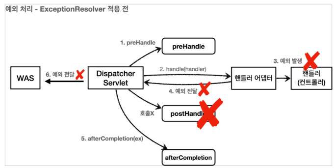
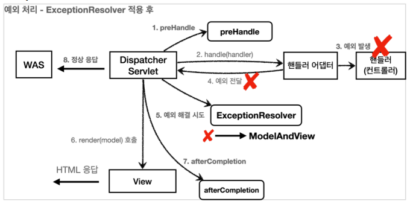

## API 예외 처리


- 시작

  - 오류 페이지 컨트롤러도 JSON 응답을 할 수 있도록 수정 필요
  - 클라이언트는 정상 요청이든, 오류 오청이든 JOSN 반환하기를 기대함

  ```java
  @RequestMapping(value = "/error-page/500", produces = MediaType.APPLICATION_JSON_VALUE)
  public ResponseEntity<Map<String, Object>> errorPage500Api(HttpServletRequest request,
                                                             HttpServletResponse response) {
      log.info("API errorPage 500");
  
      Map<String, Object> result = new HashMap<>();
      Exception ex = (Exception) request.getAttribute(ERROR_EXCEPTION);
      result.put("status", request.getAttribute(ERROR_STATUS_CODE));
      result.put("message", ex.getMessage());
  
      Integer statusCode = (Integer)
          request.getAttribute(RequestDispatcher.ERROR_STATUS_CODE);
      return new ResponseEntity<>(result, HttpStatus.valueOf(statusCode));
  }
  ```

  - 오류 페이지 요청 타입이 JSON이면 이 컨트롤러의 메서드 호출
  - `ResponseEntity` 를 사용해서 응답하기 때문에 메시지 컨버터가 동작하면서 클라이언트에 JSON이 반환


- 스프링 부트 기본 오류 처리

  - 스프링 부트가 제공하는 `BasicErrorController`

    ```java
    @RequestMapping(produces = MediaType.TEXT_HTML_VALUE)
    public ModelAndView errorHtml(HttpServletRequest request,
                                  HttpServletResponse response) {}
    
    @RequestMapping
    public ResponseEntity<Map<String, Object>> error(HttpServletRequest request) {}
    ```

    - `/error` 동일한 경로 처리
      - `server.error.path` 로 수정 가능
    - `errorHtml()` : `produces = MediaType.TEXT_HTML_VALUE`
      - 클라이언트 요청의 Accept 해더 값이 `text/html` 인 경우에는 `errorHtml()` 을 호출해서 view를 제공한다
    - `error() `
      - 그외 경우에 호출되고 `ResponseEntity` 로 HTTP Body에 JSON 데이터를 반환한다.

  - 더 자세한 오류 정보

    ```
    server.error.include-binding-errors=always
    server.error.include-exception=true
    server.error.include-message=always
    server.error.include-stacktrace=always
    ```

    - 보안상 위험할 수 있음. 간결한 메시지만 노출하자


- Html 페이지 vs API 오류
  - API 오류는 각각 컨트롤러나 예외마다 서로 다른 응답 결과를 출력해야함
  - `BasicController`는 HTML 화면을 처리할 때 사용하자
  - API 오류 처리는 `@ExceptionHandler`를 사용하자


- `HandlerExceptionResolver`

  - 줄여서 `ExceptionResolver`

  - 컨트롤러 밖으로 던져진 예외를 해결하고, 동작 방식을 변경

  - `ExceptionResolver` 적용 전

    

  - `ExceptionResolver` 적용 후

    

    - `ExceptionResolver` 로 예외를 해결해도 `postHandle()`은 호출되지 않음

  - `HandlerExceptionResolver` 인터페이스

    ```java
    public interface HandlerExceptionResolver {
        ModelAndView resolveException(
            HttpServletRequest request, HttpServletResponse response,
            Object handler, Exception ex);
    }
    ```

    - `handler` : 핸들러(컨트롤러) 정보
    - `Exception ex` : 핸들러(컨트롤러)에서 발생한 예외

  - 반환 값에 따른 동작 방식

    > HandlerExceptionResolver 의 반환 값에 따른 DispatcherServlet 의 동작 방식

    - 빈 `ModelAndView`
      - `new ModelAndView()` 처럼 빈 `ModelAndView` 를 반환하면 뷰를 렌더링 하지 않고, 정상 흐름으로 서블릿이 리턴된다.
    - `ModelAndView 지정`: `ModelAndView` 에 `View` , `Model` 등의 정보를 지정해서 반환하면 뷰를 렌더링 한다.
    - `null` : `null` 을 반환하면, 다음 `ExceptionResolver` 를 찾아서 실행한다. 만약 처리할 수 있는 `ExceptionResolver` 가 없으면 예외 처리가 안되고, 기존에 발생한 예외를 서블릿 밖으로 던진다(`WAS` 까지)


- `ExceptionResolver` 활용

  - 예외 상태 코드 변환
    - 예외를 `response.sendError(xxx)` 호출로 변경해서 서블릿에서 상태 코드에 따른 오류를 처리하도록 위임
    - 이후 `WAS`는 서블릿 오류 페이지를 찾아서 내부 호출, 예를 들어서 스프링 부트가 기본으로 설정한 `/ error` 가 호출됨
  - 뷰 템플릿 처리
    - `ModelAndView` 에 값을 채워서 예외에 따른 새로운 오류 화면 뷰 렌더링 해서 고객에게 제공
  - API 응답 처리
    - `response.getWriter().println("hello");` 처럼 HTTP 응답 바디에 직접 데이터를 넣어주는 것도 가능하다. 여기에 JSON 으로 응답하면 API 응답 처리를 할 수 있다.
  - `configureHandlerExceptionResolvers(..)` 를 사용하면 스프링이 기본으로 등록하는 `ExceptionResolver` 가 제거되므로 주의
  - `extendHandlerExceptionResolvers` 를 사용하자

  ```java
  /**
   * 기본 설정을 유지하면서 추가
   */
  @Override
  public void extendHandlerExceptionResolvers(List<HandlerExceptionResolver> resolvers) {
      resolvers.add(new MyHandlerExceptionResolver());
  }
  ```


- `HandlerExceptionResolver` 활용
  - 예외가 발생하면 거기서 마무리하자
    - 깔끔
    -  `WAS`까지 던지지 말고
  - `ExceptionResolver` 를 사용하면 컨트롤러에서 예외가 발생해도 `ExceptionResolver` 에서 예외를 처리
  - 예외가 서블릿 컨테이너까지 전달되지 않고, 스프링 MVC에서 예외 처리 끝
  - `WAS` 입장에서는 정상 처리


- 스프링이 제공하는 `ExceptionResolver1`
  - `HandlerExceptionResolverComposite` 에 다음 순서로 등록
    1. `ExceptionHandlerExceptionResolver`
       - `@ExceptionHandler` 을 처리한다. API 예외 처리는 대부분 이 기능으로 해결
    2. `ResponseStatusExceptionResolver`
       - HTTP 상태 코드를 지정해준다
       - 예) `@ResponseStatus(value = HttpStatus.NOT_FOUND)`
    3. `DefaultHandlerExceptionResolver` -> 우선 순위가 가장 낮다.
       - 스프링 내부 기본 예외 처리


- `ResponseStatusExceptionResolver`

  - `@ResponseStatus` 가 달려있는 예외 처리
  - `ResponseStatusException` 예외 처리

  ```java
  // @ResponseStatus(code = HttpStatus.BAD_REQUEST, reason = "잘못된 요청 오류")
  @ResponseStatus(code = HttpStatus.BAD_REQUEST, reason = "error.bad")
  public class BadRequestException extends RuntimeException {
  }
  ```
  
  - HTTP 상태 코드 변경
  - 메시지 기능


- `ResponseStatusException`

  - `@ResponseStatus` 는 개발자가 직접 변경할 수 없는 예외에는 적용할 수 없다
    - 라이브러리 등 내부 코드
  - 조건에 따라 동적으로 변경하는 등에 사용

  ```java
  @GetMapping("/api/response-status-ex2")
  public String responseStatusEx2() {
      throw new ResponseStatusException(HttpStatus.NOT_FOUND, "error.bad",
                                        new IllegalArgumentException());
  }
  ```

  

- `DefaultHandlerExceptionResolver`

  - 스프링 내부에서 발생하는 스프링 예외 해결

  - 예시

    ```
    - 파라미터 바인딩 시점에 타입이 맞지 않으면 내부에서 TypeMismatchException 이
    발생
    - 원래 예외 발생시 서블릿 컨테이너까지 오류가 올라가고, 500 오류 발생
    - 파라미터 바인딩은 대부분 클라이언트가 HTTP 요청 정보를 잘못 호출해서 발생하는 문제
    - 500 오류가 아니라 HTTP 상태 코드 400 오류로 변경
    ```

    - `DefaultHandlerExceptionResolver.handleTypeMismatch` 를 보면 다음과 같은 코드를 확인할 수 있다
      - `response.sendError(HttpServletResponse.SC_BAD_REQUEST) (400)`
      - 결국 `response.sendError()` 를 통해서 문제를 해결한다.


- `@ExceptionHandler`

  > 바로 ExceptionHandlerExceptionResolver

  - `BasicErrorController` 를 사용하거나 `HandlerExceptionResolver `를 직접 구현하는 방식으로 API 예외를 다루기는 쉽지 않다

  - 예외 처리 방법

    - `@ExceptionHandler` 애노테이션을 선언하고, 해당 컨트롤러에서 처리하고 싶은 예외를 지정해주면 된다
    - 해당 컨트롤러에서 예외가 발생하면 이 메서드가 호출
    - 지정한 예외 또는 그 예외의 자식 클래스는 모두 잡을 수 있다.

    ```java
    @ResponseStatus(HttpStatus.BAD_REQUEST)
    @ExceptionHandler(IllegalArgumentException.class)
    public ErrorResult illegalExHandle(IllegalArgumentException e) {
        log.error("[exceptionHandle] ex", e);
        return new ErrorResult("BAD", e.getMessage());
    }
    ```

  - 우선순위

    - 항상 자세한 것이 우선권을 가짐

    ```java
    @ExceptionHandler(부모예외.class)
    public String 부모예외처리()(부모예외 e) {}
    
    @ExceptionHandler(자식예외.class)
    public String 자식예외처리()(자식예외 e) {}
    ```

    - `자식예외` 가 발생하면 `부모예외처리()` , `자식예외처리()` 둘다 호출 대상
    - 더 자세한 것이 우선권을 가지므로 `자식예외처리()` 가 호출
    - `부모예외` 가 호출되면 `부모예외처리()` 만 호출 대상

  - `Exception`이 모든 예외의 최상위 부모

    - `Exception`으로 예외 처리를 하면 자식까지 처리 대상

  - 다양한 예외

    - 다양한 예외 한번에 처리

    ```java
    @ExceptionHandler({AException.class, BException.class})
    public String ex(Exception e) {
        log.info("exception e", e);
    }
    ```

  - 예외 생략

    - 생략하면 메서드 파라미터의 예외가 지정됨

    ```java
    @ExceptionHandler
    public ResponseEntity<ErrorResult> userExHandle(UserException e) {}
    ```

  - 파라미터와 응답

    - `@ExceptionHandler` 에는 마치 스프링의 컨트롤러의 파라미터 응답처럼 다양한 파라미터와 응답을 지정할 수 있다

  - 실행 흐름

    ```java
    @ResponseStatus(HttpStatus.BAD_REQUEST)
    @ExceptionHandler(IllegalArgumentException.class)
    public ErrorResult illegalExHandle(IllegalArgumentException e) {
        log.error("[exceptionHandle] ex", e);
        return new ErrorResult("BAD", e.getMessage());
    }
    ```

    - 컨트롤러를 호출한 결과 `IllegalArgumentException` 예외가 컨트롤러 밖으로 던져진다. 
    - 예외가 발생했으로 `ExceptionResolver` 가 작동한다.
      - 가장 우선순위가 높은 `ExceptionHandlerExceptionResolver` 가 실행된다. 
    - `ExceptionHandlerExceptionResolver` 는 해당 컨트롤러에 `IllegalArgumentException` 을 처리할 수 있는 `@ExceptionHandler` 가 있는지 확인한다.
    - `illegalExHandle()` 를 실행한다.
      - `@RestController `이므로 `illegalExHandle()` 에도 `@ResponseBody` 가 적용된다
    -  따라서 HTTP 컨버터가 사용되고, 응답이 다음과 같은 JSON으로 반환된다. 
    - `@ResponseStatus(HttpStatus.BAD_REQUEST)` 를 지정했으므로 HTTP 상태 코드 400으로 응답한다.


- `@ControllerAdvice`

  - 정상 코드와 예외 처리 코드가 하나의 컨트롤러에 섞여 있다

  - `@ControllerAdvice` 또는 `@RestControllerAdvice` 를 사용하면 둘을 분리할 수 있다.

  - 역할

    - `@ControllerAdvice` 는 대상으로 지정한 여러 컨트롤러에 `@ExceptionHandler` , `@InitBinder` 기능을 부여해주는 역할을 한다.
    - `@ControllerAdvice` 에 대상을 지정하지 않으면 모든 컨트롤러에 적용된다. (글로벌 적용)
    - `@RestControllerAdvice` 는 `@ControllerAdvice` 와 같고, `@ResponseBody` 가 추가되어 있다. 
      - `@Controller` , `@RestController` 의 차이와 같다.

  - 대상 컨트롤러 지정 방법

    ```java
    // Target all Controllers annotated with @RestController
    @ControllerAdvice(annotations = RestController.class)
    public class ExampleAdvice1 {}
    
    // Target all Controllers within specific packages
    @ControllerAdvice("org.example.controllers")
    public class ExampleAdvice2 {}
    
    // Target all Controllers assignable to specific classes
    @ControllerAdvice(assignableTypes = {ControllerInterface.class,
    AbstractController.class})
    public class ExampleAdvice3 {}
    ```

    - 특정 애노테이션이 있는 컨트롤러 지정
    - 특정 패키지 직접 지정( 해당 패키지와 하위 패키지 컨트롤러 )
    - 특정 클래스 지정
    - 대상 컨트롤러 지정을 생략하면 모든 컨트롤러에 적용