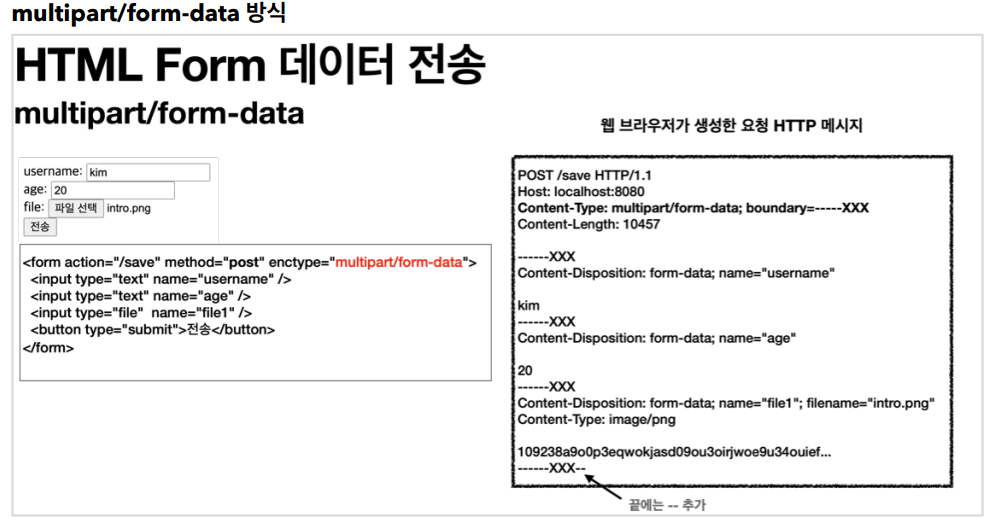

## 파일 업로드


- 파일 업로드 소개

  - `multipart/form-data`

    - 다른 종류의 여러 파일과 폼의 내용 함께 전송할 수 있다.
    -  문자와 바이너리를 동시에 전송가능
    - Form 태그에 별도의 `enctype="multipart/form-data"` 를 지정

    

    - 폼의 입력 결과로 생성된 HTTP 메시지
      - 각각의 전송 항목이 구분
      - `Content-Disposition`이라는 항목별 헤더 추가
        - 부가 정보가 있음
      - 파일의 경우 파일 이름과 `Content-Type`이 추가되고 바이너리 데이터 전송


- 서블릿과 파일 업로드1

  - 컨트롤러

    ```java
    @Slf4j
    @Controller
    @RequestMapping("/servlet/v1")
    public class ServletUploadControllerV1 {
    
        @GetMapping("/upload")
        public String newFile() {
            return "upload-form";
        }
    
        @PostMapping("/upload")
        public String saveFileV1(HttpServletRequest request) throws
                ServletException, IOException {
            log.info("request={}", request);
    
            String itemName = request.getParameter("itemName");
            log.info("itemName={}", itemName);
    
            Collection<Part> parts = request.getParts();
            log.info("parts={}", parts);
    
            return "upload-form";
        }
    }
    ```

    - `request.getParts()`
      - `multipart/form-data` 전송 방식에서 각각 나누어진 부분을 받아서 확인할 수 있다

  - 멀티파트 사용 옵션

    - 업로드 사이즈 제한

      ```
      spring.servlet.multipart.max-file-size=1MB
      spring.servlet.multipart.max-request-size=10MB
      ```

      - 사이즈를 넘으면 예외( `SizeLimitExceededException` )가 발생
      - `max-file-size` : 파일 하나의 최대 사이즈
        - 기본 1MB
      - `max-request-size` : 멀티파트 요청 하나에 여러 파일을 업로드 할 수 있는데, 그 전체 합이다
        - 기본 10MB

    - `spring.servlet.multipart.enabled` 끄기

      - `spring.servlet.multipart.enabled=false`
      - 서블릿 컨테이너는 멀티파트와 관련된 처리를 하지 않는다

    - `spring.servlet.multipart.enabled` 켜기

      - `spring.servlet.multipart.enabled=true` (기본 true)

  - `HttpServletRequest` 객체

    -  `RequestFacade` -> `StandardMultipartHttpServletRequest` 로 변환
    - `DispatcherServlet` 에서 멀티파트 리졸버( `MultipartResolver` )를 실행
    - 멀티파트 요청인 경우 서블릿 컨테이너가 전달하는 일반적인 `HttpServletRequest` 를 `MultipartHttpServletRequest` 로 변환해서 반환\
    - ` MultipartHttpServletRequest` 는 `HttpServletRequest` 의 자식 인터페이스
      - 멀티파트와 관련된 추가 기능 제공

  - 기본 멀티파트 리졸버

    - `MultipartHttpServletRequest` 인터페이스를 구현한 `StandardMultipartHttpServletRequest` 를 반환
    - 컨트롤러에서 `HttpServletRequest` 대신에 `MultipartHttpServletRequest` 를 주입받을 수 있다
      - `MultipartFile`가 더 편리하기 때문에 잘 사용하지는 않는다


- 서블릿과 파일 업로드2
  - Part
    - 멀티파트 형식은 전송 데이터를 하나하나 각각 부분( `Part` )으로 나누어 전송
    - `Part` 는 멀티파트 형식을 편리하게 읽을 수 있는 다양한 메서드를 제공
      - `request.getParts();`
      - `part.getSubmittedFileName()` : 클라이언트가 전달한 파일명 
      - `part.getInputStream()` : Part의 전송 데이터를 읽을 수 있다.
      - `part.write(...)` : Part를 통해 전송된 데이터를 저장할 수 있다.
  - `MultipartFile `이라는 인터페이스로 멀티파트 파일을 더 편리하게 지원


- 스프링 파일 업로드

  - 컨트롤러 일부

    ```java
    @GetMapping("/upload")
    public String newFile() {
        return "upload-form";
    }
    
    @PostMapping("/upload")
    public String saveFile(@RequestParam String itemName,
                           @RequestParam MultipartFile file,
                           HttpServletRequest request) throws IOException {
        
        log.info("request={}", request);
        log.info("itemName={}", itemName);
        log.info("multipartFile={}", file);
        
        if (!file.isEmpty()) {
            String fullPath = fileDir + file.getOriginalFilename();
            log.info("파일 저장 fullPath={}", fullPath);
            
            file.transferTo(new File(fullPath));
        }
        return "upload-form";
    }
    ```

    - `@RequestParam MultipartFile file`
      - 업로드하는 HTML Form의 `name`에 맞추어 `@RequestParam` 을 적용
      - `@ModelAttribute` 에서도 `MultipartFile` 을 동일하게 사용
    - `MultipartFile` 주요 메서드
      - `file.getOriginalFilename()` : 업로드 파일 명
      - `file.transferTo(...)` : 파일 저장


- 예제 만들기

  - `extractExt()` : 확장자를 별도로 추출해서 서버 내부에서 관리하는 파일명에도 붙여준다. 예

  - 아이템 컨트롤러 일부

    ```java
    @ResponseBody
    @GetMapping("/images/{filename}")
    public Resource downloadImage(@PathVariable String filename) throws MalformedURLException {
        
        return new UrlResource("file:" + fileStore.getFullPath(filename));
    }
    
    @GetMapping("/attach/{itemId}")
    public ResponseEntity<Resource> downloadAttach(@PathVariable Long itemId) throws MalformedURLException {
        Item item = itemRepository.findById(itemId);
        String storeFileName = item.getAttachFile().getStoreFileName();
        String uploadFileName = item.getAttachFile().getUploadFileName();
        UrlResource resource = new UrlResource("file:" + fileStore.getFullPath(storeFileName));
        
        log.info("uploadFileName={}", uploadFileName);
        String encodedUploadFileName = UriUtils.encode(uploadFileName,
                                                       StandardCharsets.UTF_8);
        
        String contentDisposition = "attachment; filename=\"" +
            encodedUploadFileName + "\"";
        
        return ResponseEntity.ok()
            .header(HttpHeaders.CONTENT_DISPOSITION, contentDisposition)
            .body(resource);
    }
    ```

    - `@GetMapping("/images/{filename}")` : `` 태그로 이미지를 조회할 때 사용
      - `UrlResource` 로 이미지 파일을 읽어서 `@ResponseBody` 로 이미지 바이너리를 반환
    - `@GetMapping("/attach/{itemId}")` : 파일을 다운로드 할 때 실행
      -  파일 다운로드시에는 고객이 업로드한 파일 이름으로 다운로드
      - `Content-Disposition` 해더에 `attachment; filename="업로드 파일명"` 값을 주면 된다.
      - `Header`정보에 주지 않으면 첨부 파일인 것을 인식하지 못함
        - 파일이 다운로드 되지 않고, 파일 내용을 웹 브라우저에서 보여주게 된다

