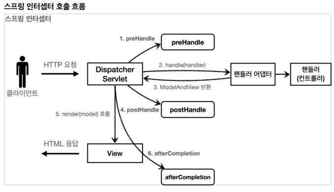

## 로그인 처리2 - 필터, 인터셉터

- 공통 관심사
  - 애플리케이션 여러 로직에서 공통으로 관심이 있는 있는 것
  - 웹과 관련된 공통 관심사를 처리할 때는 HTTP의 헤더나 URL의 정보들이 필요
  - 서블릿 필터나 스프링 인터셉터는 `HttpServletRequest` 를 제공


- 서블릿 필터

  - 서블릿이 지원하는 수문장

  - 필터 흐름

    - `HTTP 요청` -> `WAS` -> `필터` -> `서블릿` -> `컨트롤러`
    - 모든 고객의 요청에 적용이라면 필터에 사용
    - 필터는 특정 URL 패턴에 적용할 수 있음
      - `/*` : 모든 요청에 필터 적용
    - 스프링을 사용한다면 여기서 서블릿은 스프링의 디스패처 서블릿

  - 필터 체인

    - 필터는 체인으로 구성
    - 중간에 필터를 여러 개 추가할 수 있음

  - 필터 인터페이스

    - 필터 인터페이스를 구현하고 등록하면 서블릿 컨테이너가 필터를 싱글톤 객체로 생성하고, 관리한다.

    ```java
    public interface Filter {
        
        public default void init(FilterConfig filterConfig) throws ServletException {}
        
        public void doFilter(ServletRequest request, ServletResponse response,
                             FilterChain chain) throws IOException, ServletException;
        
        public default void destroy() {}
    }
    
    ```

    - `init()`: 필터 초기화 메서드, 서블릿 컨테이너가 생성될 때 호출된다.

    - `doFilter()`: 고객의 요청이 올 때 마다 해당 메서드가 호출된다. 필터의 로직을 구현하면 된다.
    - `destroy()`: 필터 종료 메서드, 서블릿 컨테이너가 종료될 때 호출된다

  

- WebConfig - 필터 설정

  - 필터 등록 방법은 여러가지가 있음

  ```java
  @Configuration
  public class WebConfig {
  
      @Bean
      public FilterRegistrationBean logFilter() {
          FilterRegistrationBean<Filter> filterRegistrationBean = new FilterRegistrationBean<>();
          filterRegistrationBean.setFilter(new LogFilter());
          filterRegistrationBean.setOrder(1);
          filterRegistrationBean.addUrlPatterns("/*");
          return filterRegistrationBean;
      }
  }
  ```

  - `setFilter(new LogFilter())` : 등록할 필터를 지정한다.
  - `setOrder(1)` : 필터는 체인으로 동작한다. 따라서 순서가 필요하다. 낮을 수록 먼저 동작한다.
  - `addUrlPatterns("/*")` : 필터를 적용할 URL 패턴을 지정한다. 한번에 여러 패턴을 지정할 수 있다.
  - 참고
    - URL 패턴에 대한 룰은 필터도 서블릿과 동일
    - `@ServletComponentScan` `@WebFilter(filterName = "logFilter", urlPatterns = "/*")` 로 필터 등록이 가능하지만 필터 순서 조절이 안된다. 따라서 FilterRegistrationBean 을 사용하자
    - 실무에서 HTTP 요청시 같은 요청의 로그에 모두 같은 식별자를 자동으로 남기는 방법은 `logback mdc`로 검색해보자


- 스프링 인터셉터

  - 서블릿 필터가 서블릿이 제공하는 기술이라면, 스프링 인터셉터는 스프링 MVC가 제공하는 기술

  - 스프링 인터셉터 흐름

    - `HTTP 요청` -> `WAS` -> `필터` -> `서블릿` -> `스프링 인터셉터` -> `컨트롤러`
    - 스프링 MVC의 시작점이 디스패처 서블릿
    - 스프링 인터셉터는 스프링 MVC가 제공하는 기능
    - 스프링 인터셉터에도 URL 패턴을 적용할 수 있는데, 서블릿 URL 패턴과는 다르고, 매우 정밀하게 설정할 수 있다

  - 스프링 인터셉터 체인

    - 서블릿 필터와 호출 되는 순서만 다르고, 제공하는 기능은 비슷
    - 서블릿 필터보다 편리하고, 더 정교하고 다양한 기능을 지원

  - 스프링 인터셉터 인터페이스

    ```java
    public interface HandlerInterceptor {
        
        default boolean preHandle(HttpServletRequest request, HttpServletResponse esponse,
                                  Object handler) throws Exception {}
        
        default void postHandle(HttpServletRequest request, HttpServletResponse response,
                                Object handler, @Nullable ModelAndView modelAndView) throws Exception {}
        
        default void afterCompletion(HttpServletRequest request, HttpServletResponse response,
                                     Object handler, @Nullable Exception ex) throws Exception {}
    }
    ```

    - 인터셉터는 컨트롤러 호출 전( `preHandle` ),  호출 후( `postHandle` ), 요청 완료 이후( `afterCompletion` )와 같이 단계적으로 잘 세분화
    - 인터셉터는 어떤 컨트롤러( `handler` )가 호출되는지 호출 정보도 받을 수 있다. 그리고 어떤 `modelAndView` 가 반환되는지 응답 정보도 받을 수 있다

  - 

    - `afterCompletion` : 뷰가 렌더링 된 이후에 호출된다.
      - 예외가 발생해도 호출된다
      - 예외가 발생하면 `afterCompletion()` 에 예외 정보( `ex` )를 포함해서 호출된다

  - 필터보다 인터셉터를 사용하는 것이 편리

    - 인터셉터는 스프링 MVC 구조에 특화된 필터 기능을 제공


- 스프링 인터셉터 - 요청 로그

  - 인터셉터도 싱글톤으로 사용됨

  - `HandlerMethod`

    - 핸들러 정보는 어떤 핸들러 매핑을 사용하는가에 따라 달라진다. 스프링을 사용하면 일반적으로 `@Controller` , `@RequestMapping` 을 활용한 핸들러 매핑을 사용하는데, 이 경우 핸들러 정보로 `HandlerMethod` 가 넘어온다.

  - `ResourceHttpRequestHandler` 

    - `@Controller` 가 아니라 `/resources/static` 와 같은 정적 리소스가 호출 되는 경우 `ResourceHttpRequestHandler` 가 핸들러 정보로 넘어오기 때문에 타입에 따라서 처리가 필요하다.

  - ```java
    if (handler instanceof HandlerMethod) {
        HandlerMethod hm = (HandlerMethod) handler;
        //호출할 컨트롤러 메서드의 모든 정보가 포함되어 있다.
    }
    ```


- 인터셉터 등록

  ```java
  @Configuration
  public class WebConfig implements WebMvcConfigurer {
      @Override
      public void addInterceptors(InterceptorRegistry registry) {
          registry.addInterceptor(new LogInterceptor())
              .order(1)
              .addPathPatterns("/**")
              .excludePathPatterns("/css/**", "/*.ico", "/error");
      }
      //...
  }
  ```

  - `WebMvcConfigurer` 가 제공하는 `addInterceptors()` 를 사용해서 인터셉터를 등록할 수 있다
  - 필터와 비교해보면 인터셉터는 `addPathPatterns` , `excludePathPatterns` 로 매우 정밀하게 URL  패턴을 지정할 수 있다.


- 스프링 인터셉터 - 인증 체크
  - 인증이라는 것은 컨트롤러 호출 전에만 호출되면 된다.  따라서 `preHandle` 만 구현하면 된다


- ArgumentResolver 활용

  - Login 애노테이션 만들기

    ```java
    @Target(ElementType.PARAMETER)
    @Retention(RetentionPolicy.RUNTIME)
    public @interface Login {
    }
    ```

    - `@Target(ElementType.PARAMETER)` : 파라미터에만 사용
    - `@Retention(RetentionPolicy.RUNTIME)` : 리플렉션 등을 활용할 수 있도록 런타임까지 애노테이션 정보가 남아있음

  - LoginMemberArgumentResolver

    ```java
    @Slf4j
    public class LoginMemberArgumentResolver implements HandlerMethodArgumentResolver {
        
        @Override
        public boolean supportsParameter(MethodParameter parameter) {
            log.info("supportsParameter 실행");
            
            boolean hasLoginAnnotation =
                parameter.hasParameterAnnotation(Login.class);
            
            boolean hasMemberType =
                Member.class.isAssignableFrom(parameter.getParameterType());
            
            return hasLoginAnnotation && hasMemberType;
        }
        
        
        @Override
        public Object resolveArgument(MethodParameter parameter,
                                      ModelAndViewContainer mavContainer, NativeWebRequest webRequest,
                                      WebDataBinderFactory binderFactory) throws Exception {
            
            log.info("resolveArgument 실행");
            
            HttpServletRequest request = (HttpServletRequest)
                webRequest.getNativeRequest();
            
            HttpSession session = request.getSession(false);
            
            if (session == null) {
                return null;
            }
            
            return session.getAttribute(SessionConst.LOGIN_MEMBER);
        }
    }
    ```

    - `supportsParameter()` : `@Login` 애노테이션이 있으면서 `Member` 타입이면 해당 `ArgumentResolver` 가 사용된다
    - `resolveArgument()` : 컨트롤러 호출 직전에 호출 되어서 필요한 파라미터 정보를 생성해준다
      - 여기서는 세션에 있는 로그인 회원 정보인 `member` 객체

  - WebConfig에 등록

    ```java
    @Override
    public void addArgumentResolvers(List<HandlerMethodArgumentResolver> resolvers) {
        resolvers.add(new LoginMemberArgumentResolver());
    }
    ```

  - `ArgumentResolver `를 활용하면 공통 작업이 필요할 때 컨트롤러를 더욱 편리하게 사용할 수 있다.