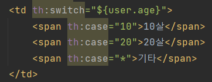

### 타임리프

- 특징
  - 서버 사이드 HTML 렌더링(SSR)
    - 백엔드 서버에서 HTML을 동적으로 렌더링
  - 네츄럴 템플릿
    - 순수 HTML을 최대한 유지하면서 뷰 템플릿 사용
    - 웹 브라우저를 직접 열어도 내용을 확인할 수 있음(마크업)
  - 스프링 통합 지원
    - 스프링과 자연스럽게 통합, 다양한 기능을 편리하게 사용
- 텍스트 - text, utext
  - HTML의 콘텐츠(content)에 데이터를 출력할 때는 다음과 같이 `th:text` 를 사용
    - `<span th:text="${data}">`
  - HTML 콘텐츠 영역안에서 직접 데이터를 출력하고 싶으면
    - `[[${data}]]`
  - 

- Escape

  > 특수 문자를 HTML 엔티티로 변경하는 것

  - 웹 브라우저는 `<` 를 HTML 테그의 시작으로 인식
  - 태그의 시작이 아닌 문자로 표현할 수 있는 방법 필요
    - HTML 엔티티
  - `th:text` , `[[...]]` 는 기본적으로 이스케이스(escape)를 제공

- Unescape

  - 이스케이프 기능을 사용하지 않으려면
    - `th:text` -> `th:utext`
    - `[[...]]` -> `[(...)]`
    - 꼭 필요할 때만 사용하자
      - 게시판의 경우 여러가지 글을 쓰면 정상 렌더링 되지 않을 수 있음

  

- SpringEL

  - 변수 표현식: `${...}`

  

  - 지역 변수 선언

    - `th:with`

      - first를 지역변수로 사용

      ```html
      <div th:with="first=${users[0]}">
       <p>처음 사람의 이름은 <span th:text="${first.username}"></span></p>
      </div>
      ```

      

- 기본 객체들

  

  - 편의 객체
    - HTTP 요청 파라미터 접근: param
      - 예) `${param.paramData}`
    - HTTP 세션 접근: session
      - 예) `${session.sessionData}`
    - 스프링 빈 접근: @
      - 예) `${@helloBean.hello('Spring!')}`

- 유틸리티 객체와 날짜

  ```
  타임리프 유틸리티 객체들
  #message : 메시지, 국제화 처리
  #uris : URI 이스케이프 지원
  #dates : java.util.Date 서식 지원
  #calendars : java.util.Calendar 서식 지원
  #temporals : 자바8 날짜 서식 지원
  #numbers : 숫자 서식 지원
  #strings : 문자 관련 편의 기능
  #objects : 객체 관련 기능 제공
  #bools : boolean 관련 기능 제공
  #arrays : 배열 관련 기능 제공
  #lists , #sets , #maps : 컬렉션 관련 기능 제공
  #ids : 아이디 처리 관련 기능 제공, 뒤에서 설명
  ```

  - 자바8 : `LocalDate`, `LocalDateTime`, `Instant`

    - 추가 라이브러리 필요 : `thymeleaf-extras-java8tim`

    - 스프링 부트 타임리프를 사용하면 해당 라이브러리가 자동으로 추가 통합

      ```html
      <span th:text="${#temporals.format(localDateTime, 'yyyy-MM-dd HH:mm:ss')}"></span>
      ```

      

- URL 링크
  - 단순한 URL
    - `@{/hello}` -> `/hello`
  - 쿼리 파라미터
    - `@{/hello(param1=${param1}, param2=${param2})}`
      - `/hello?param1=data1&m2=data2`
      - `()` 에 있는 부분은 쿼리 파라미터로 처리된다
  - 경로 변수 + 쿼리 파라미터
  - `@{/hello/{param1}(param1=${param1}, param2=${param2})}`
    - `/hello/data1?param2=data2`
    - 경로 변수와 쿼리 파라미터를 함께 사용할 수 있다.
  - 상대경로, 절대경로, 프로토콜 기준을 표현할 수도 있음


- 리터럴
  - 소스 코드상에 고정된 값을 말함
  - 문자: 'hello' 
    - 항상 작은 따옴표로 감싸야 함
      - `<span th:text="'hello'">`
    - 공백 없이 쭉 이어진다면 하나의 의미있는 토큰으로 인지해서 작은 따옴표 생략 가능
      - 룰: `A-Z` , `a-z` , `0-9` , `[]` ,` .` , `-` ,` _`
      - `<span th:text="hello">`
      - `<span th:text="hello world!"></span>` - 오류
  - 숫자: 10
  - 불린: true , false
  - null: null
  - 리터럴 대체
    - `<span th:text="|hello ${data}|>"`
- 연산
  - 비교연산: HTML 엔티티를 사용해야 하는 부분을 주의하자
    - `>` (gt), `<` (lt), `>=` (ge), `<=` (le), `! `(not), `==` (eq), `!=` (neq, ne)
    - 조건식: 자바의 조건식과 유사하다.
      - 삼항 연산자와 유사
    - Elvis 연산자: 조건식의 편의 버전
      - `<li>${data}?: '데이터가 없습니다.' = <span th:text="${data}?: '데이터가 없습니다.'"></span></li>`
    - No-Operation: `_` 인 경우 마치 타임리프가 실행되지 않는 것 처럼 동작한다
      - 이것을 잘 사용하면 HTML 의 내용 그대로 활용할 수 있다.
      - `<p th:text="${nullData}?: _ "> default value </p>`
        - default value 출력


- 속성 값 설정

  - `th:*` 로 속성을 적용하면 기존 속성을 대체
    - `<input type="text" name="mock" th:name="userA" />`
      - 타임리프 렌더링 후: `<input type="text" name="userA" />`
  - 속성 추가
    - `th:attrappend` : 속성 값의 뒤에 값을 추가한다.
    - `th:attrprepend` : 속성 값의 앞에 값을 추가한다.
    - `th:classappend` : class 속성에 자연스럽게 추가한다.
  - checked 처리
    - HTML에서 `checked` 속성은 값(`true`, `false`)과 상관없이 `checked` 라는 속성만 있어도 체크가 된다. 
    - 타임리프의 `th:checked` 는 값이 `false` 인 경우 `checked` 속성 자체를 제거
      - `<input type="checkbox" name="active" th:checked="false" />`
        - 타임리프 렌더링 후: `<input type="checkbox" name="active" />`

- 반복

  - `th:each` 사용

  - `<tr th:each="user : ${users}">`

  - `java.util.Iterable`, ` java.util.Enumeration` 을 구현한 모든 객체를 반복에 사용할 수 있음

    - `Map` 사용시 변수에 담기는 값은 `Map.Entry`

  - 반복 상태 유지

    - `<tr th:each="user, userStat : ${users}"`
    - 두번째 파라미터를 설정해서 반복의 상태를 확인할 수 있음
    - 두번째 파라미터는 생략 가능
      - 지정한 변수명( `user` ) + `Stat` 가 됨
      - `userStat.count`

  - 반복 상태 유지 기능

    ```
    index : 0부터 시작하는 값
    count : 1부터 시작하는 값
    size : 전체 사이즈
    even , odd : 홀수, 짝수 여부( boolean )
    first , last :처음, 마지막 여부( boolean )
    current : 현재 객체
    ```

    

- 조건부 평가

  - if, unless(if 반대)

    - 해당 조건이 맞지 않으면 태그 자체를 렌더링하지 않음

    

  - switch

    - `*`은 만족하는 조건이 없을 때 사용하는 디폴트

    

  

- 주석

  1. 표준 HTML 주석
     - 자바스크립트의 표준 HTML 주석은 타임리프가 렌더링 하지 않고, 그대로 남겨둔다
  2. 타임리프 파서 주석
     - 타임리프 파서 주석은 타임리프의 진짜 주석이다. 렌더링에서 주석 부분을 제거한다.
  3. 타임리프 포로토타입 주석
     - HTML 파일을 그대로 열어보면 주석 처리가 되지만
     - 타임리프를 렌더링 한 경우에만 보임

  - 렌더링 전

    ```html
    <h1>1. 표준 HTML 주석</h1>
    <!--
    <span th:text="${data}">html data</span>
    -->
    
    <h1>2. 타임리프 파서 주석</h1>
    <!--/* [[${data}]] */-->
    <!--/*-->
    <span th:text="${data}">html data</span>
    <!--*/-->
    
    <h1>3. 타임리프 프로토타입 주석</h1>
    <!--/*/
    <span th:text="${data}">html data</span>
    /*/-->
    ```

  - 렌더링 후

    ```html
    <h1>1. 표준 HTML 주석</h1>
    <!--
    <span th:text="${data}">html data</span>
    -->
    
    <h1>2. 타임리프 파서 주석</h1>
    
    <h1>3. 타임리프 프로토타입 주석</h1>
    <span>Spring!</span>
    ```

    

- 블록
  - HTML 태그가 아닌 타임리프의 유일한 자체 태그
  - 렌더링시 제거됨
  - 예) div 두개를 한번에 반복문 돌리고 싶을 때


- 자바스크립트 인라인

  - `<script th:inline="javascript">`

  ```html
  <!-- 자바스크립트 인라인 사용 전 -->
  <script>
   var username = [[${user.username}]];
   var age = [[${user.age}]];
      
   //자바스크립트 내추럴 템플릿
   var username2 = /*[[${user.username}]]*/ "test username";
      
   //객체
   var user = [[${user}]];
  </script>
  ```

  ``` html
  <!-- 결과 -->
  <script>
  var username = userA;
  var age = 10;
      
  //자바스크립트 내추럴 템플릿
  var username2 = /*userA*/ "test username";
      
  //객체
  var user = BasicController.User(username=userA, age=10);
  </script>
  ```

  

  ```html
  <!-- 자바스크립트 인라인 사용 후 -->
  <script th:inline="javascript">
   var username = [[${user.username}]];
   var age = [[${user.age}]];
      
   //자바스크립트 내추럴 템플릿
   var username2 = /*[[${user.username}]]*/ "test username";
      
   //객체
   var user = [[${user}]];
  </script>
  ```

  ```html
  <!-- 결과 -->
  <script>
  var username = "userA";
  var age = 10;
      
  //자바스크립트 내추럴 템플릿
  var username2 = "userA";
      
  //객체
  var user = {"username":"userA","age":10};
  </script>
  ```

  - 텍스트 렌더링

    - 인라인 사용 후 문자 타입은 `"`를 포함해줌
    - 문제가 될 수 있는 문자가 포함되어 있으면 이스케이프 처리도 해줌
      - `"` -> `\"`

  - 네추럴 템플릿

    - 인라인 사용 전은 주석처리 되고 끝남
    - 사용 후는 주석 부분이 제거가 되고 적용이 됨
    - `var username2 = /*[[${user.username}]]*/ "test username";`
      - 인라인 사용 전 `var username2 = /*userA*/ "test username";`
      - 인라인 사용 후 `var username2 = "userA";`

  - 객체

    - 객체를 JSON으로 자동 변환해 줌
    - 인라인 사용 전은 객체의 `toString()`이 호출된 값
    - 인라인 사용 후는 객체를 JSON으로 변환

  - 인라인 each

    ```html
    <!-- 자바스크립트 인라인 each -->
    <script th:inline="javascript">
     [# th:each="user, stat : ${users}"]
     var user[[${stat.count}]] = [[${user}]];
     [/]
    </script>
    ```

    ```html
    <!-- 결과 -->
    <script>
    var user1 = {"username":"userA","age":10};
    var user2 = {"username":"userB","age":20};
    var user3 = {"username":"userC","age":30};
    </script>
    ```

    

- 템플릿 조각

  - 조각을 만들고 다른 페이지에서 불러서 사용

  - `th:fragment` 가 있는 태그는 다른곳에 포함되는 코드 조각

  - insert

    - `<div th:insert="~{template/fragment/footer :: copy}"></div>`
    - div태그 안에 footer 삽입

  - replace

    - `<div th:replace="~{template/fragment/footer :: copy}"></div>`
    - div태그를 아예 footer로 교체

  - 부분 포함 단순 표현식

    - `<div th:replace="template/fragment/footer :: copy"></div>`
    - `~{...}`를 사용하는 것이 원칙이만 템플릿 조각을 사용하는 코드가 단순하면 생략 가능

  - 파라미터 사용

    - 파라미터를 전달해서 동적으로 조각 렌더링
    - `<div th:replace="~{template/fragment/footer :: copyParam ('데이터1', '데이터2')}"></div>`

    ```html
    <footer th:fragment="copyParam (param1, param2)">
     <p>파라미터 자리 입니다.</p>
     <p th:text="${param1}"></p>
     <p th:text="${param2}"></p>
    </footer>
    ```

    

- 템플릿 레이아웃1

  - 레이아웃 개념을 두고, 레이아웃에 필요한 코드 조각을 전달해서 완성

  ```html
  <head th:replace="template/layout/base :: common_header(~{::title},~{::link})">
      <title>메인 타이틀</title>
      <link rel="stylesheet" th:href="@{/css/bootstrap.min.css}">
      <link rel="stylesheet" th:href="@{/themes/smoothness/jquery-ui.css}">
  </head>
  ```

  - title과 lin태그를 넘김

  ```html
  <head th:fragment="common_header(title,links)">
      <title th:replace="${title}">레이아웃 타이틀</title>
      <!-- 공통 -->
      <link rel="stylesheet" type="text/css" media="all" th:href="@{/css/awesomeapp.css}">
      <link rel="shortcut icon" th:href="@{/images/favicon.ico}">
      <script type="text/javascript" th:src="@{/sh/scripts/codebase.js}"></script>
   <!-- 추가 -->
   <th:block th:replace="${links}" />
  ```

  - 메인 타이틀이 전달한 부분으로 교체
  - 추가 부분에 전달한 link도 포함됨

  

- 템플릿 레이아웃2

  - html 전체로 레이아웃 확장
  - `<html>`에 `th:html` 속성을 정의하면
    - 이 레이아웃 파일을 기본으로 필요한 내용을 부분부분 변경

  