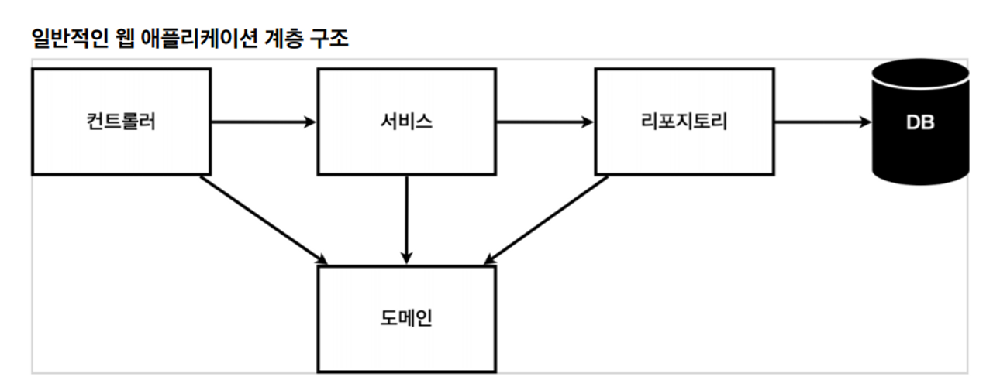
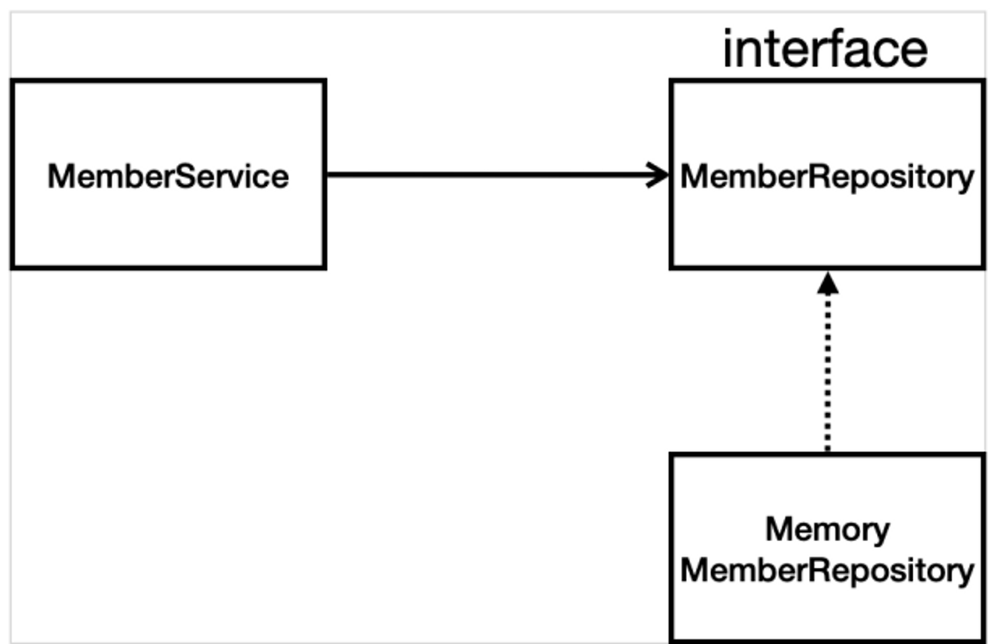

## 회원 관리 예제 - 백엔드 개발

- **비즈니스 요구사항 정리**

  

  - 일반적인 웹 애플리케이션 계층 구조

    - 컨트롤러: 웹 MVC의 컨트롤러 역할
    - 서비스: 핵심 비즈니스 로직 구현
    - 리포지토리: DB에 접근, 도메인 객체를 DB에 저장하고 관리
    - 도메인: 비즈니스 도메인 객체
      - 예) 회원, 주문, 쿠폰 등등 주로 DB에 저장하고 관리됨

  - 클래스 의존 관계

    

    - DB 선정 전, 갈아끼우기 쉽게 인터페이스로 구현 클래스를 변경할 수 있도록 설계
    - DB는 RDB, NoSQL등등 다양한 저장소 고민중으로 가정
    - 개발 진행을 위해 초기 개발 단계는 구현체로 가벼운 메모리 기반 데이터 저장소 사용

- **회원 도메인과 리포지토리 만들기**

  - `Optional`: null을 감싸서 반환
    - `Optional.ofNullable()`

- **회원 레포지토리 테스트 케이스 작성**

  - 테스트 케이스 작성

    - 테스트를 쉽게 하기 위해서 `JUnit`이라는 프레임워크로 테스트를 실행

  - 예상값과 결과값이 같은지 테스트

    ```java
    // member가 result와 같은지
    
    assertThat(member).isEqualTo(result);
    ```

  - 테스트 실행 후 레포지토리 clear

    - 앞선 테스트의 영향이 있기 때문에 clear필요

    ```java
    @AfterEach
    public void afterEach() {
    	//레포 클리어
    }
    ```

- **회원 서비스 개발**

  ```java
  // 같은 이름이 있는 중복 회원X
  
  memberRepository.findByName)member.get())
  	.ifPresent(m -> {
  			throw new IllegalStateException("이미 존재하는 회원입니다.");
  		});
  ```

- **회원 서비스 테스트**

  - 테스트 메서드는 한글로 작성해도 됨
  - `given`, `when`, `then` 구성으로 시작 권장

  ```java
  // 예외 검증
  
  assertThrows(IllegalStateException.class, () -> 메서드)
  ```

  - 각 테스트 전

    ```java
    @BeforeEach
    public void beforeEach() {
    	memberRepository = new MemoryMemberRepository();
    	memberService = new MemberService(memberRepository);
    }
    ```

    - `repository`를 `service`에 생성자로 넣어줌
      - 의존성 주입