# Django Form

- 장고는 form에 관련된 작업의 아래 세 부분을 처리해 줌
  1. 렌더링을 위한 데이터 준비 및 재구성
  2. 데이터에 대한 HTML_forms 생성
  3. 클라이언트로부터 받은 데이터 수신 및 처리

### Form Class

- Form 내 filed, filed 배치, 디스플레이 widget, label, 초기값, 유효하지 않는 field에 관련된 에러메시지 결정

- Form 선언하기

  - Model 선언과 같은 필드타입 사용(일부 매개변수도 유사)
  - forms 라이브러리에서 파생된 Form 클래스 상속받음

  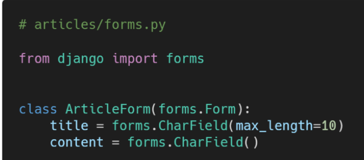

- Form 사용하기

  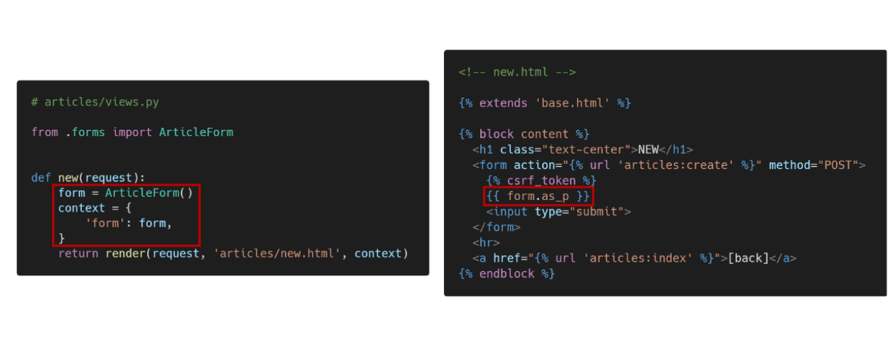

- Form rendering options

  - <label> &  <input> 쌍에 대한 3가지 출력 옵션

    1. `as_p()` : 각 필드 
태그로 감싸져서 렌더링
    2. `as_ul()` : 각 필드 목록 항목 <li>태그로 감싸져서 렌더링 됨
       - `<ul>` 태그는 직접 작성해야 함

    3. `as_table()` : 각 필드 테이블 <tr>태그로 감싸져서 렌더링
       - `<table>` 태그는 직접 작성해야 함

​	

- HTML input 요소 표현 방법 2가지
  1. Form fields
     - input에 대한 유효성 검사 로직을 처리하여 템플릿에서 직접 사용 됨
  2.  Widgets
     - 웹 페이지의 HTML input 요소 렌더링
     - GET/POST 딕셔너리에서 데이터 추출
     - widgets은 반드시 Form fields에 할당 됨
     - 
- Widget
  - 주의사항
    - Form Fields와 혼동되어서는 안됨
    - Form Fields는 input 유효성 검사를 처리
    - Widgets은 웹페이지에서 input element의 단순 raw한 렌더링 처리

​	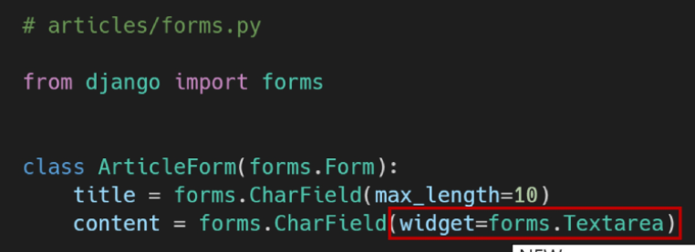

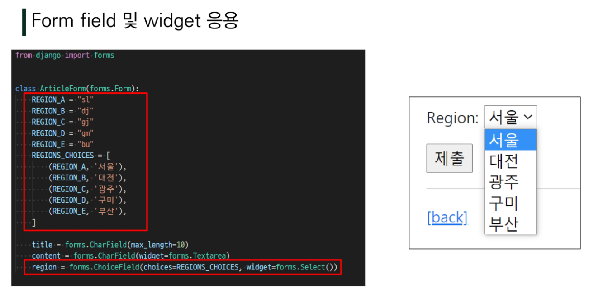

# ModelForm

> Form에서 Model 필드 재정의하는 행위 중복 방지

### ModelForm Class

- Model을 통해 Form Class를 만들 수 있는 Helper
- 일반 Form Class와 완전히 같은 방식(객체 생성)으로 view에서 사용 가능

- ModelForm 선언하기
  - forms 라이브러리에서 파생된 ModelForm 클래스를 상속받음
  - 정의한 클래스 안에 Meta클래스 선언, 어떤 모델 기반으로 Form 작성할지 정보 저장
    - 주의❗ 클래스 변수 fields와 exclude는 동시 사용 X

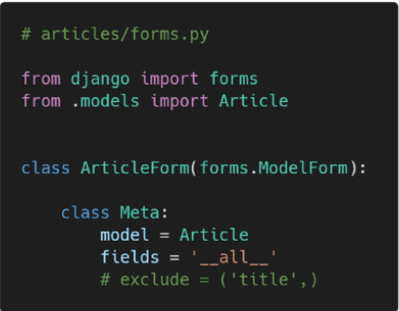

### Meta class

- Model의 정보를 작성하는 곳
- ModelForm을 사용할 경우 사용할 모델이 있어야 하는데 Meta Class가 이를 구성
  - 해당 Model에 정의한 field정보를 Form에 적용하기 위함

### CRUD

- create view 수정

  - `is_valid()` method
    - 유효성 검사 실행, 유효여부 boolean으로 반환
  - `save()` method
    - DB 객체를 만들고 저장
    - ModelForm의 하위 클래스는 기존 모델 인스턴스를 키워드인자 *instance*로 받아들일 수 있음
      - 제공되면 `save()`는 해당 인스턴스 수정(UPDATE)
      - 제공되지 않으면 `save()`는 새 인스턴스 만듦(CREATE)
    - Form의 유효성이 확인되지 않은 경우 `save()` 호출하면 `form.errors`를 확인하여 에러 확인

  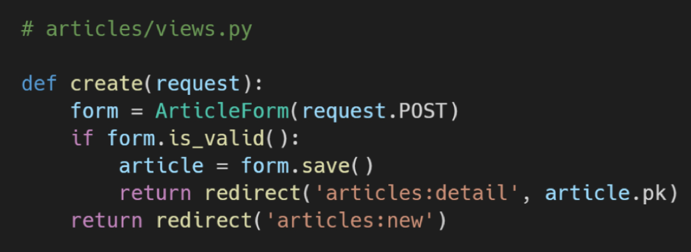

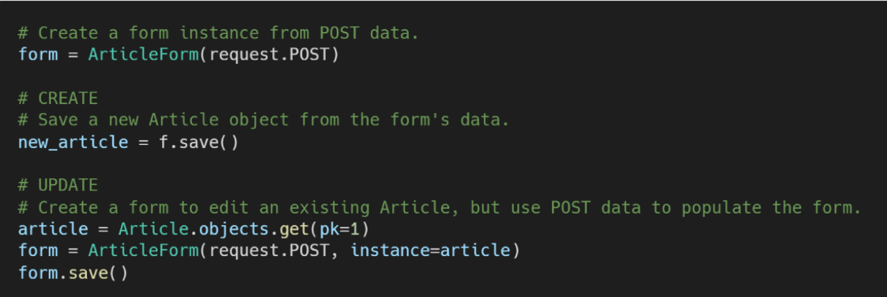

- create view 함수 구조 변경

  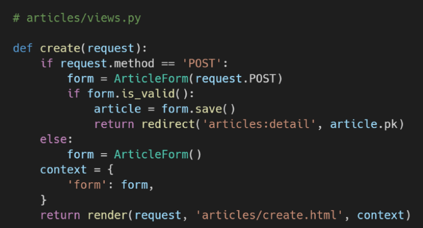

> new 삭제하고 create에 통합
>
> action값 없어도 동작

- Widgets 활용

  - 첫번째 방식

    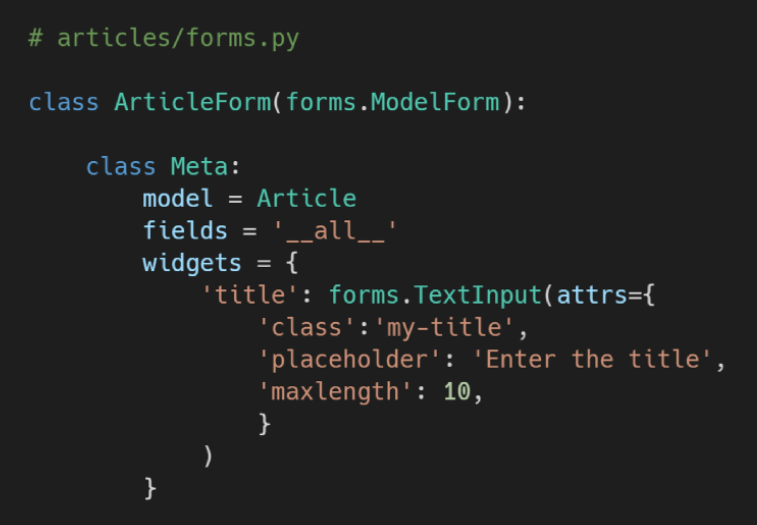

  - 두번째 방식(권장)

    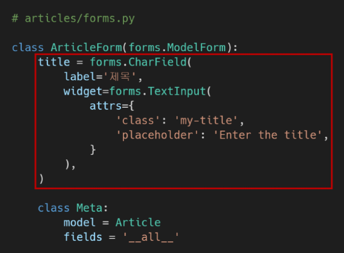

- DELETE

  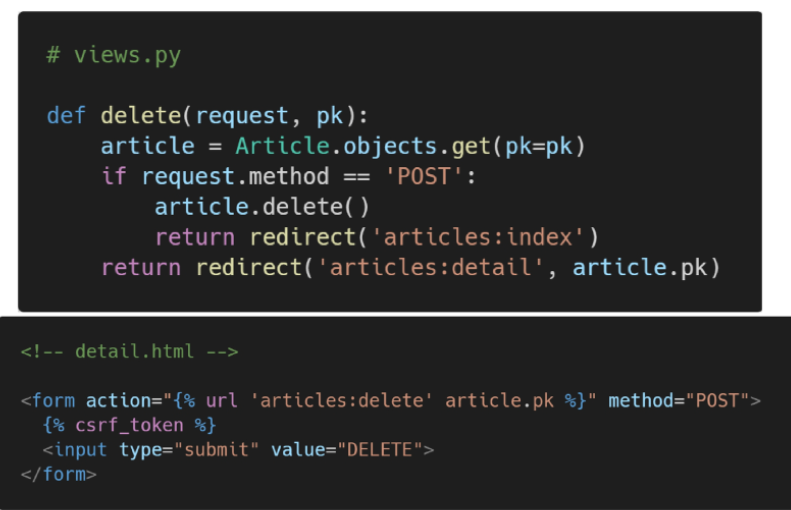

- UPDATE

  

> edit 삭제하고 update에 통합

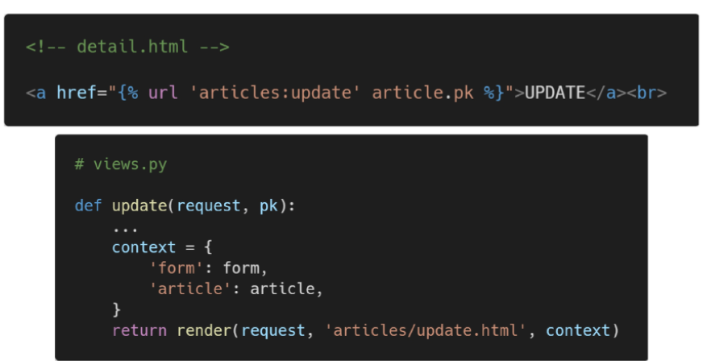

> update 로직 완성

- forms.py 파일 위치
  - Form class는 forms.py 뿐만 아니라 다른 어느 위치에 두어도 상관 없음
  - 하지만 되도록 `app폴더/forms.py`에 작성하는 것이 일반적

- Form & ModelForm 비교
  - Form
    - 어떤 Model에 저장해야 하는지 알 수 없으므로 유효성 검사 이후 cleaned_data 딕셔너리 생성
    - cleaned_data 딕셔너리에서 데이터를 가져온 후 `.save()` 호출해야 함
    - Model에 연관되지 않은 않은 데이터를 받을 때 사용
  - ModelForm
    - Django가 해당 model에서 양식이 필요한 대부분의 정보를 이미 정의
    - 어떤 레코드를 만들어야 할 지 알고 있으므로 바로 `.save()` 호출 가능

# Rendering fields manually

- 수동으로 Form 작성하기

  1. Rendering fields manually

     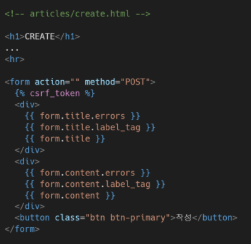

  2. Looping over the form's fields ``

     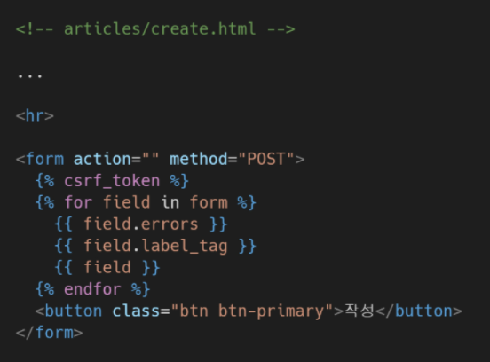

- Bootstrap과 함께 사용하기

  1. Bootsrap class with widgets

     - Bootstrap Form의 핵심 class를 widget에 작성

     - 에러 메시지 with bootstrap alert 컴포넌트

       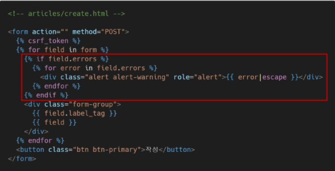

  2. Django Bootstrap 5 Library

​			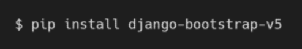

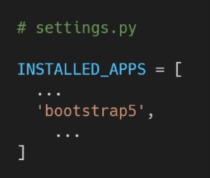

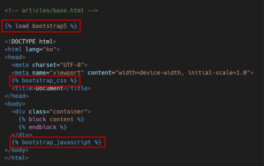

> 적용