# Django Model

### Model

- 단일한 데이터에 대한 정보를 가짐(필수 필드+동작)
- 웹 애플리케이션의 데이터를 **구조화**하고 **조작**하기 위한 도구


### >DB의 기본 구조


#### 스키마(Schema)

:DB의 구조와 제약조건에 관련한 전반적인 명세 기술


#### 테이블(Table)

:열(필드, 속성)과 행(레코드, 튜플)으로 구성


#### 기본키(PK)

> 장고는 id가 곧 PK

: 고유값, 반드시 설정해야함


### ORM

> Object-Relational-Mapping

- 장고와 DB사이 위치(장고에 포함된다고 봄)
- `python class`를 `SQL`으로 변경하여 전달
- DB에서 받은 `데이터`를 `python object`로 만들어서 전달
- 장점: 객체 지향적 접근으로 높은 **생산성**
- 단점: ORM 만으로 완전한 서비스를 구현하기 어려운 경우가 있음


### models.py 작성

```python
# articles/models.py

class Article(models.Model):
    # 길이제한 있을 때는 CharField, 없을 때는 TextField
    title = models.CharField(max_length=10)
    content = models.TextField()
```

> models.Model 무조건 넣음(테이블 CRUD)


#### CharField(max_length=None, **options)

- `max_length` 필수 인자

#### TextField(**options)

- 글자의 수가 많을 때 사용
- `max_length` 사용X


### Migrations

- django가 model에 생긴 변화를 반영하는 방법

- 명령어

  table로 만들어감

  - `makemigrations`
  - `migrate`

  확인용도

  - `sqlmigrate`
  - `showmigrations`


#### makemigrations

: 마이그레이션 설계도 만듦 


#### migrate

: 설계도를 DB에 반영하는 과정


- 테이블 이름 규칙: `앱이름_클래스명`
  - 클래스명 정할때 테이블명과 혼동하지 않도록 주의


#### sqlmigrate

`python manage.py sqlmigrate 앱이름 마이그레이션번호`

: 마이그레이션에 대한 SQL구문 확인


#### showmigrations

: 마이그레이션 파일들이 migrate 됐는지 확인


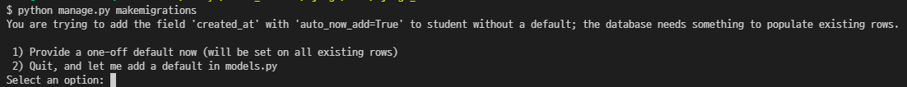

1) 장고가 디폴트값 입력
2)  모델에서 직접 디폴트값 입력

- 빈 칸 허용

  - 숫자: `null=True`

  - 문자: `blank=True`

- 필드옵션

  - auto_now_add: 최초 생성 일자, 최초 insert시에만 현재 날짜와 시간 갱신
  - auto_now: 최종 수정 일자


### 반드시 기억해야 할 migrations 3 단계

1. `models.py`
   - 모델 변경 발생시
2. `$ python manage.py makemigrations`
   - migration 파일 생성
3. `$ python manage.py migrate`
   - DB반영


### DB API

> DB를 조작하기 위한 도구

#### Making Queries

: `Class name.objects.Query Set API`

클래스명.objects(manager 역할).메소드

ex) `Article.objects.all()`


#### Django shell

: 일반적인 python shell에서는 장고 환경 접근하지 못하기 때문에 사용

- QuertSet: 유사 리스트
- `$ pip install django-extensions` : 장고 추가기능 설치

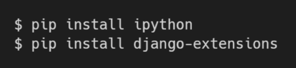

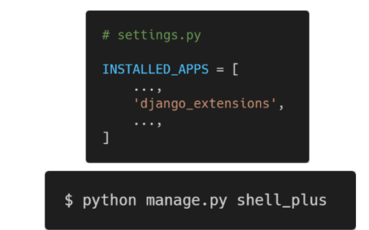


### CRUD

#### CREATE

1. 인스턴스 활용 -1

   인스턴스 생성 후 인스턴스 변수 설정

   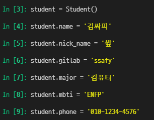...

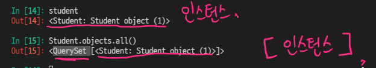

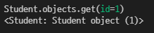데이터 1개만 요청(id번호)

2. 인스턴스 활용 -2

   초기 값과 함께 인스턴스 생성

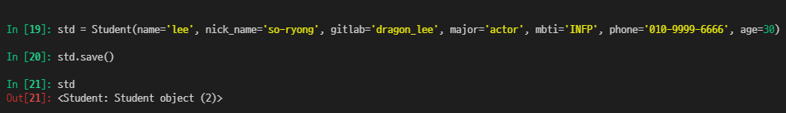

3. objects의 create 사용

​	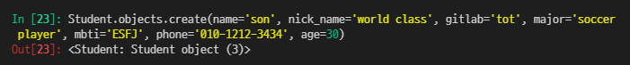

save없이 바로 저장됨

- SQLite 1, 2, 3 실습테이블 결과

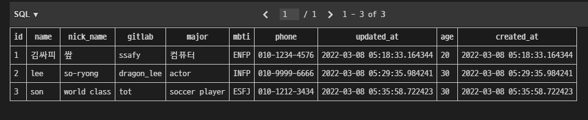

- save()
  - **필수!!** 객체를 데이터베이스에 저장

- 주요 정보 편하게 보기(str)

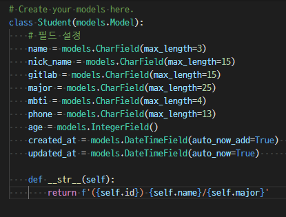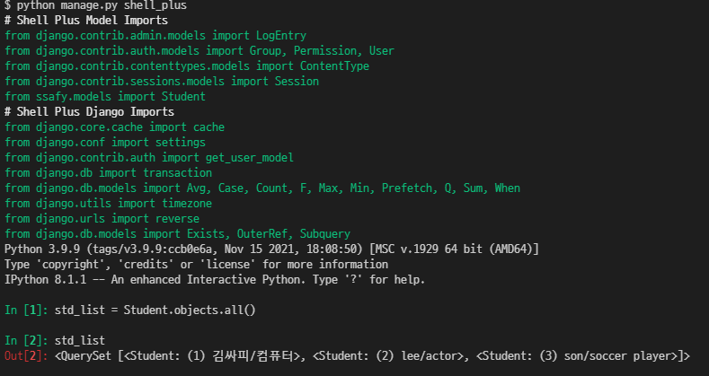


#### READ

- all()
  - 현재 QuerySet의 복사본 반환

- get()

  - 객체를 찾을 수 없으면 `DoseNotExist` 예외 발생
  - 둘 이상의 객체를 찾으면 `MultipleObjectReturned` 예외 발생

  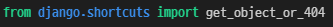

- filter()
  - 해당 조건을 만족하는 모든 data 리턴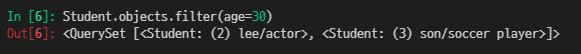


#### UPDATE

> 기존 값을 수정

1. DB에서 수정할 data를 가져온다

2. 가져온 데이터의 값을 변경

3. save 한다

   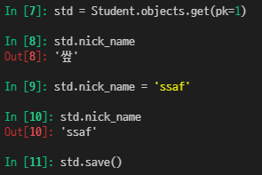


#### DELETE

> 모든 행 삭제 삭제된 객체 수와 객체 유형당 삭제 수가 포함된 딕셔너리 반환

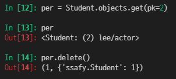

- 유효성 검사

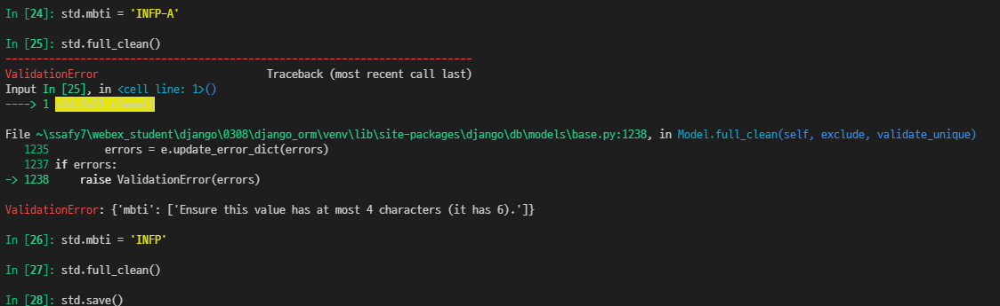

- 실습테이블

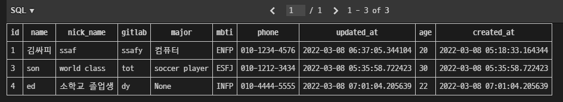

- Field lookups

  - 조회 시 검색 조건 지정

  - 부등호 중 등호만 사용가능(`<`, `>` 사용불가)

    ex) `Article.objects.filter(pk__gt=2)`

- QuerySet API

  https://docs.djangoproject.com/en/3.2/ref/models/querysets/#quertset-api-reference

  

### Admin Site

> web으로 DB관리


#### admin 생성

- 관리자 계정 생성 후 서버 실행 -> `/admin`으로 가서 로그인

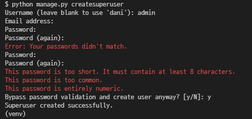

- admin사이트에 Student등록하여 보여주기
  - 사이트 내에서 생성, 수정 가능
  - `__str __` 에 정의한 형태로 보임

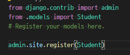

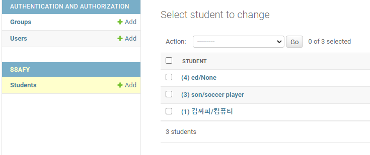

- pk와 name만 보기

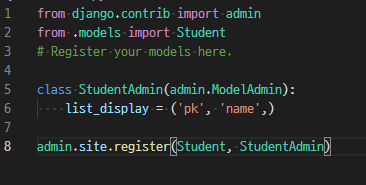

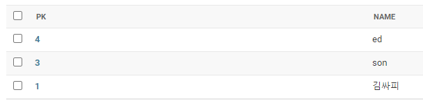

- ModelAdmin Options

https://docs.djangoproject.com/en/3.2/ref/contrib/admin/#modeladmin-options