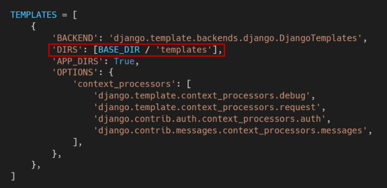
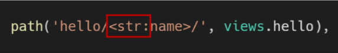
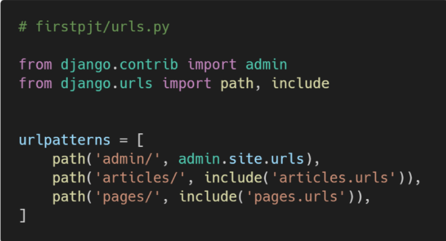
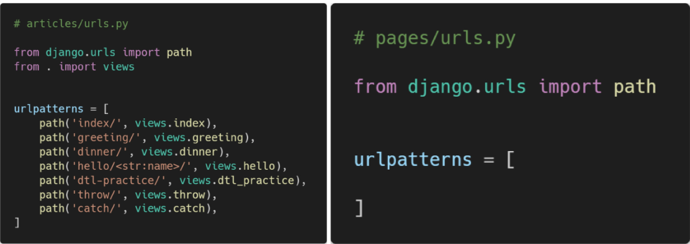
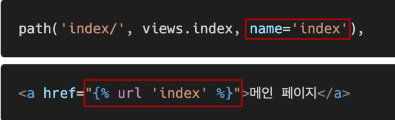
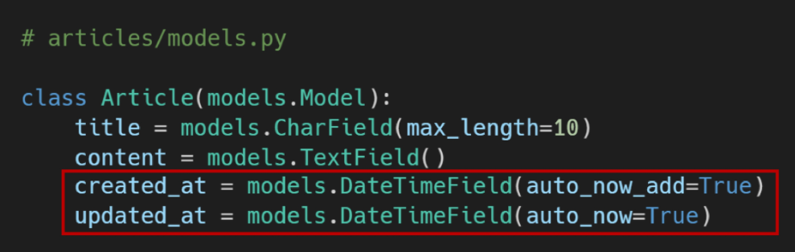
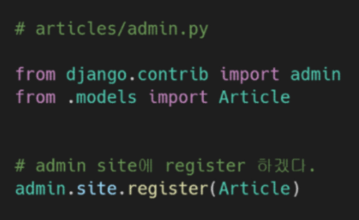
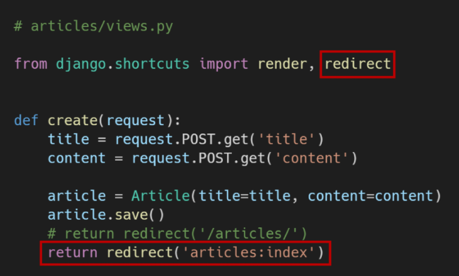

# Django 정리(for test)

> 실습 내용 따로 살펴보기

DB 안나옴


##### Django1

- 요청과 응답
- Template
- HTML Form
- URL


#### static vs Dynamic 웹 페이지

- `static`
  - 서버에 미리 저장된 파일 사용자에게 그대로 전달
  - 요청에 대한 추가적인 처리 과정 x 응답 보냄
  - 모든 상황 모든 사용자 동일
  - html, css, javascript 로 주로 작성
  - flat page라고도 함
- `dynamic`
  - 요청에 대해 추가적인 처리 과정 이후 응답 보냄
  - 방문자에 따라 페이지 내용 다름
  - 서버 사이드 프로그래밍 언어(python, java, c++ 등) 사용. 상호작용

#### Framework

- 특정 운영 체제를 위한 응용 프로그램 표준 구조를 구현하는 클래스와 라이브러리 모임
- Application framework 라고도 함
- 재사용할 수 있는 수많은 코드를 프레임워크로 통합
- `web framework` : 웹 페이지를 개발하는 과정에서 겪는 어려움을 줄이는 것이 주 목적


### ❗MTV Pattern

- `Model`
  - 응용 프로그램의 데이터 구조를 정의 DB의 기록을 관리(추가, 수정 삭제)

- `Template`

  - 파일을 구조나 레이아웃 정의
  - 실제 내용을 보여주는 데 사용

- `View`

  - http 요청을 수신하고 http 응답을 반환
  - model을 통해 요청을 충족시키는데 필요한 데이터에 접근
  - template에게 응답의 서식 설정을 맡김

  

**MVC <-> MTV** ❗

| MVC Pattern    | MTV(Django)  |
| -------------- | ------------ |
| **M**odel      | **M**odel    |
| **V**iew       | **T**emplate |
| **C**ontroller | **V**iew     |


### Django 시작하기

- 프로젝트 생성
  - `django-admin startproject <프로젝트명> .`
  - `.` : 현재 디렉토리 의미❗

- Django 서버 시작(활성화)
  - `python manage.py runserver`


### 프로젝트 구조

> 각각 어떤 것을 위한 파일인지

- `settings.py`
  - 애플리케이션의 모든 설정을 포함
- `url.py`
  - 사이트의 url과 적절한 views의 연결 지정
- `manage.py`
  - 프로젝트와 다양한 방법으로 상호작용하는 커맨드라인 유틸리티
    - `python manage.py <command> [options]`
  - 프로젝트 폴더 밖에 생성


### Application 생성

- 복수형 이름 권장

### Application 구조

- `admin.py`
  - 관리자용 페이지를 설정
- `apps.py`
  - 앱의 정보 작성
- `models.py`
  - 앱에서 사용하는 Model 정의

- `tests.py`
  - 프로젝트의 테스트 코드 작성
- `views.py`
  - view 함수들 정의
  - HTTP 요청을 수신하고 응답 반환
  - Model을 통해 요청에 맞는 필요 데이터에 접근
  - Template에게 HTTP응답 서식 맡김
- `urls.py`
  - **자동생성 X**❗
  - HTTP 요청을 알맞은 view로 전달


### Project & Application

- `project` : Application의 집합
  - 앱은 여러 프로젝트에 있을 수 있음

- `Application` : 실제 요청을 처리하고 페이지를 보여줌
  - 하나의 역할 및 기능 단위


### 앱 등록

- 반드시 앱 생성 후, `settings.py`의 `INSTALLED_APPS`에 앱 추가


### Templates

- 실제 내용을 보여주는데 사용
- 파일 구조나 레이아웃 정의
- Template 파일 경로 기본 값은 **app 폴더 안의 templates 폴더**로 지정


### 추가 설정

- `LANGUAGE_CODE`
  - 번역, `USE_I18N` 활성화되어 있어야 함❗
  - 한국은 `ko-kr`
- `TIME_ZONE`
  - 데이터베이스 연결의 시간대를 나타내는 문자열 지정

```
- USE_I18N : 번역 시스템 활성화 여부 지정
- USE_L10N : local 형식을 기본적으로 활성화할지 여부 지정
- USE_TZ : datetimes가 기본적으로 시간대를 인식하는지 여부 지정
```


### ❗DTL(Django Template Language)

**Built-in tag**

- [for](https://docs.djangoproject.com/ko/3.2/ref/templates/builtins/#for)

​	ex)

```django
<ul>

    <li>{{ athlete.name }}</li>

</ul>
```

- | Variable              | Description                                                  |
  | --------------------- | ------------------------------------------------------------ |
  | `forloop.counter`     | The current iteration of the loop (1-indexed)                |
  | `forloop.counter0`    | The current iteration of the loop (0-indexed)                |
  | `forloop.revcounter`  | The number of iterations from the end of the loop (1-indexed) |
  | `forloop.revcounter0` | The number of iterations from the end of the loop (0-indexed) |
  | `forloop.first`       | True if this is the first time through the loop              |
  | `forloop.last`        | True if this is the last time through the loop               |
  | `forloop.parentloop`  | For nested loops, this is the loop surrounding the current one |

  - for ... empty
    - `empty`: 비었을 때나 찾을 수 없을 때 보여줌

  ex)

```django
<ul>

    <li>{{ athlete.name }}</li>

    <li>Sorry, no athletes in this list.</li>

</ul>
```

- if

- load
  - 커스텀 템플릿 태그세트를 로드
  - 여러개 등록 가능

​	ex)

```django

```

- url
  - 절대 경로 참조
  - `urls.py`에서 설정한 `name` 활용

​	ex)

```django
 
```


**Built-in filter**

- [date](https://docs.djangoproject.com/ko/3.2/ref/templates/builtins/#date)

  - format

  | Format character | Description                                    | Example output   |
  | ---------------- | ---------------------------------------------- | ---------------- |
  | **Day**          |                                                |                  |
  | `d`              | Day of the month, 2 digits with leading zeros. | `'01'` to `'31'` |
  | `j`              | Day of the month without leading zeros.        | `'1'` to `'31'`  |
  | `D`              | Day of the week, textual, 3 letters.           | `'Fri'`          |
  | **Month**        |                                                |                  |
  | `m`              | Month, 2 digits with leading zeros.            | `'01'` to `'12'` |
  | `n`              | Month without leading zeros.                   | `'1'` to `'12'`  |
  | `M`              | Month, textual, 3 letters.                     | `'Jan'`          |
  | **Year**         |                                                |                  |
  | `y`              | Year, 2 digits with leading zeros.             | `'00'` to `'99'` |
  | `Y`              | Year, 4 digits.                                | `'1999'`         |
  | **Time**         |                                                |                  |
  | `h`              | Hour, 12-hour format.                          | `'01'` to `'12'` |
  | `H`              | Hour, 24-hour format.                          | `'00'` to `'23'` |
  | `i`              | Minutes.                                       | `'00'` to `'59'` |
  | `s`              | Seconds, 2 digits with leading zeros.          | `'00'` to `'59'` |

​	ex)

```django
{{ value|date:"D d M Y" }}
```

- length

  ex)

```django
{{ value|length }}
```

- lower/upper

​	ex)

```django
{{ value|lower }}
{{ value|upper }}
```


### DTL Syntax

- variable : `{{ variable }}`
  - views.py 에서 정의한 변수 사용
  - render()의 세 번째 인자로, 딕셔너리 형태의 key가 변수명이 됨

- filters : `{{ variable|filter }}`
- tags : ``
  - 반복 또는 논리 수행
  - 일부 태그는 시작과 종료 태그 필요


### Templat inheritance

- extends : ``

  - 반드시 템플릿 최상단 작성
  - 자식이 부모 템플릿 확장(상속)

- block : ` `

  - 자식 템플릿이 채울 수 있는 공간

- **템플릿 추가 경로 설정**❗

  

- include: ``
  - 템플릿 내에 다른 템플릿 포함
  - 복잡할 때 잘라서 가져옴(네비게이션 바, 카드 등 활용)


### Django 설계 철학

- 표현과 로직을 분리
- 중복을 배제


### Form

- 웹에서 사용자 정보를 입력하는 여러 방식 제공, 할당된 데이터 서버로 전송
- **핵심속성**❗
  - `action` : 입력 데이터가 전송될 URL 지정
  - `method` : 입력 데이터 전달 방식 지정


### input

- 핵심속성
  - name
  - 주요 용도는 GET/POST 방식으로 서버에 전달하는 파라미터로 매핑
    - name=key, value=value
  - GET 방식에서는 URL에서 `?key=value&key=value` 형식으로 데이터 전달


### request method - GET

- 정보를 조회하는 데 사용
- 데이터를 가져올 때만 사용해야 함


### Variable Routing

- url 주소를 변수로 사용
- 변수 값에 따라 하나의 path()에 여러 페이지 연결 가능



- converters
  - str: `/`를 제외 모든 문자열과 매치, 작성하지 않으면 기본값 `<name>`
  - int
  - slug: ASCII문자 또는 숫자, 하이픈 및 밑줄 문자


### URL

- URL mapping

  - urlpattern은 다른 모듈 포함 가능

    

  - 각각 앱 안에 urls.py을 생성하고 프로젝트 urls.py에서 각 앱의 urls.py 파일로 매핑 위탁

    

- Naming URL patterns

  - `name` value는 ``로 불려짐
  - 일치하는 절대 경로 주소 반환




# Django Model


### Model

- 단일한 데이터에 대한 정보 가짐
- 저장된 데이터베이스의 구조(layout)
- 각각의 model은 하나의 DB 테이블에 매핑 됨
- **웹 애플리케이션 데이터를 구조화하고 조작하기 위한 도구**


#### PK

> 각 행(레코드)의 고유값


### ORM

> Object-Relational-Mapping

- OOP를 사용하여 호환되지 않는 유형의 시스템간 데이터를 변환

- 장점: SQL 몰라도 됨, 객제 지향적 접근으로 높은 **생산성**
- 단점: ORM 만으로 완전한 서비스 구현 어려움

- **DB를 객체로 조작하기 위해 사용**


### 사용 모델 필드

- `CharField`(max_length=None, *options) : max_length 필수

- `TextField`(*options) : 글자수 많을 때
- `DateTimeField`(auto_now=False, auto_now_add=False, *options)

- `FloatField`(*options)
- `IntegerField`(*options)


### Migration

> Django가 model에 생긴 변화 반영

- `makemigrations`
  - 새로운 마이그레이션(설계도) 생성
  - `python manage.py makemigrations`
- `migrate`
  - 마이그레이션 DB 반영
  - 변경 사항들과 DB의 스키마가 동기화 이룸
  - `python manage.py migrate`
- `sqlmigrate`
  - 마이그레이션에 대한 SQL 구문 보기
  - `python manage.py sqlmigrate app_name 0001`
- `showmigrations`
  - 프로젝트 전체의 마이그레이션 상태 확인
  - `python manage.py showmigrations`


### DateField❗❗



- `auto_now_add` : 생성일
  - 바로 다음줄에 디폴트 값 설정 -> 1
  - 종료하고 직접 기본값을 코드에서 설정 -> 2
- `auto_now` : 업데이트일

- `DateTimeField`는 `DateField`의 서브 클래스


### CRUD ❗❗

- CREATE

  - 인스턴스 생성 후 인스턴스 변수 설정

    ```django
    article = Article()
    article.title = 'first'
    article.save()
    ```

  - 초기 값과 함께 인스턴스 생성

    ```django
    article = Article(title='second')
    article.save()
    ```

  - QuerySet API - create() 사용

    ```django
    Article.objects.create(title='third')
    ```

  - str() 정의하여 문자열 반환하도록 할 수 있음

- READ

  - `Article.objects.all()` : 전체 article 객체 조회, 현재 QuerySet의 복사본 반환
  - `Article.objects.get(key=value)` : 주어진 lookup 매개변수와 일치하는 객체 반환
    - 찾을 수 없거나 두개 이상이면 예외 발생
  - `Article.objects.filter(key=value)` : 주어진 lookup 매개변수와 일치하는 객체를 포함하는 새 QuerySet 반환

- UPDATE

  - 값을 불러서 변경하고 저장

- DELETE

  - 값을 READ로 불러서 삭제, 반환
  - `article.delete()`

- [Field lookups](https://docs.djangoproject.com/ko/3.2/ref/models/querysets/#field-lookups) -> 가볍게보기
  - 조회 시 특정 검색 조건을 지정


### Admin Site

- admin 생성

  - `python manage.py createsuperuser`
  - 주의) 기본 테이블이 생성되지 않으면 관리자 계정 생성 불가

- admin 등록

  - `admin.site.register(Article)`

    


### HTTP method

- GET
  - 특정 리소스를 가져오도록 요청
  - 반드시 데이터를 가져올 때만 사용
  - DB에 변화 x
  - CRUD에서 R 역할

- POST
  - 서버로 데이터 전송(HTTP에 담아서)
  - 서버에 변경사항을 만듦
  - CRUD C/U/D 역할 담당


### 사이트 간 요청 위조

> Cross-site request forgery

- 공격 방어
  - **Security Token(CSRF Token)**❗
    - 데이터에 임의의 난수 값을 부여, 매 요청마다 난수 값을 포함시켜 전송
    - 이후 서버에서 요청을 받을 때마다 전달된 token 값이 유효한지 검증
    - POST, PATCH, DELETE method 등에 적용(GET 제외)
  -  ``
    - input type hidden으로 작성 value는 hash 값
    - POST 일때 반드시 설정
    - 해당 태그 없이 요청을 보낸다먼 Django 서버는 403 fibidden 응답


### redirect()❗❗

- 새 URL로 요청을 다시 보냄
- 인자에 따라 `HttpResponseRedirect` 반환

- 브라우저는 현재 경로에 따라 전체 URL 자체를 재구성(reconstruct)

- 사용 가능 인자
  - model
  - view name
  - absolute or relative URL



- Variable Routing으로 pk 받아서 활용 가능

  

